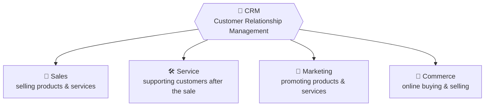
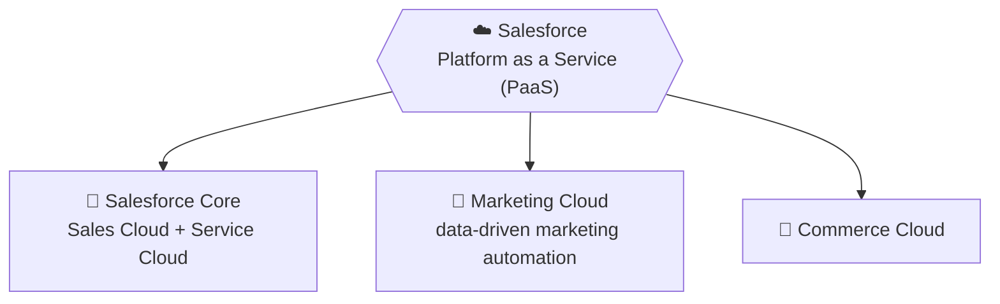
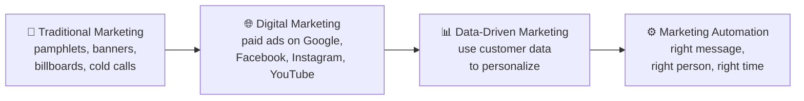
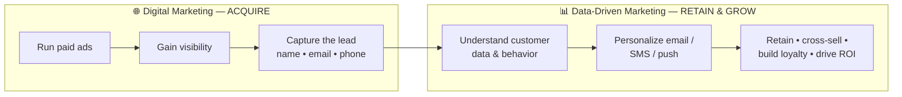
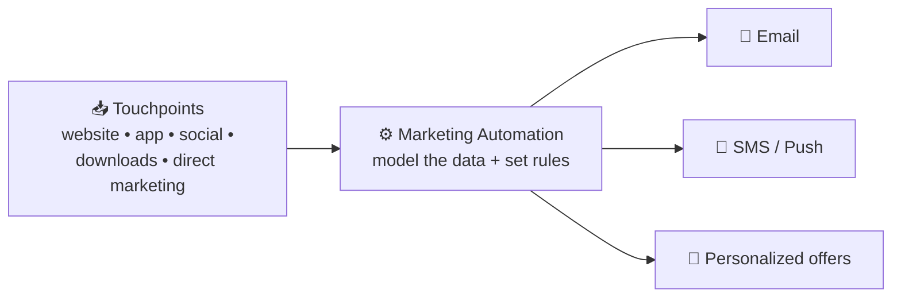
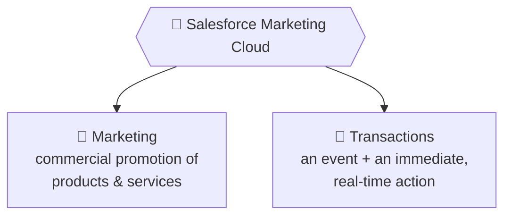
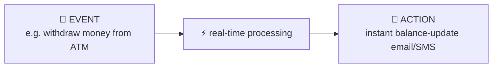
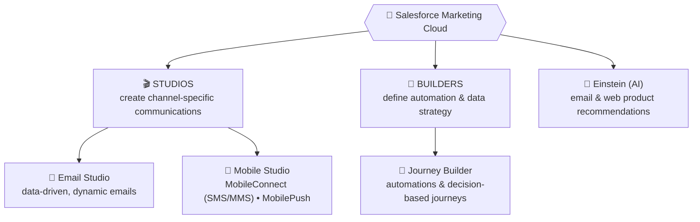
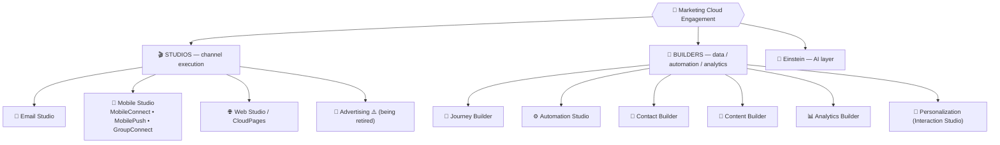
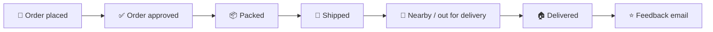

# 📘 Module 1 — Introduction to Salesforce Marketing Cloud

> **Module goal:** Understand *what Salesforce is*, how marketing evolved from **traditional → digital → data-driven → automation**, what **Salesforce Marketing Cloud (SFMC)** actually is, the **two jobs** it does (marketing + transactions), and the **studios & builders** that make it work.
>
> *These are my own study notes. Diagrams are original recreations of the lecture concepts. The raw course slides/manuals are kept in a separate private folder, not published here.*

---

## 1. What is Salesforce?

**Salesforce** is a **CRM platform** — and, more precisely, a **Platform as a Service (PaaS)**.

- **CRM = Customer Relationship Management.** Every business runs on relationships with its customers, and CRM is how those relationships are managed.
- Salesforce doesn't hand you a finished CRM — it hands you a **platform on which you build your own** sales, service, marketing, and commerce processes, tailored to your industry.

> 🔑 **One-line definition:** Salesforce is the industry-leading **platform** that companies use to *build and run* their CRM — it provides the foundation, and each business builds its own processes on top.

Every company — from a startup to a Fortune 500 giant — has sales, service, marketing, and commerce needs. What they *lack* is a connected platform to run them on. That's the gap Salesforce fills.

---

## 2. The Four Pillars of CRM & the Salesforce Ecosystem

A company's foundation is strong when four CRM components are strong:

The real power comes from **seamless integration** between these four: the person you *sold* to should automatically flow to *service*; a new product launch should flow to *marketing*; strong marketing should feed *sales*. Salesforce connects them into one ecosystem:

> 🔑 **Key point:** "Salesforce Core" usually refers to **Sales Cloud + Service Cloud** together. **Marketing Cloud** is a separate product in the same ecosystem, purpose-built for **data-driven marketing automation** — and it's the focus of this entire course.

---

## 3. What is Marketing?

Before we talk about the *cloud*, we need to be clear on the word *marketing* itself.

- **Marketing** is the **action or business of promoting and selling** products or services.
- **Every company** builds it into its **growth strategy**.
- Companies use marketing techniques to **increase sales** of their products or services.

> 🔑 **Remember:** Marketing is simply *the act of promoting products and services*. What has changed over time is the **way** we do it — and that evolution is the backbone of this module.

---

## 4. The Evolution of Marketing

Marketing methods have evolved with technology. Understanding this progression is the key to understanding *why* Marketing Cloud exists.

| Era | How it worked | Limitation |
|---|---|---|
| **Traditional** | Pamphlets, banners, billboards, phone calls | No internet/mobile; broad, untargeted, unmeasurable |
| **Digital** | Paid ads on social & search platforms | Expensive; visibility vanishes the moment you stop paying |
| **Data-Driven** | Personalize using each customer's data & behavior | Requires a platform to model and act on the data |
| **Automation** | Trigger the right communication automatically | This is where **Salesforce Marketing Cloud** lives |

---

## 5. Digital Marketing — Powerful Reach, Real Limits

**Digital marketing** promotes products and services to a **large audience** across many online channels, all typically driving traffic back to a **website**:

| Channel | Reach / note |
|---|---|
| **Facebook** | 1.5 billion+ active users; accurate demographic data |
| **Google** | 1 billion+ users; 100 billion+ searches/month (AdWords, Search, Gmail) |
| **YouTube** | 1 billion+ users; 4 billion video views/day |
| **Instagram** | 400 million+ users; highly visual |
| **LinkedIn** | 400 million+ profiles; can target companies & job titles |
| **Twitter** | 300 million+ active users |
| **Snapchat** | 200 million+ users; full-screen vertical video; ages 13–34 |
| **Email Marketing** | ~40× more effective for customer acquisition than Facebook + Twitter combined; 90% of US consumers use email daily |
| **Affiliate Marketing** | Partner-driven promotion |

**What digital marketing is great at:** spreading your business, building visibility, and *capturing leads* (name, email, phone).

**Where it falls short — this is the crucial insight:**

> ⚠️ **Digital marketing never *guarantees* sales, customer retention, or return on investment.** Its visibility is **rented** — the moment you stop pouring in money, a better-funded competitor takes your spotlight and your branding fades.

> **Real-world tell:** You rarely see **Amazon** or **Daraz** running constant ads — they only advertise around big sale events (Prime Day, Daraz 11.11 / Mega Sale). Newer, unestablished brands (the kind of quick-commerce or D2C startup flooding your Instagram/YouTube feed with ads) spend heavily to *buy* attention. Established players generate sales year-round through **data-driven marketing**, not paid ads.

---

## 6. Data-Driven Marketing (and Why It Wins)

Once digital marketing has *acquired* a customer, **data-driven marketing** takes over to *keep and grow* them.

**What data-driven marketing does (from the slide):**

- **Optimizes brand communications** based on customer information
- **Uses customer data to predict** their needs, desires, and future behaviors
- **Creates personalized marketing strategies** for the highest possible **return on investment (ROI)**

> **Examples of data-driven marketing in the wild:**
> - **foodpanda** sends *you* a Chinese-food push notification at 5–6 PM because that matches *your* ordering pattern — while someone else gets biryani at 8–9 PM. Same template, different data.
> - **Netflix** learns you prefer thrillers over romance and promotes new thrillers to you specifically.
> - **A mutual-fund app** (e.g. **Al Meezan** or **UBL Funds**) emails you updates only for the *funds you subscribed to* — same design for everyone, personalized data inside.

> 🔑 **Key point:** The goal isn't just *sending* communication — it's knowing **when** to send and **what** to promote, driven by data. You can't promote *any* product to *any* customer; you first **understand** the customer, then act.

### Benefits of Data-Driven Marketing

1. **Integration of departments and processes** under a common objective
2. **Optimal control of budgets** and maximization of ROI through efficient use of resources
3. **Identifying better business opportunities**
4. **Improving the customer experience**
5. **Product development** based on an efficient understanding of target audiences

---

## 7. Marketing Automation

**Marketing automation** is the engine that runs data-driven marketing at scale.

- It **automates the process of nurturing leads** to sales-readiness.
- It **brings together information from many touchpoints** — website visits and downloads, social media activity, and direct marketing — into one place to act on.

> **Location-based automation example:** When your **Careem/Bykea** ride or **foodpanda** order is on the way, you get "2 minutes away… 5 minutes away…" push notifications. That live, location-triggered messaging is marketing automation in action — and if the promise breaks (delivery too late), the same system can auto-trigger a refund.

> 🔑 **Key point:** Smart companies invest **more in marketing automation than in digital marketing.** Digital marketing's job ends once you have the customer's contact info — *retention, loyalty, cross-sell, and re-sell* are all won through automation.

---

## 8. What is Salesforce Marketing Cloud?

Putting it all together:

- **Salesforce Marketing Cloud (SFMC)** is a **B2C marketing automation platform**.
- It delivers **personalized customer engagement on every channel** — email, web, mobile, social, and digital advertising.
- It **enables you to know your customer, personalize with intelligence, and engage across the entire customer journey.**

> 🔑 **Certification-style definition:** SFMC is a **B2C marketing automation platform** used by virtually all **Fortune 500** companies for **data-driven marketing**. It's a **highly technical marketing product** — you work with **relational customer data** to find and act on marketing opportunities.

Companies like **Netflix, Amazon, Daraz, foodpanda, Careem, and Bykea** use this style of platform as the **backbone of their marketing automation**.

---

## 9. The Two Purposes of Marketing Cloud — Marketing & Transactions

This is a favorite exam/interview distinction: SFMC exists to send **communications**, and those fall into **two buckets**.

**1. Marketing (commercial):** Intensive promotion of products via email, SMS, and push — offers, launches, engaging app subscribers, etc.

**2. Transactions:** An **event** that triggers an **immediate action**, processed in **real time**. A transaction **does not always involve money** — it's *event + instant response*.

> **Transaction examples:** ATM withdrawal → instant balance email • forgot-password → instant OTP email • NADRA verification → OTP • Raast / JazzCash payment received → instant confirmation • flight price drops from Rs 25,000 → Rs 18,000 → instant "price slashed" alert to everyone watching it.

> 🔑 **Key point:** *Sending* a communication is easy. The hard, valuable part is **preparing the right data** and delivering **the right information at the right time** — for millions of people, automatically. Nobody drafts your monthly bank statement by hand; it's assembled from transaction data across multiple tables and sent on schedule.

---

## 10. Inside Marketing Cloud — Studios & Builders

SFMC is organized into **Studios** and **Builders**.

| Component | What it's for |
|---|---|
| **🎬 Studios** | Build **channel-specific content** (the actual emails, SMS, push messages) |
| **🧱 Builders** | Build the **strategy** — automations, journeys, and how data flows |
| **📧 Email Studio** | Create **data-driven, dynamic emails** (often using scripting to pull live data from multiple sources into one email — e.g. bank statements, stock updates) |
| **📱 Mobile Studio** | **MobileConnect** for SMS/MMS (and WhatsApp); **MobilePush** to integrate Android/iOS apps and send push notifications, including **location-based** ones |
| **🧭 Journey Builder** | Design **decision-based customer journeys** (e.g. *"product left in cart → wait → still not bought? → send reminder email + SMS + push"*) |
| **🤖 Einstein (AI)** | Powers **product & web recommendations** based on browsing history, behavior, and search patterns |

> 🔑 **Key point:** **Connecting apps and sending messages is the easy part. Preparing and modeling the data is the real engineering** — and it's what separates a professional marketing automation engineer from a button-clicker.

> **Journey Builder example (abandoned cart):** You add a product to your Amazon cart but don't buy. The journey re-checks: *was it purchased?* If not → it auto-sends email + SMS + push to remind you. Banks (HBL, UBL, Meezan, etc.) use the same decisioning for due credit-card payments and upcoming installments — everyone gets a notification, but the **amount and content differ per person**, calculated automatically.

---

## 11. The Complete Studios & Builders Map

Section 10 covered the pieces we use for the invoice project. Here's the **full ecosystem** for orientation — a common certification and interview question. Marketing Cloud's tools split into **Studios** (execute channels) and **Builders** (manage data, journeys, and analytics).

| Tool | Type | What it does |
|---|---|---|
| **Email Studio** | Studio | Build and send data-driven emails |
| **Mobile Studio** | Studio | SMS/MMS (**MobileConnect**), app push (**MobilePush**), WhatsApp/LINE (**GroupConnect**) |
| **Web Studio / CloudPages** | Studio | Landing pages, microsites, forms, coupons |
| **Advertising** | Studio | Sync CRM data to ad audiences ⚠️ *(see retirement note)* |
| **Journey Builder** | Builder | Design multi-step, automated customer journeys |
| **Automation Studio** | Builder | Schedule/trigger data + activity workflows (imports, SQL queries, sends) |
| **Contact Builder** | Builder | The centralized contact data model (Module 4) |
| **Content Builder** | Builder | Emails, templates, images, reusable blocks (Module 7) |
| **Analytics Builder** | Builder | Reports and dashboards on engagement |
| **Personalization** *(formerly Interaction Studio)* | Builder | Real-time 1:1 web/app personalization |
| **Einstein** | AI | Send-time optimization, engagement scoring, content/product recommendations |

> ⚠️ **Keep your product knowledge current (retirements):** **Social Studio** (social media management) was **retired on 18 November 2024**; **Audience Studio** (the DMP) was retired in **February 2024**; and **Advertising** (formerly Advertising Studio) is being wound down — subscriptions become **non-renewable from 15 August 2026**, with Salesforce pointing customers to **Data Cloud** ad audiences. If a slightly older course or article lists Social/Audience Studio as current, treat that as out of date.

> 🔑 **Mental model:** **Studios *do* things on channels** (send an email, an SMS, a page); **Builders *organize* the data, automation, journeys, and reporting** that feed those channels. **Einstein** is the AI layer sitting across everything.

> 💼 **Interview Q — "Difference between a Studio and a Builder?"** → Studios execute **channel-specific** work (Email, Mobile, Web); Builders handle **data, automation, journeys, and analytics** (Contact, Content, Automation, Journey, Analytics Builder).

---

## 12. Marketing Automation in the Real World — the Amazon Order Lifecycle

Amazon's post-purchase messaging is a textbook marketing-automation flow that **builds customer trust**:

And the mirror flow for returns: *return accepted → agent assigned → picked up → quality check → refund approved.* Even a small feature like **"Notify me when back in stock"** (delivered via email/SMS/push) is marketing automation quietly building trust.

> 🔑 **Big idea:** Showing the **right product to the right customer at the right time** is what earns customer **trust** and **ROI**. That is the essence of Marketing Cloud.

---

## 🎯 Key Takeaways

1. **Salesforce is a CRM platform delivered as PaaS** — you build your own Sales, Service, Marketing, and Commerce on top of it.
2. **Marketing evolved:** traditional → digital → data-driven → automation. Each step got more targeted and measurable.
3. **Digital marketing acquires; marketing automation retains.** Digital visibility is *rented* and guarantees nothing once you stop paying.
4. **Data-driven marketing** uses customer data to predict needs and personalize for **ROI** — the "when to send" and "what to promote" matter more than the sending itself.
5. **SFMC is a B2C marketing automation platform** used by Fortune 500 companies to engage customers across email, mobile, web, social, and ads.
6. **Two purposes: Marketing & Transactions.** A *transaction* = an event + an immediate real-time action (not always about money).
7. **Studios build content; Builders build strategy.** Journey Builder handles decision-based journeys; Einstein powers AI recommendations. **The data engineering is the hard, valuable part.**

---

## 💼 Interview Questions (with model answers)

- **Q: What is Salesforce?**
  A: A **CRM platform** delivered as a **Platform as a Service (PaaS)** — it provides the platform on which companies build their own CRM (sales, service, marketing, commerce).

- **Q: What is CRM and what are its four components?**
  A: Customer Relationship Management. Its four pillars are **Sales, Service, Marketing, and Commerce.**

- **Q: What cloud service model does Salesforce follow?**
  A: **PaaS** (Platform as a Service).

- **Q: What is Salesforce Marketing Cloud?**
  A: A **B2C marketing automation platform** used for **data-driven marketing**, delivering personalized engagement across email, web, mobile, social, and digital advertising.

- **Q: Is Marketing Cloud a B2B or B2C platform?**
  A: **Primarily B2C.**

- **Q: What's the difference between digital marketing and data-driven marketing?**
  A: **Digital marketing** *acquires* customers and builds visibility through paid ads — it's cost-intensive and guarantees no sales, retention, or ROI. **Data-driven marketing** uses the acquired customer's data and behavior to *personalize, retain, and grow* them for maximum ROI.

- **Q: What is marketing automation?**
  A: Automating the **nurturing of leads to sales-readiness** and ongoing engagement by bringing together data from many touchpoints (web, app, social, direct) and triggering the right message at the right time.

- **Q: What are the two main purposes of Marketing Cloud?**
  A: **Marketing** (commercial promotion) and **Transactions** (an event plus an immediate, real-time action).

- **Q: What is a "transaction" in Marketing Cloud terms?**
  A: An **event and its immediate automated action**, processed in real time — e.g. an ATM withdrawal triggering an instant balance email. It **doesn't always involve money** (OTPs, price-drop alerts, etc.).

- **Q: What is the difference between Studios and Builders?**
  A: **Studios** create **channel-specific content** (Email Studio, Mobile Studio); **Builders** define the **automation, journey, and data strategy** (Journey Builder).

- **Q: Name some Studios and Builders in Marketing Cloud.**
  A: Studios — **Email Studio**, **Mobile Studio** (MobileConnect, MobilePush). Builder — **Journey Builder**. Plus **Einstein** for AI recommendations.

---

## 🔁 Quick-Recall Flashcards

- **Q:** What service model is Salesforce? → **A:** PaaS (Platform as a Service).
- **Q:** Four pillars of CRM? → **A:** Sales, Service, Marketing, Commerce.
- **Q:** What is "Salesforce Core"? → **A:** Sales Cloud + Service Cloud.
- **Q:** Marketing evolution in order? → **A:** Traditional → Digital → Data-Driven → Automation.
- **Q:** What does digital marketing *fail* to guarantee? → **A:** Sales, retention, and ROI.
- **Q:** SFMC in one line? → **A:** A B2C marketing automation platform for data-driven marketing.
- **Q:** Two purposes of SFMC? → **A:** Marketing and Transactions.
- **Q:** Transaction = ? → **A:** An event + an immediate real-time action (not always money).
- **Q:** Studios vs Builders? → **A:** Studios = content per channel; Builders = automation/journey/data strategy.
- **Q:** What powers Amazon's product recommendation emails? → **A:** Einstein (AI) within Marketing Cloud.

---

## 📖 Glossary

| Term | Meaning |
|---|---|
| **Salesforce** | Industry-leading CRM platform delivered as PaaS. |
| **CRM** | Customer Relationship Management — managing a company's customer relationships across sales, service, marketing, commerce. |
| **PaaS** | Platform as a Service — a cloud model providing a platform to build your own applications/processes. |
| **Salesforce Core** | Sales Cloud + Service Cloud together. |
| **Marketing Cloud (SFMC)** | Salesforce's B2C data-driven marketing automation platform. |
| **Traditional Marketing** | Pre-internet promotion — pamphlets, banners, billboards, calls. |
| **Digital Marketing** | Paid online promotion across search/social channels to acquire leads and visibility. |
| **Data-Driven Marketing** | Using customer data to personalize communications and maximize ROI. |
| **Marketing Automation** | Automating lead nurturing and cross-channel engagement using data. |
| **B2C** | Business-to-Consumer marketing (SFMC's primary focus). |
| **Transaction** | An event plus an immediate real-time action (not always monetary). |
| **Studio** | An SFMC area for building channel-specific content (e.g. Email Studio, Mobile Studio). |
| **Builder** | An SFMC area for defining automation/journey/data strategy (e.g. Journey Builder). |
| **Email Studio** | Studio for creating data-driven, dynamic emails. |
| **Mobile Studio** | Studio for SMS/MMS (MobileConnect) and app push notifications (MobilePush). |
| **Journey Builder** | Builder for decision-based, multi-step customer journeys. |
| **Einstein** | Marketing Cloud's AI, powering product and web recommendations. |

---

*End of Module 1. Next module: **setting up Marketing Cloud** — logging in, creating users, assigning roles & permissions, MIDs, and business units.*
