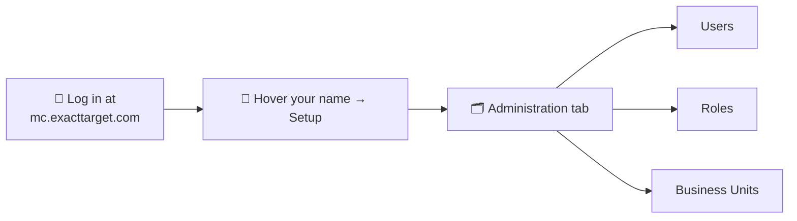
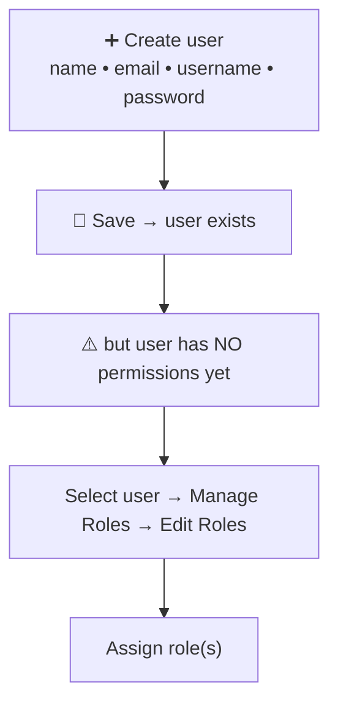
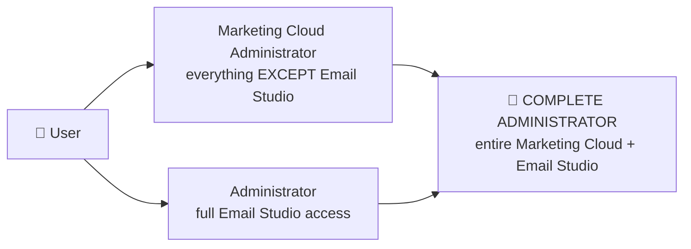
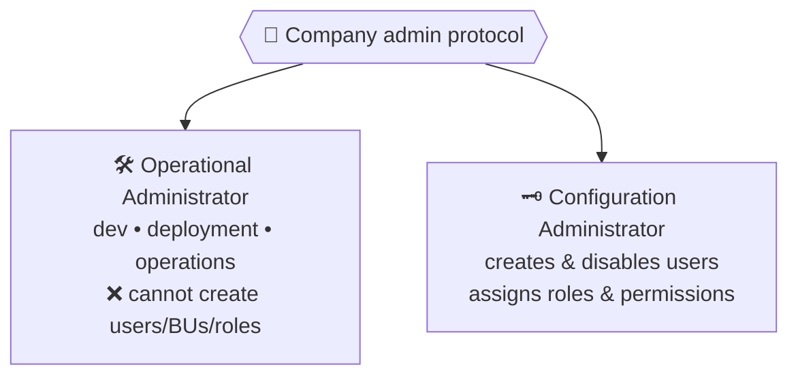
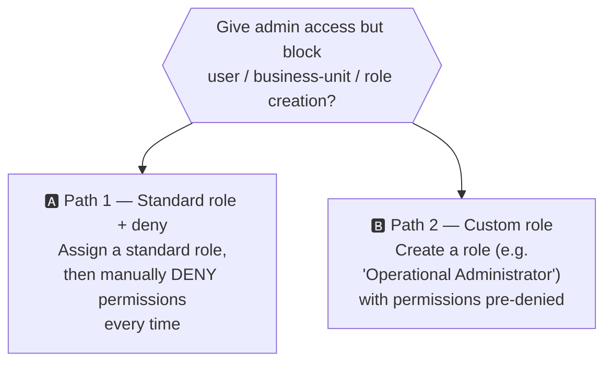
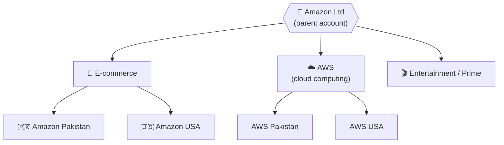
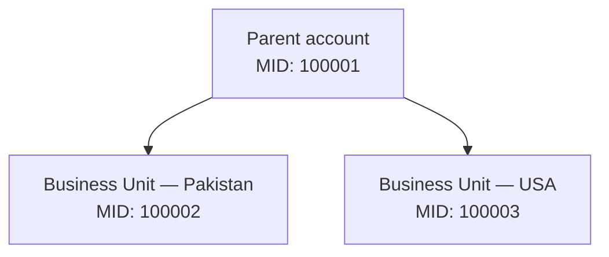
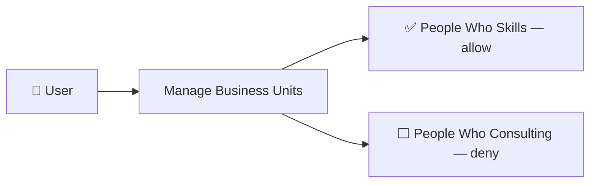
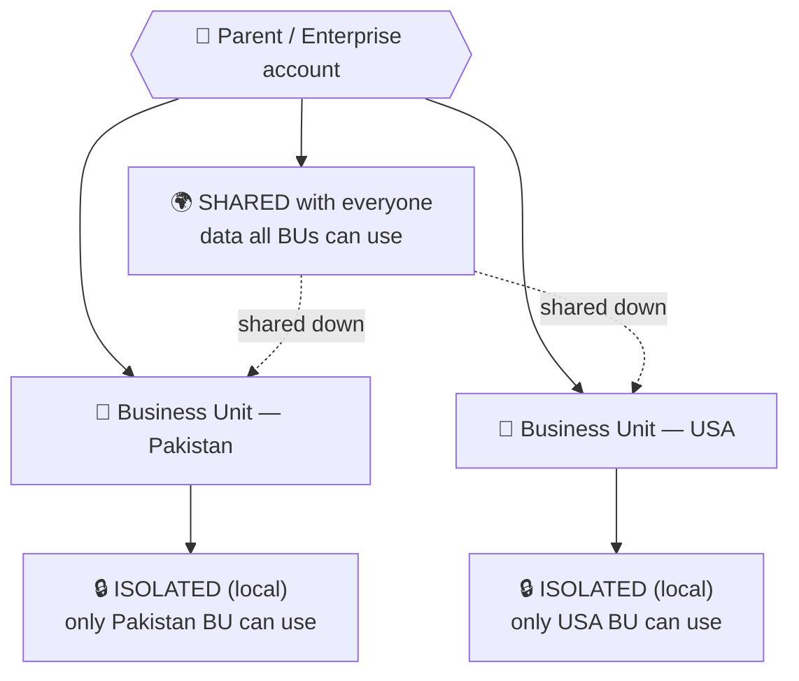

# 📗 Module 2 — Marketing Cloud Setup & Administration

> **Module goal:** Learn the day-one admin skills of a Marketing Cloud consultant — **logging in**, **creating users**, **assigning roles & permissions** (standard *and* custom), understanding **Email Studio roles**, the **MID**, and **Business Units** with their parent-child hierarchy.
>
> *These are my own study notes. Diagrams are original recreations of the lecture concepts. The raw course slides/manuals are kept in a separate private folder, not published here.*

---

## 1. Accessing Marketing Cloud

Marketing Cloud is accessed through a single login URL:

> 🔑 **Login URL:** **`mc.exacttarget.com`**

> ⚠️ **Interview note — why "exacttarget"?** Marketing Cloud is built on **ExactTarget**, the company Salesforce acquired and rebranded as Marketing Cloud. The legacy login URL kept the ExactTarget name. Expect this as a quick trivia question.

Everything in this module lives under **Setup → Administration**, which contains **Users**, **Roles**, and **Business Units**.

---

## 2. Creating a User

A brand-new Marketing Cloud account starts with creating users — a core admin task you'll be handed on day one at a company.

**Path:** `Setup → Administration → Users → Create`

Fill the sub-form and save:

| Field | Notes |
|---|---|
| **Name** | Display name of the user |
| **Email address** | The user's email |
| **Username** | Login username |
| **Temporary password** | First-login password |
| **Permanent password** | The user's ongoing password |

> 🔑 **Key point:** Creating the user is only **step one**. A freshly created user has **no permissions** — they can log in but can't *do* anything until you assign roles.

---

## 3. Assigning Roles — the Standard Roles

**Path:** `Users → search & select the user → Manage Roles → Edit Roles`

Marketing Cloud ships with several **standard roles**:

| Marketing Cloud Role | Permission |
|---|---|
| **Marketing Cloud Administrator** | Assigns Marketing Cloud roles to users and manages channels, apps, and tools. Applies to **all Marketing Cloud functionality *except* Email Studio**. |
| **Marketing Cloud Viewer** | Shows cross-channel marketing activity. **The most restrictive role** — no access to creation, sending, or reporting. |
| **Marketing Cloud Channel Manager** | Creates and executes cross-channel marketing campaigns and administers specific channels. Can **create, send, and monitor** journeys and messages. **Includes reports.** |
| **Marketing Cloud Security Administrator** | Maintains security settings and manages user activity and alerts. Determines user access and works with Marketing Cloud security. |
| **Marketing Cloud Content Editor/Publisher** | Creates and delivers messages through channel apps; can create and send journeys and messages. **Does *not* include access to many reports.** |

> 🔑 **Matching roles to people on your team:**
> - **Business Analyst** (non-technical, needs to *review* delivered work) → **Marketing Cloud Viewer**
> - **Project/Channel Manager** (pulls performance reports, monitors campaigns) → **Marketing Cloud Channel Manager**
> - **Security team** (watches for invalid logins, unauthorized exports, suspicious API calls) → **Marketing Cloud Security Administrator**

---

## 4. ⭐ The Classic Interview Question — Making a *Complete* Administrator

This is **the** interview question the instructor explicitly flagged.

> ⚠️ **Marketing Cloud Administrator does NOT include Email Studio.** It grants admin rights across *almost all* of Marketing Cloud, but **Email Studio has its own separate roles and permissions.**

So to make someone a **complete administrator**, you must assign **two roles**:

> 🔑 **Memorize this:** **Complete Administrator = Marketing Cloud Administrator + Administrator.** The first covers all of Marketing Cloud *except* Email Studio; the second (an **Email Studio** role) covers Email Studio — including setup, email creation, and data extensions.

---

## 5. Email Studio Roles

Because Email Studio has its **own** role set, it's worth knowing them separately:

| Email Studio Role | Permission |
|---|---|
| **Administrator** | Access to **all** Email Studio functions — including Setup, email creation, and creating **data extensions**. |
| **Content Creator** | Access to all content, shared folders, and tracking — but **no** access to data or administrative features. |
| **Data Manager** | Access to **everything in Email Studio except email content**. |
| **Analyst** | Access to **tracking features only**. |

> 🔑 **Key point:** *"Administrator"* (Email Studio) ≠ *"Marketing Cloud Administrator"*. They're different roles governing different areas. Confusing the two is a common beginner mistake — and exactly what the "complete administrator" question tests.

---

## 6. Fine-Tuning Permissions — Deny on Top of a Role

Even after assigning a role, you can **deny specific permissions** on top of it, to match your company's protocols.

**Path:** select user → **Edit Permissions** → deny the critical functions you want to withhold.

Common things a company withholds from an operational admin:

- Creating **new users**
- Creating **new business units**
- Creating **new roles**

> **Why?** Many companies split administrators into two types:
> - **Operational Administrator** — handles development, deployment, and operations.
> - **Configuration Administrator** — a separate provisioning team that *only* creates/disables users and assigns roles & permissions.

---

## 7. Custom Roles — Do It Once, Reuse Forever

Denying the same permissions *every single time* you create a user is tedious. The cleaner solution: build a **custom role** with those permissions **pre-denied**.

**Path:** `Administration → Users → Roles → Create`

Two ways to achieve the same restricted access:

> 🔑 **Key point:** A **custom role** bundles your desired allow/deny permission set **once**. Then admins simply assign, say, *"Operational Administrator"* — no need to re-deny permissions each time. Custom roles are assigned exactly like standard roles (`Manage Roles → Edit Roles`).

---

## 8. MID — Member Identification

Every account in Marketing Cloud carries a unique identifier.

> 🔑 **MID = Member Identification code** — a **unique code assigned to every account**, whether it's a **parent account** or a **sub-account (business unit)**.

The MID is used across many operations in Marketing Cloud (you'll use it heavily in later modules). Think of it as the **account number** that uniquely identifies each business unit.

---

## 9. Business Units

Whatever account you see inside Marketing Cloud is actually a **Business Unit (BU)**.

- A business unit **controls access to information and the sharing of information** throughout Marketing Cloud.
- Business units can **maintain a hierarchical structure with parent-child relationships**.
- Each BU gets its **own MID** and its own **instance** of Marketing Cloud (identical in look and function to the parent — just tied to it).
- You can **share data across BUs**, but they're **designed to keep data separate** for different business lines/markets.
- How many BUs you can create depends on the **business unit licenses** purchased from Salesforce.

### Why business units exist — the Amazon example

Amazon operates in many countries *and* runs multiple business lines, each needing separate data, teams, strategies, and access:

> 🔑 **Key point:** Different markets buy different brands, have different teams, and need different access. A **US marketing team** understands the US market; a **Pakistan team** understands Pakistan. Business units keep each one's **data, users, and strategy segregated** — while still rolling up to a parent.

Each BU has its own MID:

---

## 10. Creating a Business Unit & Managing Access

### Creating a BU

**Path:** `Setup → Administration → Business Units → Create`

| Field | Notes |
|---|---|
| **Business unit name** | e.g. *"People Who Consulting"* |
| **Parent** | Select the correct parent in the hierarchy (this is critical — see below) |
| **Email display name, reply address, company name, address** | Can be inherited from the parent |

> ⚠️ **Choosing the right parent matters.** In a deep hierarchy, a child BU's parent must be its *immediate* parent, not the top of the tree. For Amazon: **Amazon Pakistan (e-commerce)** → parent is **E-commerce**, *not* Amazon Ltd. **AWS Pakistan** → parent is **AWS**. Amazon Ltd is only the parent of the *top-level* business lines.

> **B2C vs B2B example:** *"People Who Skills"* (live training for individuals) is a **B2C** business unit. Adding a *"People Who Consulting"* line (selling Salesforce consulting to companies) is **B2B** — different audience, different team, different strategy — so it deserves its **own business unit**.

### Restricting a user to specific BUs

Not every user should access every business unit — only super-admins/management should see them all.

**Path:** select the user → **Manage Business Units** → check/uncheck each BU → **Save**

> 🔑 **Key point:** To restrict a user from a business unit, **uncheck that BU** under *Manage Business Units* and save. This is how you keep a "People Who Skills" user out of the "People Who Consulting" data.

---

## 11. Sharing vs Isolating Data Across Business Units (Concept)

Once you have multiple business units, an important question follows: **should a piece of data be visible to *every* business unit, or locked to *one*?** Business units are designed to keep data **separate** by default — but Marketing Cloud also lets you deliberately **share** data enterprise-wide when it makes sense.

**Two everyday use cases to make it concrete:**

- **🌍 Shared — a global product catalogue.** A retailer sells the *same* products in Pakistan, the USA, and the UAE. The product list (names, images, prices) is identical everywhere, so it's created **once** and **shared** to every business unit. No point maintaining three copies that drift out of sync.
- **🔒 Isolated — country customer data.** Each country's **subscribers** belong only to that market. The Pakistan team should never see or message USA customers (different privacy laws, different consent, zero business reason). So customer data stays **isolated** inside each business unit.

> 🔑 **Rule of thumb:** *reference data everyone reuses* → **share it**; *personal/market-specific data* → **isolate it**. Choosing correctly per client is a real data-architecture decision a consultant makes.

> 💡 **The full mechanics come in Module 4.** In Marketing Cloud, this sharing/isolating is implemented on **Data Extensions** — a *shared data extension* lives in the parent's **Shared** folder, while a *local (isolated) data extension* lives inside a single business unit. Since we haven't met data extensions yet, just hold onto the **concept** here; Module 4 shows exactly how it's built.

---

## 12. Account Types & Security Settings

Two admin topics that round out setup and appear on the Administrator cert.

### Account types (editions)

> 🔑 Marketing Cloud comes in editions (**Basic → Pro → Corporate → Enterprise**), and modern accounts use the **Enterprise 2.0** architecture — the parent + business-unit model that makes **business units** and **shared vs isolated data** (Section 11) possible. Older "Enterprise 1.0 / Core" accounts predate that model.

### Security settings (Setup → Security)

A Marketing Cloud Administrator (or Security Administrator) hardens the account here:

| Setting | Purpose |
|---|---|
| **Multi-Factor Authentication (MFA)** | **Now mandatory** — every user logs in with a second factor |
| **Login IP allowlisting** | Restrict logins to trusted IP ranges |
| **Session timeout** | Auto-log-out idle sessions |
| **Password policies** | Length, complexity, expiry, lockout rules |
| **Export email / data controls** | Limit who can export data (and to where) |

> 🔑 **Tie-back to roles (Module 2):** these settings are exactly what the **Marketing Cloud Security Administrator** role manages — while **user/role/BU creation** is what you deny from an operational admin. Security config and provisioning are deliberately separate duties.

> 💼 **Interview Q — "Is MFA optional in Marketing Cloud?"** → No — **MFA is mandatory** (Salesforce enforces it), so every user authenticates with a second factor.

---

## 🎯 Key Takeaways

1. **Log in at `mc.exacttarget.com`**; all admin lives under **Setup → Administration** (Users, Roles, Business Units).
2. **Creating a user ≠ granting access** — a new user has no permissions until you assign roles.
3. **Five standard roles:** Administrator, Viewer (most restrictive), Channel Manager, Security Administrator, Content Editor/Publisher.
4. ⭐ **Complete Administrator = Marketing Cloud Administrator + Administrator**, because Marketing Cloud Administrator excludes **Email Studio**, which has its own roles.
5. **Email Studio roles:** Administrator, Content Creator, Data Manager, Analyst.
6. **Restrict access two ways:** deny permissions on top of a standard role, *or* build a **custom role** with them pre-denied.
7. **MID** = unique Member Identification code for every account (parent or BU).
8. **Business Units** segregate data/users/strategy by market or business line, support **parent-child hierarchy**, each with its own MID; restrict users via **Manage Business Units**.

---

## 💼 Interview Questions (with model answers)

- **Q: ⭐ How do you make someone a complete administrator in Marketing Cloud?**
  A: Assign **two roles** — **Marketing Cloud Administrator** (covers all of Marketing Cloud *except* Email Studio) **+ Administrator** (the Email Studio role that adds full Email Studio access including setup, email creation, and data extensions).

- **Q: What URL do you use to access Marketing Cloud?**
  A: **`mc.exacttarget.com`** — a legacy of the ExactTarget platform Salesforce rebranded as Marketing Cloud.

- **Q: What is a MID?**
  A: A **Member Identification code** — a unique identifier assigned to every account, whether a parent account or a business unit.

- **Q: What is a Business Unit?**
  A: A sub-account that **controls access to and sharing of information** across Marketing Cloud, supporting a **hierarchical parent-child structure** to keep data separate by market or business line. Each BU has its own MID and its own instance.

- **Q: Can business units share data, or is it always separate?**
  A: Both. BUs keep data **separate by default**, but data that everyone needs (e.g. a **global product catalogue**) can be **shared** enterprise-wide, while personal/market-specific data (e.g. each country's **customers**) stays **isolated**. In practice this is implemented on **data extensions** — shared vs local — covered in Module 4.

- **Q: Which standard role is the most restrictive?**
  A: **Marketing Cloud Viewer** — view-only, with no create, send, or report access.

- **Q: What role fits a non-technical business analyst who just needs to review work?**
  A: **Marketing Cloud Viewer.** For a manager who pulls performance reports and monitors campaigns → **Marketing Cloud Channel Manager.**

- **Q: What are the two ways to restrict a user's permissions?**
  A: (1) Assign a **standard role** and then **deny** specific permissions via Edit Permissions; or (2) create a **custom role** with those permissions pre-denied.

- **Q: Why would a company create a custom role?**
  A: To avoid re-denying the same permissions every time — bundle the desired allow/deny set once (e.g. *"Operational Administrator"*) and reuse it.

- **Q: How do you stop a user from accessing a specific business unit?**
  A: Select the user → **Manage Business Units** → **uncheck** that BU → Save.

- **Q: Name the Email Studio roles.**
  A: **Administrator, Content Creator, Data Manager, Analyst.**

- **Q: Difference between an operational and a configuration administrator?**
  A: The **operational admin** handles development, deployment, and operations; the **configuration admin** is a provisioning role that creates/disables users and assigns roles & permissions.

- **Q: When creating a child business unit in a deep hierarchy, which parent do you select?**
  A: Its **immediate** parent (e.g. Amazon Pakistan → *E-commerce*), not the top-level account (Amazon Ltd).

---

## 🔁 Quick-Recall Flashcards

- **Q:** Marketing Cloud login URL? → **A:** `mc.exacttarget.com`.
- **Q:** Where do admin tasks live? → **A:** Setup → Administration (Users, Roles, Business Units).
- **Q:** Does a new user have permissions? → **A:** No — you must assign roles.
- **Q:** Most restrictive standard role? → **A:** Marketing Cloud Viewer.
- **Q:** Complete administrator = ? → **A:** Marketing Cloud Administrator + Administrator.
- **Q:** Why two roles? → **A:** Marketing Cloud Administrator excludes Email Studio, which has its own roles.
- **Q:** Email Studio roles? → **A:** Administrator, Content Creator, Data Manager, Analyst.
- **Q:** Two ways to restrict permissions? → **A:** Deny on a standard role, or create a custom role.
- **Q:** MID? → **A:** Unique Member Identification code per account/BU.
- **Q:** Business Unit purpose? → **A:** Control & segregate access/sharing of data, with parent-child hierarchy.
- **Q:** Restrict a user from a BU how? → **A:** Manage Business Units → uncheck the BU → Save.

---

## 📖 Glossary

| Term | Meaning |
|---|---|
| **mc.exacttarget.com** | The login URL for Salesforce Marketing Cloud. |
| **ExactTarget** | The platform Salesforce acquired and rebranded as Marketing Cloud (origin of the login URL). |
| **Setup → Administration** | Where users, roles, and business units are managed. |
| **User** | An individual login account in Marketing Cloud; has no rights until roles are assigned. |
| **Role** | A bundle of permissions assigned to a user. |
| **Permission** | A specific right to perform (or be denied) an action. |
| **Marketing Cloud Administrator** | Admin role covering all of Marketing Cloud *except* Email Studio. |
| **Administrator (Email Studio)** | Role granting full Email Studio access (setup, email creation, data extensions). |
| **Marketing Cloud Viewer** | Most restrictive role — view only. |
| **Channel Manager** | Creates/sends/monitors campaigns and journeys; includes reports. |
| **Security Administrator** | Manages security settings, user activity, and alerts. |
| **Content Editor/Publisher** | Creates and delivers messages; limited report access. |
| **Custom Role** | A user-defined role with a chosen allow/deny permission set. |
| **Operational Administrator** | Example custom role: broad access but blocked from creating users/BUs/roles. |
| **MID** | Member Identification code — unique per account/business unit. |
| **Business Unit (BU)** | A sub-account that segregates and controls access to data, in a parent-child hierarchy. |
| **Parent / Child account** | The hierarchical relationship between business units. |
| **Manage Business Units** | The screen used to allow/deny a user access to specific BUs. |
| **Shared data** | Data (implemented as a shared data extension) made available to *all* business units from the parent. |
| **Isolated / local data** | Data confined to a *single* business unit, invisible to others. |
| **Data Extension** | (Preview — covered later) A table that stores data in Marketing Cloud; created within Email Studio. |

---

*End of Module 2. Next module: diving into **Email Studio** — subscribers, data extensions, and building your first data-driven email.*
