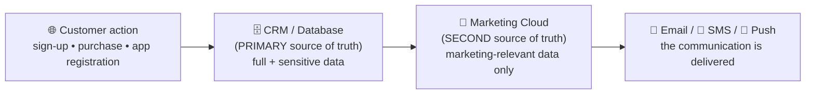
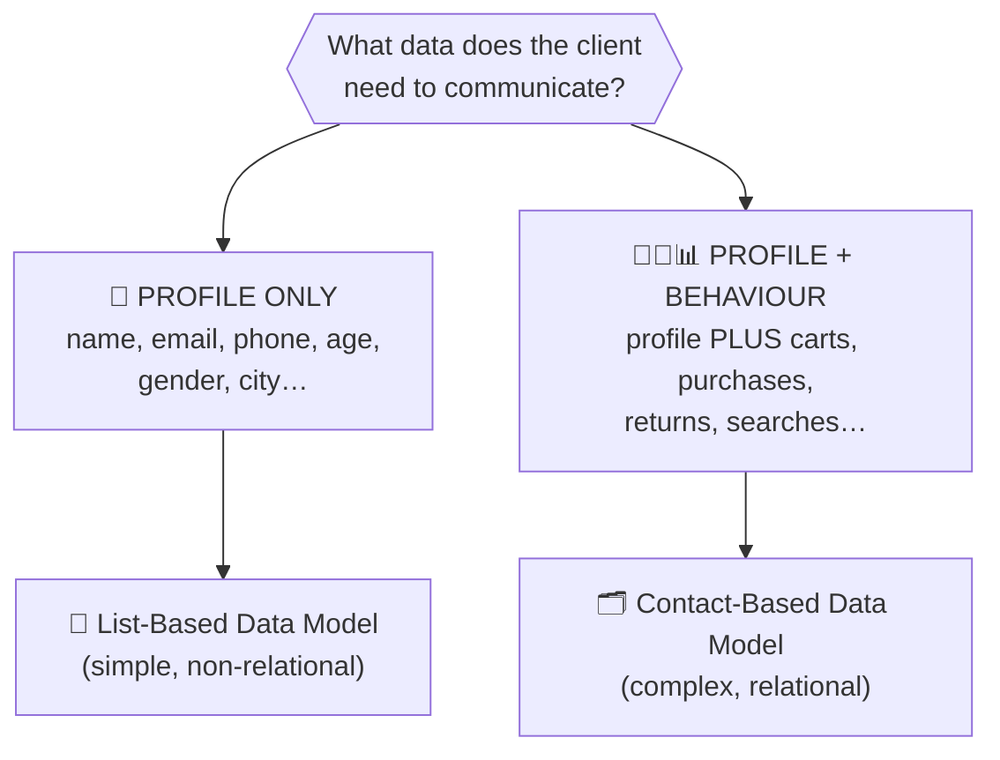
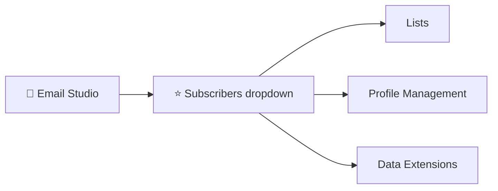
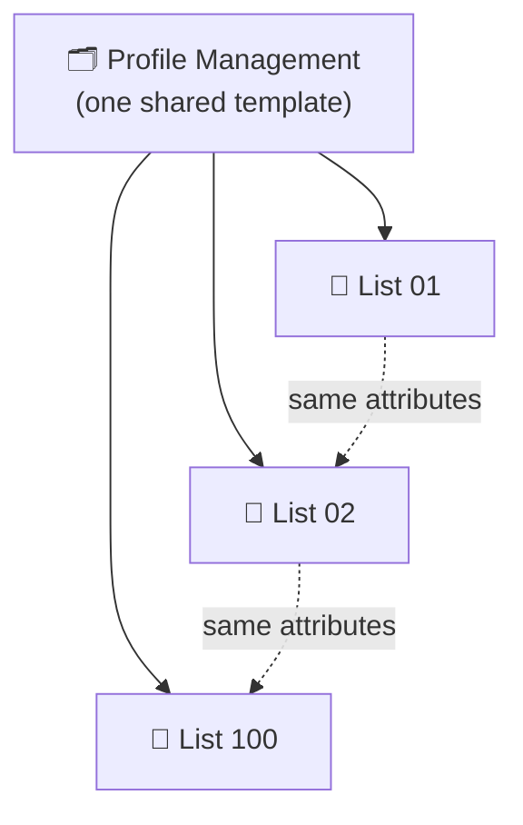
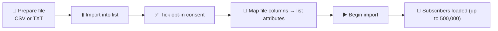
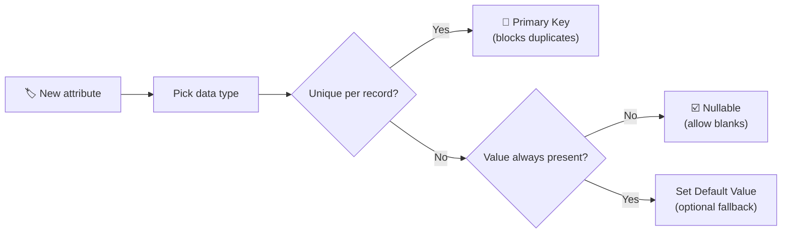
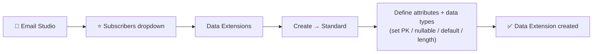

# 📙 Module 3 — Data Models: Lists & Data Extensions

> **Module goal:** Master the two data *containers* in Marketing Cloud. Learn why Marketing Cloud is *not* a database, how to read a client's **data requirements**, then go deep on both models side by side — the **List** (simple, non-relational) and the **Data Extension** (custom, relational) — their data types, field settings, and a full comparison.
>
> *These are my own study notes. Diagrams are original recreations of the lecture concepts. The raw course slides/manuals are kept in a separate private folder, not published here.*

> 🧭 **How this topic is split:** This module covers **what the tables are** (Lists & Data Extensions as containers). **Module 4** covers **how you connect and use them** — relationships, the Contact Model, sendable/shared data, and the invoice project that applies it all.

---

## 1. The Golden Rule: Marketing Cloud is NOT a Database

Before any data modelling, internalize this — it's the foundation everything else rests on, and a favourite interview trap.

> 🔑 **Marketing Cloud is a *marketing automation platform*, not a database and not a full CRM.** It does **not** hold sales/service records, and it is **not** the *first* place your data is born.

Data is *born* somewhere else — a website sign-up, an app registration, a purchase — and lands first in a **CRM or database** (the primary source of truth). Only the slice of data **needed to communicate** then flows *into* Marketing Cloud.

> ⚠️ **Never store sensitive data in Marketing Cloud.** If you're a bank, account numbers and passwords stay in the core banking system. What Marketing Cloud needs is only what's required to *reach* the customer — **email address, phone number, WhatsApp number** — plus whatever is needed to *personalize* the message.

> 🔑 **Interview one-liner:** Marketing Cloud is the **second source of truth**, a **receiver** of data used **for marketing purposes only** — it *sends* communications, it doesn't *originate* or *own* the master data.

---

## 2. Why the Data Model Comes First

Because data flows *in* from other systems, you must **recreate the right structure inside Marketing Cloud to receive it**. As a consultant, your very first job on any project is to understand the **client's data requirements** before building anything.

Different industries carry very different data:

- **E-commerce** — orders, carts, browsing, returns
- **Pharmaceutical / healthcare** — health metrics, activity, adherence
- **Media & entertainment** — subscriptions, content preferences
- **Manufacturing** — operational and back-office data

> 🔑 **Key point:** You don't need to be a domain expert in *pharma* or *insurance*. You need to answer one question: **what data does this client need to send its communications, and how should that data be structured inside Marketing Cloud?**

---

## 3. Two Kinds of Businesses → Two Data Models

For Marketing Cloud purposes, every business falls into one of two buckets, and that choice drives which data model you use.

| | **Profile-only business** | **Profile + Behaviour business** |
|---|---|---|
| **Example** | A news site — sends everyone current-affairs updates; your age/behaviour doesn't change what they send | An e-commerce store — what it sends depends on what you carted, bought, returned, or searched |
| **Data needed** | Basic profile: name, email, phone, age, gender, city | Profile **plus** unlimited, ever-changing behaviours |
| **Data model** | **List-Based** (single table, simple) | **Contact-Based** (many related tables) |

> 🔑 **Key point:** **Behaviours are endless** — every new website feature creates a new behaviour you can't predict. Simple profile data fits a single table; behavioural data needs a **relational** structure. That's the whole reason two data models exist.

---

# PART A — The List-Based Data Model 📄

## 4. The List — Overview

The **List** is Marketing Cloud's **simple, default, non-relational** data model, built to store **customer profiles only**.

The five properties every interviewer expects you to know:

| # | Property | Detail |
|---|---|---|
| 1 | **Non-relational** | A single, standalone table — you can't link one list to another |
| 2 | **Common profile template** | *Every* list shares the same attribute template (managed in Profile Management) |
| 3 | **Email Studio only** | Lists exist **only** inside Email Studio — not Mobile Studio, not other studios |
| 4 | **500,000 subscriber limit** | A single list holds up to **500,000 (5 lakh)** subscribers; beyond that you create another list |
| 5 | **Only 3 data types** | Attributes can be **Text, Numeric, or Date** — nothing else |

> ⚠️ **Why only 3 data types is a real limitation:** you *can't* cleanly store a bill of **Rs 2,750.75** (needs a **Decimal**), a *purchased? yes/no* flag (needs a **Boolean** for decisions), or a country **ISO code** like `PK`/`US` (needs a **Locale**). Lists simply weren't built for behaviour — only profile.

---

## 5. Subscribers & GDPR — The Compliance Foundation

A list stores **subscribers**. Understanding what a subscriber *is* comes before anything technical.

> 🔑 **A subscriber is a person who has *opted in* — given you permission to communicate with them.** You may **never** load data you scraped, bought, or otherwise obtained without consent.

**Ways people legitimately become subscribers:**

- A **sign-up / subscription form** on your website
- **Lead / inquiry forms** from Google, Facebook, Instagram ads
- **Offline collection** — sign-ups at malls, events, or in-store (then fed into the system)
- Giving an email in exchange for an **e-book, discount, or promotion**

> ⚠️ **GDPR compliance:** The **General Data Protection Regulation** says you cannot hold or message a person's personal data without their knowledge and consent. Load non-opted-in data and someone can prove they never subscribed — exposing you and your company to lawsuits and heavy penalties. Every import in Marketing Cloud forces you to tick an **opt-in consent** checkbox for exactly this reason.

> 💡 **Also worth knowing — "All Subscribers":** Marketing Cloud keeps a master list called **All Subscribers** — the single roll-up of *every* subscriber in the account across all lists. Each person appears there once, keyed by their **Subscriber Key**.

---

## 6. Creating a List (Email Studio)

Because lists live in Email Studio, that's where you build them.

> 🔑 **Exam gold:** The instructor's rule of thumb — *the **Subscribers dropdown** in Email Studio is worth ~50% of Marketing Cloud interview questions.* Master everything inside it: **Lists, Profile Management, Data Extensions.**

**Steps to create a list:** Email Studio → **Subscribers → Lists** → (optionally right-click *My Lists* → **New Folder** to stay organized) → **Create** → name it → **Save**.

Open the new list and you'll find **attributes already there** — Email Address, Subscriber Key, Status, Created Date, and more. You never defined them… so where did they come from?

> 🔑 **Because a list is a *default* data model, Salesforce pre-builds a standard profile template for it.** You weren't asked what to store — the profile attributes come ready-made. This is the visible proof of property #2 (common template).

---

## 7. Profile Management — Where List Attributes Live

Every list's attributes are controlled centrally in **Subscribers → Profile Management**.

- It ships with **default attributes** (Email Address, First Name, Last Name, and system defaults).
- You can **add or remove custom attributes** here — and whatever you change applies to **every list** in the account.
- New custom attributes can only be **Text, Numeric, or Date** (property #5 again).

> 🔑 **This proves lists are non-relational.** Because *all* lists inherit one common profile template, List 01 and List 02 hold the **same kind of data** (profile). You can't put *profile* in one and *purchase history* in another — so there's nothing to relate. Same template ⇒ no relationships ⇒ non-relational.

> 💼 **Interview Q — "How do you modify the attributes of a list?"**
> → Go to **Email Studio → Subscribers → Profile Management**, then add/modify attributes (Text, Numeric, or Date only). You don't edit attributes on the list itself.

---

## 8. Subscriber Key — the Unique Identifier

Every subscriber needs a unique ID. In Marketing Cloud that's the **Subscriber Key**.

- Two attributes are **mandatory and non-deletable** on every list: **Email Address** and **Subscriber Key**.
- Think of it like a roll number, registration number, or employee ID — one unique value per person.

> ⚠️ **Marketing Cloud does NOT generate the Subscriber Key.** Since MC is the *second* system, the key usually comes from the *primary* system:
> - In a Salesforce CRM flow, a record starts as a **Lead** with a **Lead ID**; that Lead ID becomes the Subscriber Key when the data flows to Marketing Cloud.
> - If you're a small business using MC as your *only* system (no CRM/DB), you can simply use the **email address as the Subscriber Key**.

> 💼 **Interview Q — "What is a Subscriber Key and who generates it?"**
> → A unique identifier for each subscriber. Marketing Cloud does **not** auto-generate it; it comes from the upstream CRM/database, or you use the email address when MC is the sole system.

---

## 9. Adding Subscribers — Manual & Bulk Import

**Manually:** in the list, click **Create** → **Next** → supply the two mandatory fields (**Subscriber Key** + **Email Address**), optionally fill custom attributes → **Next** → **Finish**. Refresh to see the new subscriber.

**Bulk (the real-world way):**

Key facts interviewers ask about the import:

- **Supported file types:** **CSV** and **TXT** only.
- **File size limit:** up to **20 MB** from your computer (larger files use other methods, covered later).
- **Consent gate:** you must tick the **opt-in agreement** confirming every address gave express permission (GDPR).
- **Mapping:** file columns map to list attributes; exact-name matches auto-map. *Watch spacing* — "Subscriber Key" (with a space) won't auto-map to a file column named "SubscriberKey"; map those manually.

> 💡 **Import types** (you'll pick one): **Add & Update** (adds new, updates existing) and **Overwrite** (clears the list and loads fresh) are the two you'll use most.

---

## 10. Where Lists Fall Short → Data Extensions

Lists are perfect for a **small, local, profile-only** business. But they hit a wall for anyone needing behaviour:

- ❌ **Email Studio only** — useless for Mobile Studio SMS/push
- ❌ **500,000-subscriber cap** — too small for a multinational (L'Oréal, Nike, Nestlé… easily exceed this)
- ❌ **Only 3 data types** — can't store decimals, booleans, or locale codes, so behaviour is off-limits
- ❌ **One shared template** — every list is forced to hold the same profile shape

The fix for all four is the **Data Extension** — the second container, and the rest of this module.

---

# PART B — Data Extensions 🗂️

## 11. What a Data Extension Is

> 🔑 **A Data Extension is a *custom table* in Marketing Cloud** (some call it a *custom object*). Because *you* define its structure, you can build different tables for different purposes — profile in one, transactions in another, product data in a third.

Behaviours differ by industry (a pharma app tracks steps and adherence; an e-commerce app tracks carts and returns), so there can be **no fixed template** for behaviour — which is exactly why data extensions are **custom**.

> 💡 **Mental model:** A **Data Extension is a *custom* table.** A **List is a *standard* table** — still a table, just a fixed, pre-templated one. Same idea (a table of records); the difference is whether *you* get to design the columns.

---

## 12. Data Extension Properties (Interview-Critical)

| Property | Detail |
|---|---|
| **Custom structure** | No predefined template — you choose every attribute |
| **Relational** | Can be linked (1:1, 1:many) via a shared key *(architecture in Module 4)* |
| **No record limit** | Store unlimited records (no 500,000 cap) |
| **~8 data types** | Text, Number, Date, **Boolean, Email Address, Phone, Decimal, Locale** |
| **Available everywhere** | Part of the **centralized** data model — all studios & builders |
| **Field length up to 4,000** | Max characters for a field value is **4,000** |

---

## 13. The 8 Data Types — and Why the Right One Matters

Choosing the correct data type isn't cosmetic; the platform *behaves* differently per type.

| Data Type | Use it for | Why it matters |
|---|---|---|
| **Text** | Names, free text, IDs | Default; length defaults to 50 (raise up to 4,000) |
| **Number** | Age, quantity | Whole numbers |
| **Decimal** | Bill / price (Rs 2,750.75) | You set precision — left up to 18 digits, right e.g. 2 → `2750.75` |
| **Date** | Transaction date | Can capture date **and** time |
| **Boolean** | Purchased? true/false | Enables **decisioning** in journeys |
| **Email Address** | Subscriber's email | So MC *knows* it's an email to send to — not just text |
| **Phone** | Subscriber's phone | So MC can send **SMS/push** — a phone is **not** a Number |
| **Locale** | Country ISO code (`PK`, `US`, `JP`) | Region-aware formatting/targeting |

> ⚠️ **Two classic "gotchas" interviewers test:**
> - **Phone ≠ Number.** If you store a phone as *Number*, Marketing Cloud can't tell it's a dialable number for SMS/push. Use the **Phone** type.
> - **Email ≠ Text.** If email sits in a *Text* field, the system can't distinguish it from a first name. Sends look for a field typed **Email Address**. (Note: a **List** only allows *one* email field, in Profile Management — but a **Data Extension** lets you create many.)

---

## 14. Field Settings — Primary Key, Nullable, Default, Length

When defining each attribute, four settings do a lot of work:

- **Primary Key** — marks a field as unique; **prevents duplicate records**. (A list's Subscriber Key is a primary key by default; a DE has **no** default primary key because it's built from scratch — you set your own, often Subscriber Key.)
- **Nullable** — if checked, the field may be **blank**; if unchecked, that field is **required** on every record. *Leave one required field empty in your file and the whole import fails.*
- **Default Value** — a fallback used when no value is supplied (e.g. default First Name → `Guest`; or a **Date** field defaulting to the **current date/time**).
- **Length** — text defaults to **50** characters; raise it when needed (e.g. **4,000** for a long image URL).

> 💼 **Interview Q — "Maximum character limit for a data-extension field?"** → **4,000 characters.** (An import row exceeding it will be skipped.)

---

## 15. Types of Data Extensions

When you click **Create**, you choose a type:

| Type | What it is |
|---|---|
| **Standard** | A normal, empty custom table you define from scratch — **the default you'll use most.** |
| **Filtered** | A subset auto-populated from a *source* DE using filter criteria (e.g. "customers in Pakistan"). |
| **Random** | A random sample drawn from a source DE (handy for A/B test splits). |
| **From Template** | A new DE pre-structured from a saved template. |
| **Synchronized (Salesforce DE)** | Mirrors CRM objects into MC via **Marketing Cloud Connect** (advanced). |

> To build one from scratch, pick **Standard** → name it → keep defaults → define attributes + data types → **Create**.

> 💡 You can create data extensions from **Email Studio** (as above), but the *centralized* home for them — where they get linked into the contact model — is **Contact Builder**, covered in Module 4.

---

## 16. List vs Data Extension — Full Comparison ⚖️

The single most-tested comparison in the whole data-model topic:

| Feature | 📄 **List** | 🗂️ **Data Extension** |
|---|---|---|
| Structure | Standard (fixed template) | **Custom** |
| Relationships | ❌ Non-relational | ✅ **Relational** (1:1, 1:many) |
| Availability | Email Studio only | **All** studios & builders |
| Record limit | **500,000** | **Unlimited** |
| Data types | 3 (Text, Numeric, Date) | **~8** (adds Boolean, Decimal, Email, Phone, Locale) |
| Template | One shared profile template | None — you design it |
| Primary key | Subscriber Key (default) | You define (none by default) |
| Best for | Small, local, **profile-only** business | **Behaviour-rich**, large, multi-channel business |

---

## 🎯 Key Takeaways

1. **Marketing Cloud is not a database or CRM** — it's the **second source of truth**, holding marketing-relevant data only, never sensitive data.
2. **Always start with the data model** — understand the client's data requirement before building.
3. **Two business types → two containers:** profile-only → **List**; profile + behaviour → **Data Extension**.
4. **List = simple, non-relational, Email-Studio-only, 500,000 cap, 3 data types (Text/Numeric/Date), one shared template.** Managed via **Profile Management**; mandatory fields Email Address + Subscriber Key; **MC doesn't generate the Subscriber Key**.
5. **Subscribers must be opted-in** — **GDPR**, enforced by the consent checkbox. Imports accept **CSV/TXT up to 20 MB**.
6. **Data Extension = custom, relational, available everywhere, no cap, ~8 data types, no forced template.**
7. **Pick the right data type deliberately** — Phone ≠ Number, Email ≠ Text — and mind field settings (Primary Key, Nullable, Default, **4,000-char** length).
8. **DE types:** Standard, Filtered, Random, From Template, Synchronized.

---

## 💼 Interview Questions (with model answers)

- **Q: Is Marketing Cloud a database?**
  A: No. It's a **marketing automation platform** and the **second source of truth** — a receiver of marketing-relevant data, not the primary owner. Sensitive data stays in the CRM/database.

- **Q: What are the data models in Marketing Cloud?**
  A: Two — the **List-Based** data model (simple, non-relational) and the **Contact-Based** data model (relational, built on Data Extensions).

- **Q: What is a List-Based data model?**
  A: A simple, **non-relational** model storing **profiles only**, using a **shared template**, **Email-Studio-only**, up to **500,000** subscribers, with just **3 data types** (Text, Numeric, Date).

- **Q: Who is a "subscriber," and what is GDPR compliance?**
  A: A person who has **opted in** to your communications. **GDPR** (General Data Protection Regulation) forbids holding/messaging personal data without consent — MC enforces an opt-in confirmation on every import.

- **Q: What is a Subscriber Key, and does Marketing Cloud generate it?**
  A: A **unique identifier** per subscriber. MC does **not** generate it — it comes from the upstream CRM/database (e.g. a Lead ID), or you use the **email address** when MC is the only system.

- **Q: How do you modify the attributes of a list?**
  A: Via **Email Studio → Subscribers → Profile Management** (custom attributes limited to Text, Numeric, Date).

- **Q: What file types can you import, and what's the size limit?**
  A: **CSV** and **TXT**, up to **20 MB** from your computer.

- **Q: What is the difference between a List and a Data Extension?**
  A: A **List** is a standard, non-relational, Email-Studio-only table (500k cap, 3 data types, shared template). A **Data Extension** is a **custom, relational** table available across all studios/builders with no record cap and ~8 data types.

- **Q: What is a Data Extension, and how many data types does it support?**
  A: A **custom table (object)** with a structure you define; about **8** data types — Text, Number, Date, Boolean, Email Address, Phone, Decimal, Locale.

- **Q: Why can't you store a phone number as a Number type?**
  A: MC wouldn't recognize it as a dialable number for SMS/push — use the **Phone** data type.

- **Q: What's the maximum character limit of a data-extension field?**
  A: **4,000 characters** — rows exceeding it are skipped on import.

- **Q: What is a Primary Key, and does a DE have one by default?**
  A: A field marked unique to **prevent duplicates**. A DE has **no default** primary key (unlike a list's Subscriber Key) — you define your own.

- **Q: What are the types of data extensions?**
  A: **Standard, Filtered, Random, From Template,** and **Synchronized (Salesforce) DE**.

---

## 🔁 Quick-Recall Flashcards

- **Q:** Is Marketing Cloud the first place data lives? → **A:** No — second source of truth (marketing data only).
- **Q:** Two data models? → **A:** List-based (non-relational) and Contact-based / Data Extensions (relational).
- **Q:** List subscriber limit? → **A:** 500,000 (5 lakh) per list.
- **Q:** List data types? → **A:** Text, Numeric, Date (only 3).
- **Q:** Lists available in which studio? → **A:** Email Studio only.
- **Q:** A subscriber is…? → **A:** Someone who opted in.
- **Q:** GDPR full form? → **A:** General Data Protection Regulation.
- **Q:** Two mandatory list attributes? → **A:** Email Address and Subscriber Key.
- **Q:** Does MC generate the Subscriber Key? → **A:** No.
- **Q:** Where are list attributes managed? → **A:** Profile Management.
- **Q:** Import file types & size? → **A:** CSV/TXT, up to 20 MB.
- **Q:** Data Extension in one line? → **A:** A custom, relational table.
- **Q:** How many DE data types? → **A:** ~8 (adds Boolean, Decimal, Email, Phone, Locale).
- **Q:** Store money / yes-no / phone as? → **A:** Decimal / Boolean / Phone.
- **Q:** Max DE field length? → **A:** 4,000 characters.
- **Q:** DE types? → **A:** Standard, Filtered, Random, From Template, Synchronized.

---

## 📖 Glossary

| Term | Meaning |
|---|---|
| **Data Model** | The structure used to store and relate data inside Marketing Cloud. |
| **Source of Truth** | The authoritative system for a piece of data; MC is the *second* (marketing) source. |
| **List-Based Data Model** | Simple, non-relational model for customer profiles; Email-Studio-only. |
| **List** | A single, standalone table of subscriber profiles (max 500,000). |
| **Subscriber** | A person who has opted in to receive communications. |
| **Subscriber Key** | Unique identifier for a subscriber; not generated by MC. |
| **Profile Management** | The shared attribute template controlling all lists' attributes. |
| **All Subscribers** | The master list rolling up every subscriber in the account. |
| **GDPR / Opt-in** | General Data Protection Regulation; explicit consent to be contacted. |
| **Contact-Based Data Model** | Relational model built on Data Extensions. |
| **Data Extension (DE)** | A custom, relational table (object) in Marketing Cloud. |
| **Data Type** | The kind of value a field holds (Text, Number, Date, Boolean, Email Address, Phone, Decimal, Locale). |
| **Decimal / Boolean / Locale** | Numeric-with-precision / true-false / region-ISO field types. |
| **Primary Key** | A field marked unique to prevent duplicate records. |
| **Nullable** | A field allowed to be blank. |
| **Default Value** | Fallback value used when none is supplied (e.g. current date). |
| **Length** | Max characters for a field (text default 50; max 4,000). |
| **Standard / Filtered / Random DE** | DE creation types: from scratch / filtered subset / random sample. |
| **Synchronized DE** | A DE mirroring CRM data via Marketing Cloud Connect. |

---

*End of Module 3. Next: **Module 4 — Contact Model & Data Architecture** — relationships, Contact Builder, sendable vs non-sendable, shared vs isolated data, retention, and the start of the Invoice Transaction project.*
