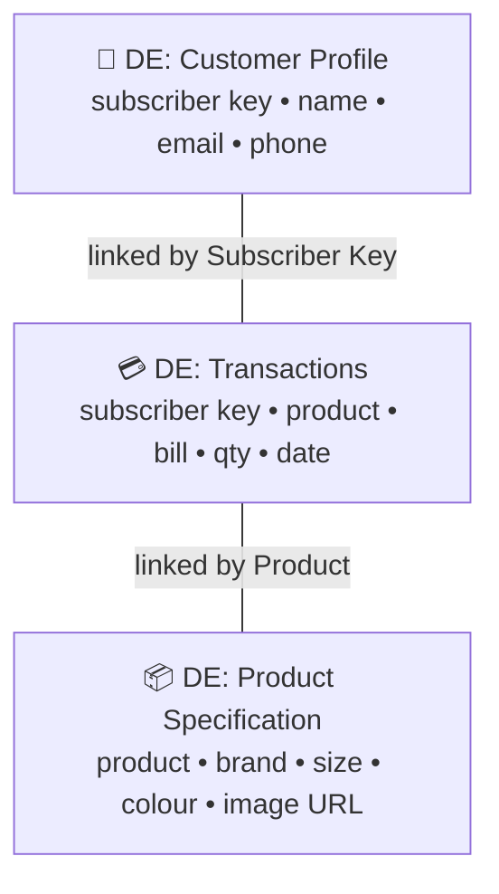
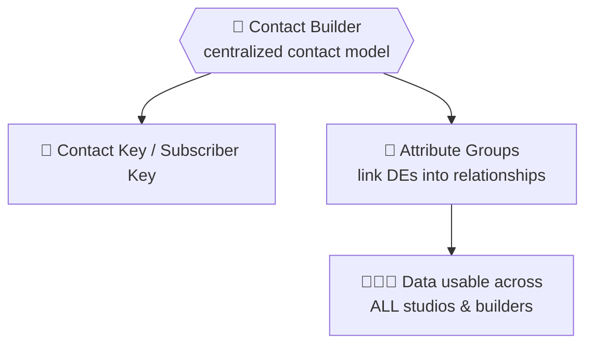
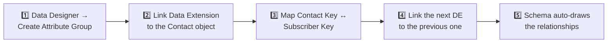
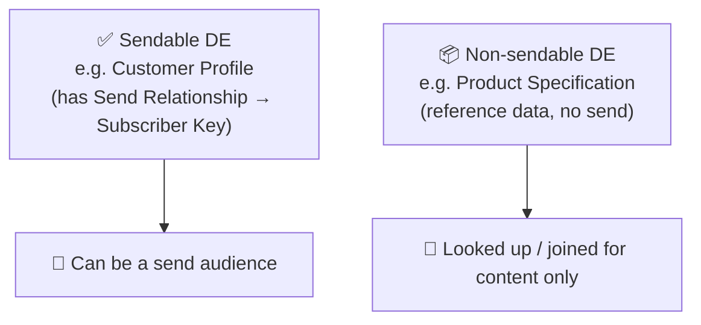
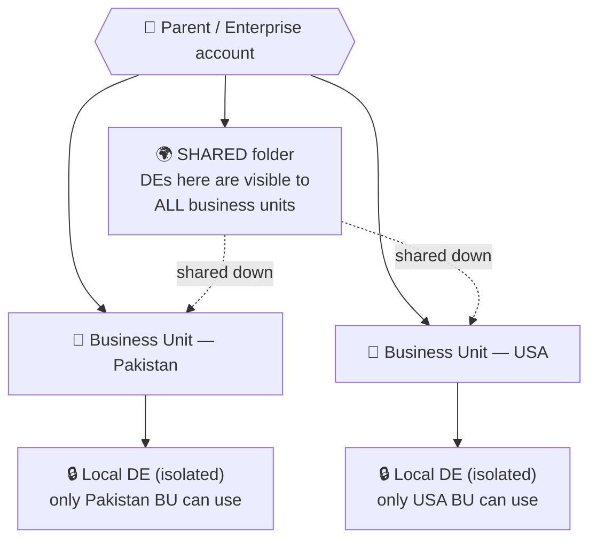
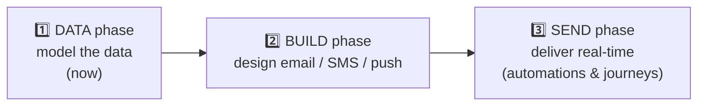
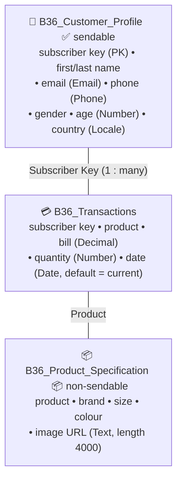

# 📙 Module 4 — Contact Model & Data Architecture

> **Module goal:** Now that you know the two *containers* (Module 3), learn how to **connect and use them**. Cover **relationships** between data extensions, the **Contact Model** in Contact Builder, **sendable vs non-sendable** DEs, **shared vs isolated** data, and **retention** — then apply all of it by starting the **Invoice Transaction project**.
>
> *These are my own study notes. Diagrams are original recreations of the lecture concepts. The raw course slides/manuals are kept in a separate private folder, not published here.*

> 🧭 **Recap of the split:** Module 3 covered **what the tables are** (Lists & Data Extensions). This module covers **how you architect and use them** — the relationships and platform-level concepts that turn a pile of tables into a working data model, ending with the project that ties it together.

---

## 1. From Tables to Architecture

A data extension on its own is just a table. The *power* of the contact-based model comes from **linking** tables so one subscriber's profile, transactions, and product data all connect.

> 🔑 **Key point:** Lists *can't* do this — every list shares one template, so there's nothing distinct to relate. Data extensions are **custom**, so two tables can hold *different* data about the *same* subscriber and be joined by a shared key. That join is what makes the model **relational**.

---

## 2. Relationships Between Data Extensions

Because you control each DE's structure, you can define how they relate:

| Relationship | Meaning | Example |
|---|---|---|
| **1 : 1** | One row here ↔ one row there | One subscriber ↔ one loyalty record |
| **1 : many** | One row here ↔ many rows there | One subscriber ↔ many transactions |

> **Use case:** In our project, **one customer** (Customer Profile) can have **many transactions** (Transactions DE) — a classic **1-to-many**. They link on **Subscriber Key**: the same key identifies the person in both tables, so MC can pull "all of *this* customer's orders" when building their invoice.

> 🔑 The shared key is the hinge of the whole model. Get the keys right and everything downstream — personalization, journeys, sends — just works.

---

## 3. Contact Builder — the Centralized Contact Model

The lecture creates data extensions inside **Email Studio**, which works — but the *centralized* contact-based model is properly governed in **Contact Builder**.

> 🔑 **Contact Builder** is where you see every contact and design the **Contact Model** — linking data extensions together with **Attribute Groups** and relationships so **all channels** share one unified view of the contact.

- **Contact Key** (Contact Builder) is the account-wide unique identifier for a *contact*; it aligns with the **Subscriber Key** used in Email Studio.
- Data extensions created anywhere can be **linked in Contact Builder** to form the relational model that powers **every** studio and builder — not just email.

> 💡 **Email Studio vs Contact Builder for DEs:** you can *create* a DE in Email Studio, but to *relate* DEs into a single contact model used platform-wide, you work in **Contact Builder**. Think: Email Studio = one channel's view; Contact Builder = the whole-contact view.

### Building the Contact Model in Data Designer — step by step

Inside **Contact Builder → Data Designer** you turn a set of standalone data extensions into a linked model using **Attribute Groups**. The engine is a system super-object called **Contact**.

> 🔑 **What is the Contact object?** A **system-defined super-object** that binds all your data extensions together. Data extensions are *custom* objects; **Contact** is the single built-in object every DE links to, so Marketing Cloud understands that scattered tables all describe the **same person**.

1. **Create an attribute group** — Data Designer → *Create Attribute Group* (e.g. `B36_Group`). An **attribute group** is simply the container that links related data extensions into one model.
2. **Link the first DE to Contact** — pick your **profile** DE and link it to the **Contact** object, mapping **Contact Key ↔ Subscriber Key**. Save. Your first DE is now part of the contact model.
3. **Chain the related DEs** — link **Transactions** to **Customer Profile** on **Subscriber Key** (same person → their orders), then link **Product Specification** to **Transactions** on **Product** (the ordered product → its details).
4. **Read the schema** — Data Designer auto-draws the model. Hover a join to confirm the linking key (Profile↔Transactions on *Subscriber Key*; Transactions↔Product on *Product*; Contact↔Profile on *Subscriber Key*).

> 🔑 **Why it matters:** you already *know* the tables relate — but the **system doesn't** until you declare it here. Attribute groups are how you *tell the system* the relationships, turning three loose DEs into one queryable, cross-channel contact model. (Expect *"What is an attribute group?"* in interviews.)

> **Use case:** with the model wired, a journey or email can start from one **Contact** and automatically pull *their* profile, *their* transactions, and each order's *product details* — no manual joining. That single unified view is the entire point of the contact model.

---

## 4. Sendable vs Non-Sendable Data Extensions

Not every data extension is one you can *send email to*. This is a top interview topic and shows up directly in our project.

> 🔑 **Sendable DE** = can be used as a *send audience*. It needs a **Send Relationship**: a field in the DE (e.g. Subscriber Key) mapped to the **Subscriber Key on the All Subscribers list**, so Marketing Cloud knows *who* each row represents.
> **Non-sendable DE** = pure storage/reference — you never send to it directly.

> 🔗 **Deep-dive:** *how* a sendable DE's records actually reach the All Subscribers master list (it takes sendable **plus** a first send) is covered in **Module 5 — Subscribers, Status & Deliverability**.

> **Use case (our project):** **Customer Profile** is **sendable** — its rows *are* real subscribers, so you can send invoices to it. **Product Specification** is **non-sendable** — it just supplies product name, colour, and image, looked up while building the message. A DE can also be **Testable** — usable for test sends.

---

## 5. Retention Policies

Data extensions can **auto-clean themselves** with a **retention policy**: delete individual records, all records, or the entire DE after a set period.

> 🔑 **Why it matters:** transactional/behavioural data piles up fast. Retention keeps storage lean and supports **data-privacy/GDPR** obligations (don't keep personal data longer than needed).

> **Use case:** OTP or password-reset transaction rows have no long-term value — set retention to **purge them after 30 days**. Your DE stays lean and you're not hoarding personal data you no longer need.

---

## 6. Isolated vs Shared Data (Enterprise 2.0)

This concept lives in **Enterprise 2.0** accounts (the parent + business-unit structure from Module 2). It answers: *who can see and use a given data extension?*

> 🔗 **Back-reference:** We introduced this idea conceptually in **Module 2 (Sharing vs Isolating Data Across Business Units)** — *reference data everyone reuses gets shared; personal/market-specific data stays isolated.* This section is the **mechanic** behind that idea: it's implemented on **data extensions**.

| | **Shared Data Extension** | **Isolated (Local) Data Extension** |
|---|---|---|
| **Where it's created** | In the **Shared** folder at the parent/enterprise level | Inside a **specific business unit** |
| **Who can access it** | **All** business units | **Only** that one business unit |
| **Use it when** | Reference data everyone needs — e.g. a **global product catalogue** all country BUs reuse | Market-specific data — e.g. **Pakistan-only** subscribers a US BU shouldn't touch |

> **Use case:** A retailer sells the *same* products in Pakistan, the USA, and the UAE, so the **product catalogue** is a **shared** DE — built once, reused by every BU, never out of sync. But each country's **customer list** is an **isolated** DE — the Pakistan team can't see USA customers, honouring different privacy laws and consent. *Reference data → share; personal/market data → isolate.*

---

## 7. The Invoice Transaction Project 🧾

Our running project for the rest of the course, and the worked example that applies everything above. It proves Marketing Cloud's *transactional* superpower: when a customer transacts on the website, an **invoice is auto-triggered in real time** — no manual work, even at millions of transactions per minute, each invoice personalized.

> 🔑 **Reminder — what a transaction is:** an **action → immediate response** (sign-up → confirmation email; forgot-password → OTP; ATM withdrawal → balance SMS). A New-Year promo blast is **not** a transaction (no user action triggered it).

### The three project phases

### Phase 1 — three related data extensions

An invoice needs three kinds of data, so we build three **related** DEs (impossible with lists, which share one template):

**Design decisions worth remembering (each maps to a concept above):**

- **Relationship:** **Subscriber Key** links Customer Profile ↔ Transactions as **1-to-many** (one customer, many orders).
- **Sendable vs non-sendable:** Customer Profile is **sendable**; Product Specification is **non-sendable** reference data.
- **Bill = Decimal** (e.g. Rs 2,750.75) — impossible in a list.
- **Transaction Date = Date with default `current date`** and **nullable**, so you *don't* pass it from the file — the moment a row lands, MC stamps the exact **date + time** (your transaction timestamp). Perfect for real-time invoices.
- **Image = Text, length 4,000** — you store the image **URL**, not the file. (One product got skipped on import because its URL exceeded 4,000 chars — the hard limit.)
- **Nullable where data may be missing** — e.g. some products lack an image, so **Image is nullable**; otherwise those rows would fail to import.

### Importing the data

Same flow as lists: prepare a **CSV**, **Import** into each DE, **map** columns (auto-maps on exact names; otherwise **map manually**), choose the import type.

> 💡 **Add & Update vs Overwrite:** *Add & Update* adds new rows and updates matching ones; *Overwrite* **deletes all existing records** and loads the file fresh. We used Overwrite to reload the product data after fixing the oversized image URL.

> 🔑 **Real-world caveat:** we imported manually for learning, but in production this data arrives from the **website in real time** — you never hand-key invoices. The manual import just lets us build and understand the model first.

---

## 8. Contact Deletion — the "Right to Be Forgotten"

A contact isn't just a row you can casually delete — Marketing Cloud has a **dedicated Contact Deletion** framework in Contact Builder, and it matters for privacy law.

> 🔑 **Contact Deletion** permanently removes a contact and *all* their data **across every data extension and channel** in the account (and its business units) — not just from one table. It's how you honour a **GDPR "right to be forgotten"** or CCPA deletion request.

How it behaves:

- You add contacts to a **deletion request**; MC first **suppresses** them, then permanently deletes over a **restriction (waiting) period** you configure.
- Deletion is **account-wide and irreversible** — the contact is scrubbed from all DEs linked to the contact model.
- It's controlled centrally in **Contact Builder → Contacts Configuration**, and must be **enabled** before use.

> ⚠️ **Don't confuse it with suppression/unsubscribe:** suppression and unsubscribe *stop sending* to someone who still exists; **contact deletion erases them entirely**. Use deletion only for genuine erasure requests.

> 💼 **Interview Q — "How do you fulfil a GDPR delete request in Marketing Cloud?"** → Use **Contact Deletion** in Contact Builder, which permanently removes the contact and their data across all data extensions after a restriction period — not a manual row delete.

---

## 🎯 Key Takeaways

1. **A lone data extension is just a table** — the model's power is **linking** DEs by a shared key (**relational**).
2. **Relationships** are **1:1** or **1:many** (one customer → many transactions), hinged on the **Subscriber Key**.
3. **Contact Builder** governs the **centralized contact model** (Contact Key, Attribute Groups) so data is usable across **all** studios & builders — not just email.
4. **Sendable vs non-sendable:** sendable DEs have a **Send Relationship** to Subscriber Key; non-sendable DEs are reference-only.
5. **Retention** auto-purges stale data — leaner storage and GDPR-friendly.
6. **Shared vs isolated:** shared DEs (parent) serve **all** BUs; isolated DEs stay **local** to one BU — reference data → share, personal data → isolate.
7. **Invoice project = Data → Build → Send**, starting with three related DEs (Customer Profile ✅sendable, Transactions, Product Specification 📦non-sendable) — a live application of every concept in this module.

---

## 💼 Interview Questions (with model answers)

- **Q: What makes the contact-based data model "relational"?**
  A: Data extensions are **custom**, so different tables can hold different data about the **same** subscriber and be **linked by a shared key** (e.g. Subscriber Key), enabling 1:1 and 1:many relationships. Lists can't — they share one template.

- **Q: Give an example of a 1-to-many relationship in Marketing Cloud.**
  A: **One customer → many transactions.** Customer Profile links to the Transactions DE on Subscriber Key.

- **Q: What is Contact Builder?**
  A: The centralized area that defines the **Contact Model** — linking data extensions via **Attribute Groups** and the **Contact Key** so contact data is usable across every studio and builder.

- **Q: What's the difference between a Contact Key and a Subscriber Key?**
  A: **Contact Key** is Contact Builder's account-wide unique identifier for a *contact*; **Subscriber Key** is Email Studio's identifier for a *subscriber*. They align to the same person in a unified model.

- **Q: Sendable vs non-sendable data extension?**
  A: A **sendable** DE has a **Send Relationship** (a field linked to Subscriber Key on All Subscribers) so it can be a send audience. A **non-sendable** DE is reference/storage only.

- **Q: What is a retention policy and why use it?**
  A: A rule that **auto-deletes** DE records/data after a set period — keeps storage lean and supports GDPR (don't keep personal data longer than needed).

- **Q: What is the difference between shared and isolated (local) data extensions?**
  A: **Shared** DEs are created at the parent/enterprise level and usable by **all** business units; **isolated/local** DEs live inside **one** business unit only.

- **Q: When would you share data vs isolate it?**
  A: **Share** reference data everyone reuses (e.g. a global product catalogue); **isolate** personal/market-specific data (e.g. each country's customers) for privacy and clarity.

- **Q: Difference between Add & Update and Overwrite on import?**
  A: **Add & Update** adds new records and updates existing ones; **Overwrite** deletes all current records and loads the file fresh.

- **Q: In the invoice project, why is Product Specification non-sendable?**
  A: Its rows are **products, not people** — it supplies content (name, colour, image) looked up while building the message; you never send email *to* it.

---

## 🔁 Quick-Recall Flashcards

- **Q:** What makes DEs relational? → **A:** Custom tables linked by a shared key.
- **Q:** One customer, many orders = which relationship? → **A:** 1-to-many.
- **Q:** Centralized contact model tool? → **A:** Contact Builder.
- **Q:** Contact Builder's unique identifier? → **A:** Contact Key (aligns with Subscriber Key).
- **Q:** Attribute Groups do what? → **A:** Link DEs into relationships in the contact model.
- **Q:** Sendable DE needs…? → **A:** A Send Relationship to Subscriber Key.
- **Q:** Non-sendable DE is for…? → **A:** Reference/storage only.
- **Q:** Retention policy does what? → **A:** Auto-deletes stale DE data.
- **Q:** Shared DE lives where? → **A:** Parent/enterprise Shared folder, usable by all BUs.
- **Q:** Isolated DE lives where? → **A:** Inside one business unit only.
- **Q:** Three project phases? → **A:** Data → Build → Send.
- **Q:** Three invoice-project DEs? → **A:** Customer Profile, Transactions, Product Specification.
- **Q:** Store an image in a DE how? → **A:** As a URL in a Text field (length up to 4,000).
- **Q:** Transaction date captured how? → **A:** Date field defaulting to current date/time (nullable, not passed from file).

---

## 📖 Glossary

| Term | Meaning |
|---|---|
| **Relationship (1:1, 1:many)** | How two data extensions link via a shared key. |
| **Contact Builder** | Centralized tool for the contact model, attribute groups, and Contact Key. |
| **Contact Model** | The linked set of data extensions forming one unified view of a contact. |
| **Attribute Group** | A Contact Builder grouping that links DEs into relationships. |
| **Contact Key** | Account-wide unique identifier for a contact (aligns with Subscriber Key). |
| **Sendable DE** | A DE with a Send Relationship, usable as a send audience. |
| **Non-sendable DE** | A reference/storage DE you never send to directly. |
| **Send Relationship** | The link mapping a DE field to Subscriber Key on All Subscribers. |
| **Testable DE** | A DE usable for test sends. |
| **Retention Policy** | Rule that auto-deletes DE records/data after a set period. |
| **Shared Data Extension** | A DE at the parent level accessible to all business units. |
| **Isolated / Local DE** | A DE confined to a single business unit. |
| **Enterprise 2.0** | The parent + business-unit account architecture where shared/isolated applies. |
| **Transaction** | An action that triggers an immediate response (not always monetary). |
| **Add & Update / Overwrite** | Import behaviours: merge new/updated rows / replace all rows. |

---

*End of Module 4. Next module: **Email Studio** — turning this data model into a real, dynamic invoice email (content blocks, dynamic content, and personalization with AMPscript).*
