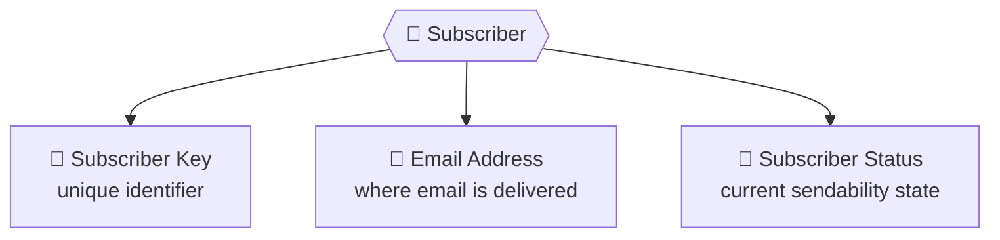
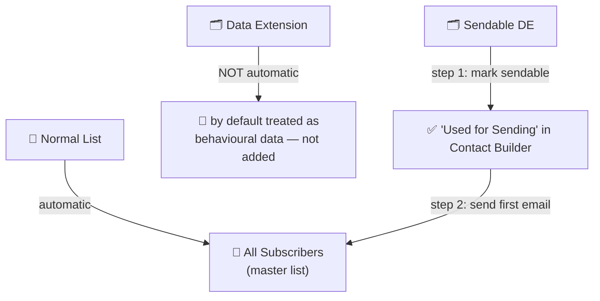
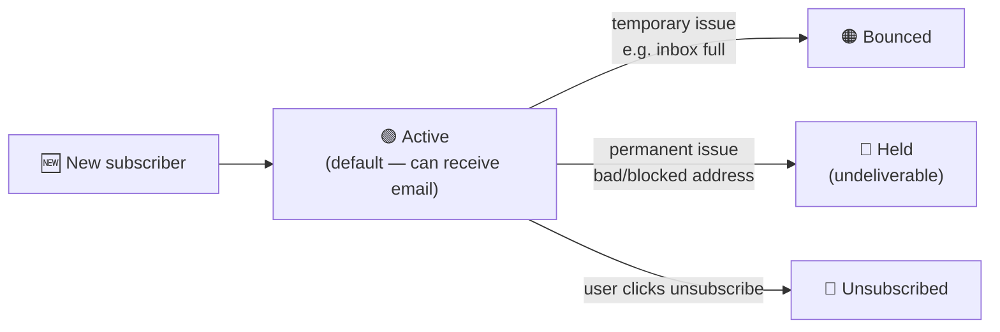
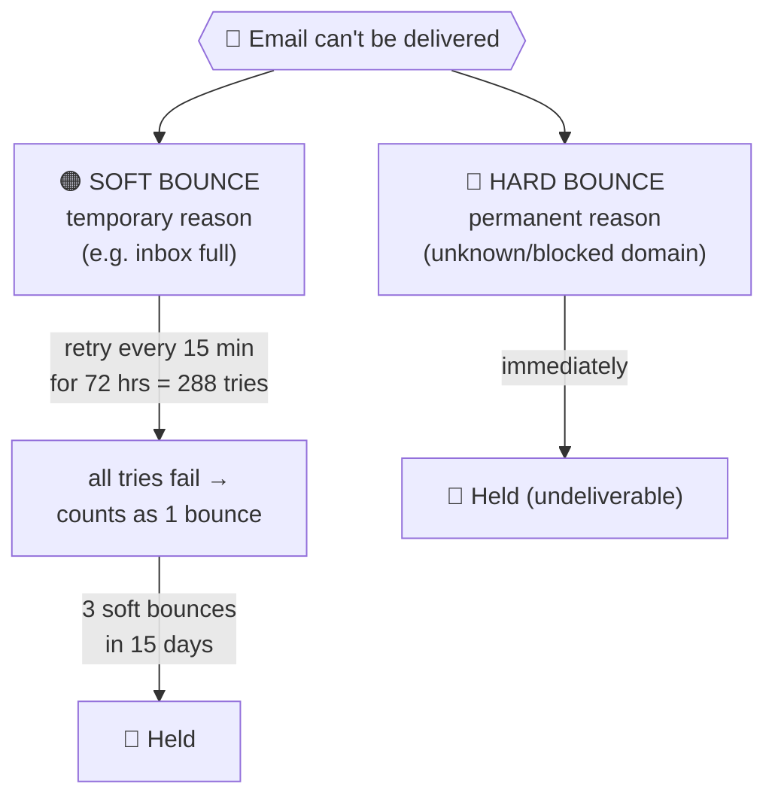
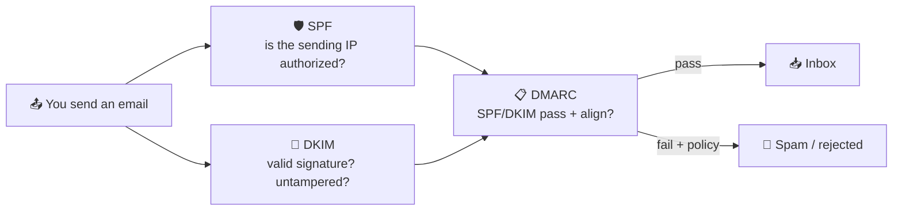

# 📕 Module 5 — Subscribers, Status & Deliverability

> **Module goal:** Understand the **subscriber** — Marketing Cloud's fundamental audience unit. Learn the **three properties** of a subscriber, the **All Subscribers** master list and how records reach it, the **four subscriber statuses**, and **bounce management** (soft vs hard, and the retry logic behind a status change).
>
> *These are my own study notes. Diagrams are original recreations of the lecture concepts. The raw course slides/manuals are kept in a separate private folder, not published here.*

---

## 1. What Is a Subscriber?

> 🔑 **A subscriber is any person who has *opted in* to receive your communications, and who exists in the All Subscribers list of your account.** They are the unit you send email (and other messages) to.

A subscriber can *originate* in two places (covered in Modules 3–4):

- a **List** (Email Studio), or
- a **sendable Data Extension**.

But wherever they originate, every subscriber ultimately lives in one master list — **All Subscribers** (Section 3).

---

## 2. The Three Properties of a Subscriber

Every subscriber in Marketing Cloud has **three default (system) properties**. This is a guaranteed interview question.

| Property | What it is | Notes |
|---|---|---|
| **Subscriber Key** | Unique identifier for the subscriber | **Not auto-generated** by MC — comes from the upstream CRM/DB (e.g. a Lead/Contact ID) or you use the **email address** when MC is your only system |
| **Email Address** | The address email is sent to | Must be present for any profile record you intend to email |
| **Subscriber Status** | The current *sendability* state | The focus of this module (Sections 4–6) |

> 💡 You can add unlimited **custom** properties (first name, age, country…) via Profile Management or DE attributes — but these **three** are the built-in ones the system always maintains.

---

## 3. The All Subscribers List — the Master List

> 🔑 **All Subscribers is the master list of every subscriber in the account.** Whether a person came from a normal list or a sendable data extension, they appear here **once**, keyed by Subscriber Key — and this is where their **status** is tracked. There is **no 500,000 cap** on All Subscribers.

**Find it:** Email Studio → **Subscribers → All Subscribers**.

### How records reach All Subscribers — the crucial mechanic

This is the part that trips people up, and it's a favourite interview question:

- **List records → added automatically.** A list can *only* hold profiles, so the system already trusts every list record is a subscriber and adds it to All Subscribers immediately.
- **Data-extension records → NOT added by default.** The system can't tell whether a DE holds *profiles* or *behaviour*, so it treats **every** DE as behavioural and does **not** create subscribers from it.

> ⚠️ **To get DE records into All Subscribers you need BOTH steps:**
> 1. **Make the DE sendable** ("Used for Sending" — edited in **Contact Builder**, because the DE is part of a data relationship), *and*
> 2. **Send the first email** to that DE.
>
> Marking sendable alone is **not** enough — the subscriber joins All Subscribers only when the **first message** is sent. A record that never reaches All Subscribers **cannot be emailed**.

> 🔗 **Cross-link:** the *sendable DE* concept and its Send Relationship are introduced in **Module 4 — Sendable vs Non-Sendable**. This module completes the story: *sendable + first send = joins All Subscribers.*

> **Worked example:** In our invoice project, `B36_Customer_Profile` holds real people, so we mark it **sendable** and send it a first email — now its rows appear in All Subscribers. `B36_Transactions` and `B36_Product_Specification` are behavioural/reference, stay **non-sendable**, and never populate All Subscribers (you'd never email a *product*).

---

## 4. Subscriber Status — the Four States

> 🔑 **Subscriber Status is the subscriber property that tells you whether Marketing Cloud can send to that person right now.** There are **four** statuses.

| Status | Meaning | Cause | Can you send? |
|---|---|---|---|
| 🟢 **Active** | Default state of every new subscriber | Created from a list or a sent-to sendable DE | ✅ Yes |
| 🟠 **Bounced** | Email keeps getting returned | **Temporary** (system) reason — e.g. inbox full | ⚠️ Only after bounce logic (Section 6) |
| 🔴 **Held** | Undeliverable / deactivated address | **Permanent** (system) reason — unknown/blocked domain, *or* repeated soft bounces | ❌ No |
| 🔴 **Unsubscribed** | Person opted out | **Subscriber** behaviour — clicked unsubscribe | ❌ No |

> 🔑 **System behaviour vs subscriber behaviour:** *Bounced* and *Held* are driven by the **system/mail server** (the subscriber has no control). *Unsubscribed* is a **subscriber choice**. Framing statuses this way is a clean interview answer.

> ⚠️ **Held has two causes:** (1) a straight **permanent failure** (address not found / domain blocked), or (2) **repeated soft bounces** over time (Section 6). Both end in *Held = undeliverable*.

---

## 5. Why Status Changes — the Two Failure Reasons

When you send, one of two kinds of problem can flip a subscriber off Active:

- **Temporary reason (soft):** the address is valid but *can't accept mail right now* — classic case, the **inbox is full**. Fixable later. Leads toward **Bounced**.
- **Permanent reason (hard):** the address *can't receive mail at all* — **wrong/misspelled domain** (e.g. `gmail.con`), address not found, or a **blocked/suspicious domain**. Leads straight to **Held**.

> **Everyday example:** Chasing a "25% off" coupon, someone types `ali@gmail.con` in a hurry. There's no such domain — the coupon email has nowhere to go, so that address goes **Held** immediately. Meanwhile a real address whose mailbox is simply full goes down the **soft-bounce** path instead.

---

## 6. Bounce Management — Soft vs Hard (Interview & Cert Critical)

A "bounce" is an email **returned to Marketing Cloud** because it couldn't be delivered. There are **two types**, and the *logic* behind them is a top certification question.

### Hard bounce — permanent, immediate

> 🔑 A **hard bounce** is a rejection for a **permanent** reason (unknown domain, address not found, blocked domain). The subscriber is marked **Held** straight away — **no retries**.

### Soft bounce — temporary, with retry logic

> 🔑 A **soft bounce** is a rejection for a **temporary** reason (e.g. inbox full). A single return does **not** immediately change status.

The retry mechanic — memorize these numbers:

- On a soft bounce, Marketing Cloud **retries every 15 minutes for 72 hours** — that's **288 attempts**.
- Only if **all 288 attempts fail** does it count as **one** (soft) bounce and flip the subscriber to **Bounced**.
- If **3 soft bounces occur within 15 days**, the address is treated as a **hard bounce** and the subscriber becomes **Held**.

> ⚠️ **The nuance interviewers probe:** a *single* failed delivery is **not** a bounce. One soft bounce = **288 failed retries over 72 hours**. Three such soft bounces inside 15 days → **Held**. Hard bounces skip all of this and hold the address at once.

> **Use case:** A customer's inbox is full during your Friday send. MC quietly retries every 15 minutes through the weekend (up to 288 times). If they clear space by Saturday, delivery succeeds and they stay **Active** — you never even noticed. If they never clear it, that's one soft bounce; three such episodes in 15 days and MC stops trying (**Held**) to protect your sender reputation.

---

## 7. Email Authentication & Deliverability — Getting to the Inbox

Statuses and bounces (above) tell you *what happened* to a send. **Deliverability** is about *preventing* the bad outcomes — proving you're a legitimate sender so mailbox providers (Gmail, Yahoo, Outlook) put you in the **inbox, not spam**. This is heavily tested on the cert and in interviews.

### 7.1 The three authentication protocols — SPF, DKIM, DMARC

> 🔑 Three DNS-based standards prove an email genuinely comes from your domain:
> - **SPF (Sender Policy Framework)** — a DNS record listing the **IP addresses/servers authorized** to send for your domain. The receiver checks the sending server against that list.
> - **DKIM (DomainKeys Identified Mail)** — adds a **cryptographic signature** so the receiver can verify the message really came from your domain **and wasn't tampered with** in transit.
> - **DMARC (Domain-based Message Authentication, Reporting & Conformance)** — a **policy** (`p=none` / `quarantine` / `reject`) that tells receivers **what to do** when SPF/DKIM fail, and where to send reports. DMARC passes when SPF *or* DKIM passes **and aligns** with the visible From domain.

> 💡 **DKIM is the more reliable pillar** in Marketing Cloud — forwarding can break SPF alignment, but the DKIM signature usually survives, so DMARC still passes via DKIM.

### 7.2 Sender Authentication Package (SAP)

> 🔑 The **Sender Authentication Package (SAP)** is the Salesforce add-on that lets you send **fully authenticated email from your own domain**. It bundles:
> - **Private/Dedicated Domain** — send from `email.yourbrand.pk` (not a shared Salesforce domain), with SPF/DKIM/DMARC configured for it
> - **Dedicated IP address** — your reputation is yours alone (vs the shared IP's ~250k/month cap and shared risk — Module 9)
> - **Reply Mail Management (RMM)** — handles replies (auto-replies, out-of-office, manual unsubscribe requests)
> - **Account Branding** — branded links and image paths on your own domain

> 💡 SAP is aimed at higher-volume senders (roughly **250,000+ emails/month**) who need their own authenticated domain and reputation.

### 7.3 IP Warming

> 🔑 **IP warming** = gradually ramping up send volume on a **new dedicated IP** so mailbox providers can build trust in it. A brand-new ("cold") IP sending a huge blast looks suspicious and gets filtered.

- Needed when you get a **new dedicated IP**, or one that's been **unused for ~a month**.
- You start with small, highly-engaged volumes and **increase gradually** over days/weeks.
- A dedicated IP needs roughly **250,000 emails/month** of consistent volume to hold a healthy reputation.

### 7.4 Modern mailbox-provider requirements (Gmail / Yahoo / Outlook)

> ⚠️ Since **February 2024**, Gmail and Yahoo enforce **bulk-sender rules** (Microsoft/Outlook followed in 2025), with escalating enforcement through 2025. For senders of **5,000+ emails/day** you must:
> - **Authenticate** with **SPF, DKIM, and DMARC** (aligned to your From domain)
> - Offer **one-click unsubscribe** (the RFC 8058 `List-Unsubscribe` header) on marketing email
> - Keep your **spam-complaint rate below 0.3%** (aim under 0.1%)
>
> Fail these and mail is **rejected outright**, not just filtered. Transactional email (invoices, OTPs) is exempt from the one-click-unsubscribe rule.

> 🔑 **Why this matters for a consultant:** deliverability is the difference between a campaign that lands and one that vanishes. Authentication (SAP + SPF/DKIM/DMARC), a warmed dedicated IP, clean opt-in lists, and low complaint rates are the levers you pull to protect it.

> 💼 **Interview Q — "What are SPF, DKIM, and DMARC?"** → SPF authorizes sending IPs, DKIM cryptographically signs the message, and DMARC sets the policy for what happens when SPF/DKIM fail (and reports on it). Together they prove the email is genuinely from your domain.
> **Q — "What is the Sender Authentication Package?"** → A Salesforce add-on giving you an authenticated private domain, a dedicated IP, Reply Mail Management, and account branding — for senders who need their own domain/reputation.
> **Q — "What is IP warming and when do you need it?"** → Gradually increasing volume on a new (or dormant) dedicated IP to build ISP trust and avoid spam filtering.

---

## 🎯 Key Takeaways

1. **A subscriber = an opted-in person who lives in All Subscribers.** They can originate in a list or a sendable DE.
2. **Three subscriber properties:** Subscriber Key, Email Address, Subscriber Status. (Subscriber Key isn't auto-generated by MC.)
3. **All Subscribers is the master list** (no 500k cap) and holds each subscriber's status.
4. **List records auto-join All Subscribers; DE records don't** — a DE must be **sendable** *and* receive a **first send** before its records join.
5. **Four statuses:** 🟢 Active (default), 🟠 Bounced (temporary/system), 🔴 Held (permanent/system), 🔴 Unsubscribed (subscriber choice).
6. **Two bounce types:** **hard** (permanent → Held immediately) and **soft** (temporary → retry **every 15 min for 72 hrs = 288 tries**).
7. **Held has two paths:** a permanent failure, or **3 soft bounces in 15 days**.

---

## 💼 Interview Questions (with model answers)

- **Q: What is a subscriber?**
  A: A person who has **opted in** to your communications and exists in the **All Subscribers** list. They can be created from a list or a sendable data extension.

- **Q: What are the properties of a subscriber?**
  A: Three default ones — **Subscriber Key**, **Email Address**, and **Subscriber Status** (plus any custom attributes).

- **Q: What is the All Subscribers list?**
  A: The **master list** of every subscriber in the account, where each appears once (by Subscriber Key) and where **status** is tracked. It has **no 500,000 cap**.

- **Q: Why don't data-extension records show up in All Subscribers by default?**
  A: The system treats every DE as **behavioural** data. To create subscribers from a DE you must make it **sendable** *and* **send the first email** — only then do its records join All Subscribers.

- **Q: What are the four subscriber statuses?**
  A: **Active, Bounced, Held (undeliverable), Unsubscribed.** New subscribers default to **Active**.

- **Q: Difference between a soft bounce and a hard bounce?**
  A: **Soft** = temporary reason (e.g. inbox full) — MC retries every 15 min for 72 hrs (288 tries). **Hard** = permanent reason (unknown/blocked domain) — the address is **Held** immediately.

- **Q: How many times does Marketing Cloud retry a soft bounce?**
  A: **288 times** — every 15 minutes for 72 hours.

- **Q: How can repeated soft bounces become a hard bounce?**
  A: **3 soft bounces within 15 days** cause the address to be treated as a hard bounce and set to **Held**.

- **Q: What are the two ways a subscriber ends up "Held"?**
  A: (1) an immediate **permanent** failure (unknown/blocked/mistyped domain), or (2) **3 soft bounces in 15 days**.

- **Q: Which status changes are driven by the system vs the subscriber?**
  A: **Bounced** and **Held** are **system/mail-server** driven; **Unsubscribed** is the **subscriber's** own action.

---

## 🔁 Quick-Recall Flashcards

- **Q:** A subscriber lives in…? → **A:** The All Subscribers list.
- **Q:** Three subscriber properties? → **A:** Subscriber Key, Email Address, Status.
- **Q:** Is Subscriber Key auto-generated? → **A:** No.
- **Q:** Does a list record auto-join All Subscribers? → **A:** Yes.
- **Q:** Does a DE record auto-join All Subscribers? → **A:** No — needs sendable + first send.
- **Q:** Four subscriber statuses? → **A:** Active, Bounced, Held, Unsubscribed.
- **Q:** Default status of a new subscriber? → **A:** Active.
- **Q:** Soft bounce = ? → **A:** Temporary failure (e.g. inbox full).
- **Q:** Hard bounce = ? → **A:** Permanent failure (unknown/blocked domain) → Held immediately.
- **Q:** Soft-bounce retry count? → **A:** 288 (every 15 min for 72 hrs).
- **Q:** Soft → hard rule? → **A:** 3 soft bounces in 15 days → Held.
- **Q:** Held means? → **A:** Undeliverable.
- **Q:** Unsubscribed is whose action? → **A:** The subscriber's.

---

## 📖 Glossary

| Term | Meaning |
|---|---|
| **Subscriber** | An opted-in person, tracked in All Subscribers, that you can message. |
| **Subscriber Key** | Unique identifier for a subscriber (not auto-generated by MC). |
| **Subscriber Status** | The subscriber property indicating current sendability. |
| **All Subscribers** | The account's master list of every subscriber; holds statuses; no 500k cap. |
| **Sendable DE** | A data extension marked "Used for Sending," able to create subscribers on first send. |
| **Active** | Default status; the subscriber can receive email. |
| **Bounced** | Status after delivery keeps failing for a temporary reason. |
| **Held** | Undeliverable status — permanent failure or 3 soft bounces in 15 days. |
| **Unsubscribed** | Status after the subscriber opts out. |
| **Soft Bounce** | Temporary delivery failure (e.g. inbox full); retried 288 times over 72 hrs. |
| **Hard Bounce** | Permanent delivery failure (unknown/blocked domain); Held immediately. |
| **Bounce** | An email returned to Marketing Cloud because it couldn't be delivered. |

---

*End of Module 5. Related: **Module 6 — Email Compliance & List Management** (CAN-SPAM, plus publication & suppression lists — how opt-outs and do-not-contact are handled).*
