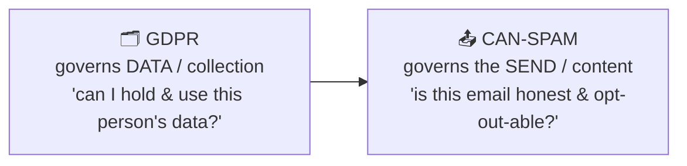
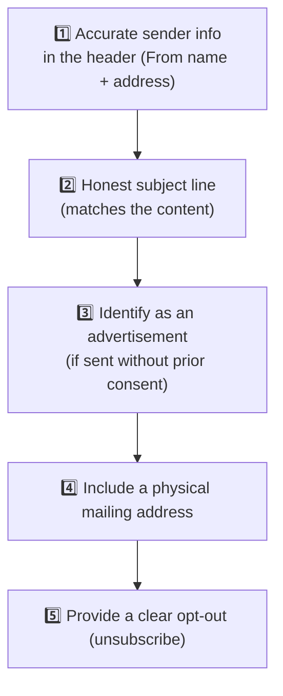
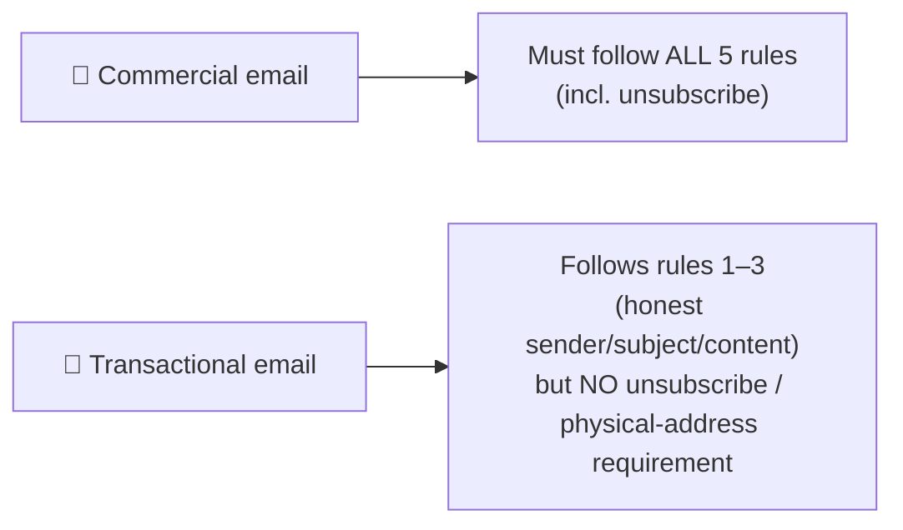
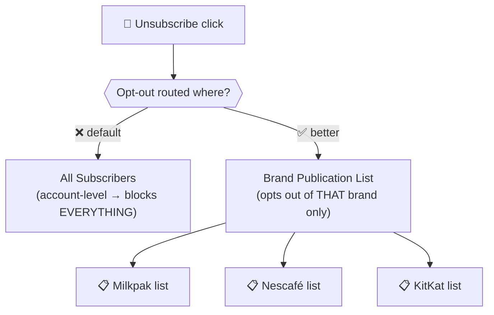
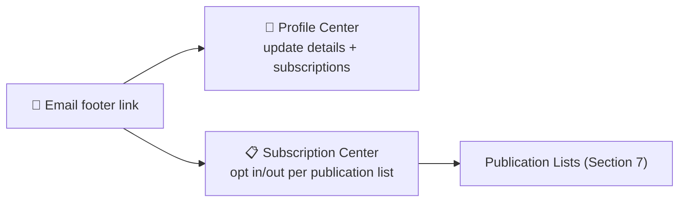

# 📕 Module 6 — Email Compliance & List Management

> **Module goal:** Learn the compliance and audience-control side of sending. **Part A** covers the **CAN-SPAM** law — the five rules every commercial email must follow. **Part B** covers the **list types** that implement people's contact choices — **Publication Lists** (granular opt-out) and **Suppression Lists** (do-not-contact) — and how they compare to the lists you already know.
>
> *These are my own study notes. Diagrams are original recreations of the lecture concepts. The raw course slides/manuals are kept in a separate private folder, not published here.*

---

# PART A — Email Compliance (CAN-SPAM) 📜

## 1. The Compliance Landscape

Two different laws govern two different stages of marketing. Interviewers love asking you to tell them apart.

| | **GDPR** | **CAN-SPAM** |
|---|---|---|
| Origin | EU (General Data Protection Regulation) | **US federal law (2003), enforced by the FTC** |
| Governs | **Collecting & holding** personal data (consent) | **Sending** commercial email (honesty + opt-out) |
| Covered in | Module 3 | This module |

> 🔑 **One-liner:** **GDPR is about the *data* (did they consent to you having it?); CAN-SPAM is about the *email* (is the send honest and opt-out-able?).** A professional consultant respects both. *(Note: CAN-SPAM is a US law; its principles are widely adopted as best practice worldwide.)*

---

## 2. CAN-SPAM — Who It Applies To

> 🔑 **CAN-SPAM primarily governs *commercial* emails** (promotions, newsletters, flash sales, coupons, loyalty, events) — the ones the user **didn't ask for**. It applies **much less** to *transactional* emails (invoices, OTPs, shipping updates), which the user's own action triggered.

The logic: because a commercial email is **unsolicited by nature**, the sender must be extra careful to be honest and give an easy way out.

---

## 3. The Five CAN-SPAM Rules

Every commercial email must meet all five. Learn them in order — they're a classic interview list.

**1️⃣ Accurately identify the sender in the header.** The **From name** and **From address** must point to a genuine, matching sender.
- ✅ *Legit:* an email from **Daraz** whose address is `...@daraz.pk` — name and domain agree.
- ❌ *Spam tell:* an email claiming to be from a famous travel brand but sent from `newsletters@wt.in` — the domain doesn't back the claim.

**2️⃣ Use a subject line that accurately represents the content.** No bait-and-switch.
- ✅ *"Give your home a summer upgrade"* → email actually shows summer furniture.
- ❌ *"Register now — flat 10% off!"* → email contains nothing of the sort (often a hook to get you to open something malicious).

**3️⃣ Identify the message as an advertisement — if you lack prior consent.** You normally shouldn't email a non-subscriber at all, but if you do, the body must be **clearly labelled an advertisement**.
- *Why:* advertisements are **generic** (a billboard, a TV spot — nobody gave data). Email is **personal** — it hits an address *you* provided. So an unsolicited email must announce itself as an ad.

**4️⃣ Include a physical mailing address.** Your company's real postal address (street, city, postal code) must appear in the email. Omitting it can trigger spam complaints. *(Legitimate senders show, e.g., a Karachi or Lahore head-office address in the footer.)*

**5️⃣ Provide a clear, easy way to opt out.** A visible **unsubscribe** link in the footer, with an unsubscribe process that isn't hidden or obstructive. All commercial emails must have this.

---

## 4. Transactional Emails Are Different

> 🔑 **Transactional emails don't get an unsubscribe link** — and rightly so. If you buy something, receiving the **invoice** is your right, regardless of your promo-subscription status. Same for OTPs, shipping updates, and balance alerts.

> **Use case:** You unsubscribe from **Daraz** promotions today. Tomorrow you buy a gift — you still receive the **order invoice and shipping updates**, because those are transactional. Likewise, unsubscribing from a bank's marketing emails never stops your **OTP** when you hit "forgot password" — receiving it is your right.

---

## 5. Why Compliance Matters — Domain Reputation

> ⚠️ Break these rules and your emails land in **spam**, dragging down your **domain reputation**. A company can pour millions into Marketing Cloud, and one careless, non-compliant consultant can get its branded domain flagged — a reputational nightmare that's very hard to undo (you can't casually change a domain like `daraz.pk`).

> 🔑 **As a consultant, compliance is part of the job.** Advising clients to send honest, opt-out-able, address-bearing email protects the exact asset their business runs on: a trusted sending domain.

> 🔗 **How CAN-SPAM is enforced in the platform:** the settings that implement these rules — **Send Classification** (commercial vs transactional), **Sender Profile** (accurate From), and **Delivery Profile** (footer with address + unsubscribe) — are covered in **Module 9 — Email Sends: Configuration & Tracking**. Classify a send *Commercial* and Marketing Cloud will *block* it if the unsubscribe link is missing.

---

# PART B — List Management 🗂️

## 6. The Four List Types at a Glance

Marketing Cloud has **four** kinds of list. Two you've met (Modules 3 & 5); two are new here.

| List type | Purpose | Covered in |
|---|---|---|
| **Subscriber (normal) List** | Store a set of subscriber **profiles** | Module 3 |
| **All Subscribers** | The **master** list of everyone; tracks status | Module 5 |
| **Publication List** | Let subscribers **opt out at a granular (brand/topic) level** | This module |
| **Suppression List** | A **do-not-contact** list that excludes addresses from sends | This module |

> 💼 *"What are the types of lists in Marketing Cloud?"* → **Subscriber list, All Subscribers, Publication list, Suppression list.**

---

## 7. Publication Lists — Granular Opt-Out

### The problem they solve

By default, when someone clicks **unsubscribe**, they're opted out at the **All Subscribers (account) level** — the highest level. For a **multi-brand** company that's dangerous:

> ⚠️ **The multi-brand trap:** Suppose one company runs several brands — e.g. **Nestlé** with **Milkpak, Nescafé, KitKat, and Maggi**. A customer who's tired of *Maggi* promos clicks unsubscribe… and if that opt-out hits **All Subscribers**, they now receive **nothing** from *any* Nestlé brand — including the **Nescafé** offers they actually wanted. You've lost a hard-won, paid-for contact over one brand.

### The fix

> 🔑 **A Publication List lets a subscriber opt out of one brand/topic without leaving All Subscribers.** You create a publication list per brand and route each brand's unsubscribes there — so opting out of one brand leaves the others (and the account) intact.

**Create & use:** Email Studio → **Subscribers → Publication Lists → Create** (e.g. one per brand). Then **at send time**, select the matching publication list so that any unsubscribe from that send is recorded **against that list**, not All Subscribers.

> 🔑 **Default rule:** if you **don't** select a publication list on a send, **All Subscribers acts as the default publication list** — i.e. the dangerous account-level opt-out. So a good consultant builds a **diverse publication portfolio** rather than relying on the single All-Subscribers default.

> **Use case:** A customer unsubscribes from the **Milkpak** send → their status changes **only inside the Milkpak publication list**; in All Subscribers they stay **Active**. Next month's **Nescafé** campaign still reaches them. Opt-out respected, relationship preserved.

---

## 8. Suppression Lists — Do-Not-Contact

Sometimes a person must be excluded even though they **haven't** clicked unsubscribe.

> 🔑 **A Suppression List is a do-not-contact list.** Any address in a suppression list is **excluded** from a send it's applied to — without changing the subscriber's status in All Subscribers.

### When you need one

> **Use case:** A customer **phones in** and says "stop emailing me" — but they never clicked unsubscribe. You must honour it, yet you **shouldn't** hand-edit system data (you don't manually flip someone to unsubscribed), and you can't delete them from a data extension holding millions of rows. The clean solution: put their address in a **suppression list** and apply it to your sends.

**Create & use:** Email Studio → **Subscribers → Suppression Lists → Create** → **import** the addresses to exclude (CSV, mapping Subscriber Key + Email Address). Then **at send time**, apply the suppression list; those addresses are **excluded** from that send.

---

## 9. Publication vs Suppression — the Key Distinction

| | **Publication List** | **Suppression List** |
|---|---|---|
| **Controlled by** | The **subscriber** (their opt-out choice) | The **sender** (business decision) |
| **Purpose** | Manage **opt-outs** at brand/topic level | **Do-not-contact** exclusion |
| **Effect** | Records an unsubscribe *for that list* | Excludes the address from the send |
| **Changes All-Subscribers status?** | No (that's the point) | No |
| **Trigger** | Person clicks unsubscribe | Person asks / business rule requires it |

> 🔑 **One-liner:** **Publication list = subscriber-driven opt-out (per brand); Suppression list = sender-driven do-not-contact.** Both keep someone off a send without nuking their account-level status.

---

## 10. Profile Center & Subscription Center — Where Subscribers Self-Manage

Publication lists (Section 7) are only useful if subscribers can actually *choose* what they receive. Two Salesforce-hosted pages, linked from the email **footer**, let them do exactly that.

> 🔑 **Profile Center** = a hosted page where a subscriber updates their **profile attributes** (name, preferences) *and* manages subscriptions, with an unsubscribe option.
> **Subscription Center** = a hosted page focused on **opting in/out of specific publication lists** — the "manage your preferences" page — plus an unsubscribe-from-all option.

> 🔑 **This is the front-end of publication lists:** the Subscription Center is *how* a subscriber unsubscribes from "Milkpak" but stays on "Nescafé." Giving people **granular self-service** lowers full opt-outs and spam complaints — protecting deliverability (Module 5).

> 💡 **Preference management > hard unsubscribe.** A good consultant designs a Subscription Center so an annoyed subscriber can *dial down* one topic instead of leaving entirely.

---

## 11. The Wider Compliance Landscape

CAN-SPAM (US) and GDPR (EU) are the headliners, but interviewers like to hear you know the map:

| Law | Region | Key point |
|---|---|---|
| **GDPR** | EU/UK | **Consent** to collect/hold personal data; right to erasure (Module 3–4) |
| **CAN-SPAM** | US | Honest commercial email + easy opt-out (Part A) |
| **CASL** | Canada | **Stricter** — generally requires **express opt-in consent** before emailing |
| **CCPA / CPRA** | California | Right to know, delete, and **opt out of sale** of personal data |

> ⚠️ **Modern mailbox rules aren't law, but they bite harder.** Since 2024, **Gmail/Yahoo bulk-sender requirements** (5,000+/day: SPF+DKIM+DMARC, one-click unsubscribe, spam rate < 0.3%) can get mail **rejected** — see Module 5. Compliance now means *both* the laws **and** the mailbox providers' technical rules.

> 💼 **Interview Q — "Which compliance laws affect email marketing?"** → **GDPR** (EU consent), **CAN-SPAM** (US honesty + opt-out), **CASL** (Canada, express consent), **CCPA/CPRA** (California privacy) — plus mailbox-provider rules from Gmail/Yahoo/Outlook.

---

## 🎯 Key Takeaways

1. **GDPR governs the data; CAN-SPAM governs the send.** Know both.
2. **CAN-SPAM targets commercial email** (unsolicited), far less so transactional.
3. **Five CAN-SPAM rules:** accurate sender header, honest subject, identify as ad (if no consent), physical mailing address, clear opt-out.
4. **Transactional emails skip the unsubscribe requirement** — you can't opt out of an invoice or OTP.
5. **Non-compliance = spam folder = damaged domain reputation** — a core consultant responsibility.
6. **Four list types:** subscriber list, All Subscribers, publication list, suppression list.
7. **Publication list = granular, subscriber-driven opt-out** (avoids the multi-brand trap); **All Subscribers is the default** if none is selected.
8. **Suppression list = sender-driven do-not-contact** exclusion; neither list changes account-level status.

---

## 💼 Interview Questions (with model answers)

- **Q: What is CAN-SPAM, and what does it govern?**
  A: A **US federal law (2003, FTC-enforced)** governing **commercial email** — requiring honesty and an opt-out. It applies far less to transactional email.

- **Q: What's the difference between GDPR and CAN-SPAM?**
  A: **GDPR** governs **collecting/holding** personal data (consent); **CAN-SPAM** governs **sending** commercial email (honest headers/subject, physical address, opt-out).

- **Q: List the CAN-SPAM requirements.**
  A: (1) Accurate sender info in the header, (2) honest subject line, (3) identify as an advertisement if sent without consent, (4) include a physical mailing address, (5) provide a clear opt-out.

- **Q: Do transactional emails need an unsubscribe link?**
  A: **No.** Receiving an invoice, OTP, or shipping update is the user's right regardless of promo-subscription status; transactional emails are exempt from the opt-out (and physical-address) requirement.

- **Q: What are the types of lists in Marketing Cloud?**
  A: **Subscriber list, All Subscribers, Publication list, Suppression list.**

- **Q: What is a Publication List and why use one?**
  A: A list that lets subscribers **opt out at a brand/topic level** without leaving All Subscribers — essential for multi-brand companies so one brand's opt-out doesn't block all the others.

- **Q: What happens if you don't select a publication list on a send?**
  A: **All Subscribers becomes the default publication list**, so any unsubscribe opts the person out at the **account level**.

- **Q: What is a Suppression List?**
  A: A **do-not-contact** list; addresses in it are **excluded** from sends it's applied to, without changing their All-Subscribers status.

- **Q: Difference between a Publication List and a Suppression List?**
  A: **Publication** = subscriber-driven opt-out per brand/topic; **Suppression** = sender-driven do-not-contact exclusion. Neither alters account-level status.

- **Q: A customer phones asking never to be emailed but never clicked unsubscribe — what do you do?**
  A: Add them to a **suppression list** and apply it to sends. You don't hand-edit system status or delete them from a large DE.

---

## 🔁 Quick-Recall Flashcards

- **Q:** GDPR governs…? → **A:** Data collection/consent.
- **Q:** CAN-SPAM governs…? → **A:** Sending commercial email.
- **Q:** CAN-SPAM origin? → **A:** US federal law (2003), FTC-enforced.
- **Q:** CAN-SPAM applies mostly to…? → **A:** Commercial (not transactional) email.
- **Q:** Five CAN-SPAM rules? → **A:** Accurate header, honest subject, identify-as-ad, physical address, opt-out.
- **Q:** Do transactional emails need unsubscribe? → **A:** No.
- **Q:** Cost of non-compliance? → **A:** Spam folder + damaged domain reputation.
- **Q:** Four list types? → **A:** Subscriber, All Subscribers, Publication, Suppression.
- **Q:** Publication list = ? → **A:** Granular, subscriber-driven opt-out.
- **Q:** Default if no publication list selected? → **A:** All Subscribers (account-level opt-out).
- **Q:** Suppression list = ? → **A:** Sender-driven do-not-contact exclusion.
- **Q:** Does suppression change status? → **A:** No.

---

## 📖 Glossary

| Term | Meaning |
|---|---|
| **CAN-SPAM** | US federal law (2003, FTC) governing commercial email honesty and opt-out. |
| **GDPR** | EU regulation governing consent to collect/hold personal data (Module 3). |
| **Commercial email** | Promotional email the recipient didn't request (heavily governed by CAN-SPAM). |
| **Transactional email** | Action-triggered email (invoice, OTP, shipping) — exempt from opt-out rules. |
| **From name / From address** | The sender identity shown in the header; must be accurate. |
| **Physical mailing address** | The company's real postal address, required in commercial emails. |
| **Opt-out / Unsubscribe** | The required mechanism for recipients to stop commercial email. |
| **Domain reputation** | The trust level of a sending domain; harmed by non-compliance/spam. |
| **Subscriber List** | A normal list of subscriber profiles (Module 3). |
| **All Subscribers** | Master list of all subscribers; default publication list (Module 5). |
| **Publication List** | A list managing granular, subscriber-driven opt-outs per brand/topic. |
| **Suppression List** | A sender-managed do-not-contact list that excludes addresses from sends. |

---

*End of Module 6. Next batch: **Email Sends & Tracking** — send classification, sender & delivery profiles, user-initiated vs triggered sends, deduplication, and send KPIs.*
