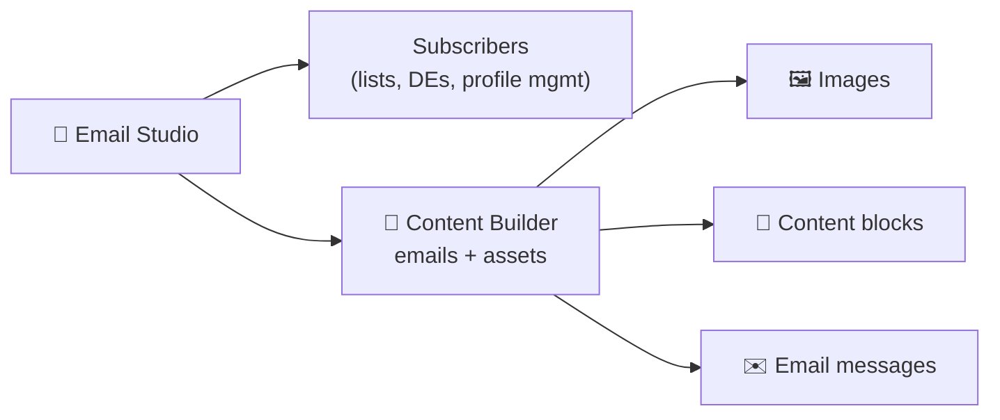
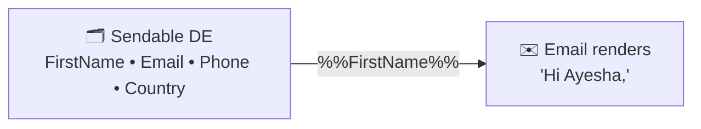
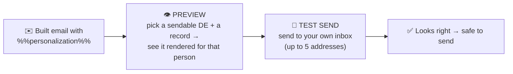
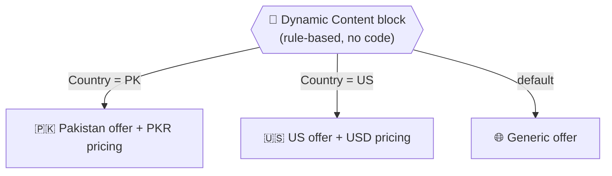
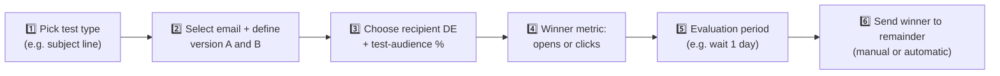

# 📗 Module 7 — Building Data-Driven Emails

> **Module goal:** Start the **build phase** of the invoice project. Learn **Content Builder** (where emails and assets live), the **content blocks** that make up an email, **personalization strings** (`%%field%%`) for simple dynamic data, and how to **preview & test** before sending. This sets up Module 8 (AMPscript), where we go deeper.
>
> *These are my own study notes. Diagrams are original recreations of the lecture concepts. The raw course slides/manuals are kept in a separate private folder, not published here.*

---

## 1. Where Emails Are Built — Content Builder

You've lived in the **Subscribers** dropdown so far (lists, data extensions, profile management). To build an email you move to **Content Builder**.

> 🔑 **Content Builder** is Email Studio's home for **emails and all reusable assets** — images, content blocks, templates. Organize everything into **folders** (e.g. a `B36_Content` folder) so assets stay findable.

> 💡 **Scope note:** This course focuses on the **data-driven** side of email — pulling the right data in — **not** visual design. HTML/CSS styling is a creativity layer you add on top; the value skill is making the email **dynamic**.

---

## 2. Creating an Email

**Content Builder → Create → Email Message.** You'll pick a starting point:

| Option | When to use |
|---|---|
| **Template** | Start from a predefined layout (basic or themed — newsletters, retail, finance…) |
| **HTML** | Build from scratch with your own HTML |
| **Text Only** | Plain text, no multimedia |
| **From Existing** | Reuse/modify an email you already built |

> For learning the mechanics, start from an **empty template → blank layout** so nothing is pre-arranged and every block is yours to place. Name the email (e.g. `B36_Invoice`) → **Next** → the email builder opens.

---

## 3. Content Blocks — the Building Pieces

An email is assembled from **drag-and-drop blocks** on the canvas:

| Block | Purpose |
|---|---|
| **Image** | Place a logo/photo — upload, pick an existing asset, or paste an **image URL** |
| **Text** | Headlines and body copy (bold, headings H1–H3, alignment, colour, background) |
| **Button** | A call-to-action button |
| **HTML** | Hand-written HTML for full control |
| **Free Form** | Mixed content in one block |
| **Code Snippet** | A block that can hold **AMPscript** (Module 8) |

> **Invoice build so far:** drop an **Image** block for the brand logo (paste a hosted logo URL, set pixel size, uncheck *Scale to Fit* for exact sizing), then a **Text** block to greet the customer — *"Thank you for making a purchase with us."*

---

## 4. The Personalization Problem

A generic *"Thank you for your purchase"* isn't good enough — an invoice must address each customer **by name**, and you're sending to a whole data extension of people.

> ⚠️ **You can't hard-code the name.** If you type *"Hi Ali"*, everyone gets "Ali." You need the email to **dynamically fetch each subscriber's first name** from the data extension it's sent to.

This is **personalization** — and the simplest tool for it is the **personalization string**.

---

## 5. Personalization Strings — `%%field%%`

> 🔑 A **personalization string** injects a subscriber's field value into the email. Syntax: **`%%FieldName%%`**, where `FieldName` is the **attribute name** in the data extension (or a subscriber attribute).

- `%%FirstName%%` → each recipient's first name
- `%%EmailAddress%%`, `%%Phone%%`, `%%Country%%` → their other fields

> ⚠️ **The critical constraint:** **personalization strings only read from the *sendable* data extension** you're sending to. They pull a value from the send audience and **display** it — nothing more. They **cannot** reach into a *non-sendable* (behavioural/reference) DE. That limit is exactly what pushes us to **AMPscript** in Module 8.

> 💡 **Match the name exactly.** `%%FirstName%%` must match the DE attribute's name (spacing included), or the value won't render / the preview will fail.

> **Invoice build:** replace the greeting with *"Hi `%%FirstName%%`, thank you for your purchase,"* then add `%%EmailAddress%%`, `%%Phone%%`, and `%%Country%%` (as the shipping address) — all pulled live from the sendable **Customer Profile** DE.

---

## 6. Preview & Test — Never Send Blind

Before sending to anyone, verify the personalization actually renders. **Preview and Test** combines two tools:

- **Preview:** choose the **sendable DE** and toggle through individual records — watch `%%FirstName%%` change to *Ayesha*, *Bilal*, *Fatima*… as you step through subscribers. This proves the strings resolve correctly.
- **Test send:** email it to yourself (up to **5** addresses) to confirm it renders properly **in a real inbox**, not just the preview.

> ⚠️ **Only sendable DEs appear for preview.** Non-sendable (behavioural/reference) DEs can't be previewed — another reminder that personalization strings live and die by the **sendable** DE. Reaching the other DEs' data needs Module 8.

> 🔑 **Never write a personalization string and blast it untested.** A broken string that ships to thousands looks unprofessional and erodes trust. Preview → test → *then* send.

---

## 7. Where This Leaves Us (→ Module 8)

We can now render **profile** data (name, email, phone, country) from the **sendable** Customer Profile DE. But an invoice also needs **transaction** data (product, bill, quantity, date) and **product** data (brand, size, colour, image) — and those live in **non-sendable** DEs.

> ⚠️ **Personalization strings can't reach them.** Try `%%Product%%` and the preview errors: *"personalization string not found in this sendable DE."* To pull data from *related, non-sendable* DEs, you need **AMPscript** — Module 8.

---

## 8. Dynamic Content Blocks — Personalization Without Code

Personalization strings (Section 5) inject a *value*; AMPscript (Module 8) runs *logic*. There's a **third** way that needs **no code** at all: the **Dynamic Content** block.

> 🔑 A **Dynamic Content block** shows **different content to different subscribers based on attribute rules** you set in the Content Builder UI — e.g. *if `Gender = Female` show block A, else show block B*, or swap the hero image by `Country`.

> 🔑 **Three ways to personalize — know the difference (classic interview comparison):**

| Method | What it does | Needs code? |
|---|---|---|
| **Personalization string** | Injects one field's value (`%%FirstName%%`) | No |
| **Dynamic Content block** | Swaps whole blocks by attribute **rules** | No (UI rules) |
| **AMPscript** | Retrieves related data + runs full logic | Yes |

> 💡 **When to use which:** a value → personalization string; a simple "show this to that audience" swap → dynamic content block; anything needing **lookups across DEs or real logic** → AMPscript.

---

## 9. A/B Testing — Let the Data Pick the Winner

Don't guess which subject line or design performs better — **test it on a sample, then let the numbers decide**.

> 🔑 **A/B testing** creates **two versions** (A and B) of a communication, sends each to a small **test portion** of your audience, measures which performs better on a chosen **metric**, declares a **winner**, and sends that winner to the **remaining majority**.

> **The framing that makes it click (brand-manager scenario):** You're running a big sale and your team hands you two strong email versions. You *can't* pick on personal taste — if the campaign flops, "why did you choose that one?" has no good answer. So you take a **drop from the ocean** (say 10,000 of millions), split it in two, send A to one half and B to the other, and see which gets more engagement. The data — not your gut — chooses what goes to the millions. **Decisions on data, not opinion.**

### What you can A/B test

Marketing Cloud lets you test **one variable at a time** across these types:

| Test type | You're comparing… |
|---|---|
| **Subject line** | Two subject lines (best for lifting **opens**) |
| **Email** | Two entirely different emails |
| **Content area** | One email, one block different (e.g. a different hero image) |
| **From name** | Two **sender profiles** |
| **Send date/time** | Two send times |
| **Preheader** | Two preheaders |

> 💡 **What's a preheader?** The short preview line shown **next to/after the subject** in the inbox, **before** the email is opened (e.g. *"Rush to your nearest store"*). It isn't visible inside the opened email — it's an inbox teaser, so it's worth testing.

### The setup flow

Key choices interviewers ask about:

- **Test-audience size:** keep it **small — about 10%** of the total (5% to A, 5% to B), leaving ~90% as the **remainder**. Testing on everyone defeats the purpose.
- **Winner metric:** **open rate** (best for subject-line/preheader/from-name tests) or **click-through rate** (best for content tests).
- **Evaluation period:** wait long enough (e.g. **a day**) before declaring a winner — people are asleep, at work, etc. Don't judge in the first hour.
- **Send to remainder:** **automatic** (winner auto-sends after the evaluation window) or **manual** (you review, then send).

> 🔑 **A/B test ≠ test send.** A **test send** (Section 6) mails a proof to *your own inbox* to check rendering. An **A/B test** mails two real versions to *sample subscribers* to measure engagement and pick a winner.

> 💼 **Interview Q — "What is A/B testing and what can you test?"** → Sending two versions to test audiences and picking the higher-engagement winner to send to the rest; you can test subject line, email, content area, from name, send time, or preheader.
> **Q — "A/B test vs test send?"** → Test send = render check to yourself; A/B test = engagement experiment on sample subscribers to choose a winner.
> **Q — "Three ways to personalize an email?"** → Personalization strings, Dynamic Content blocks, and AMPscript.

---

## 🎯 Key Takeaways

1. **Content Builder** is where emails and assets live — organize with folders.
2. This course prioritizes **data-driven** email (dynamic data) over visual design.
3. Create an email from **Template / HTML / Text / Existing**; start from a **blank** layout to learn the blocks.
4. Emails are built from **blocks**: image, text, button, HTML, free form, and **code snippet** (for AMPscript).
5. **Personalization strings** (`%%FieldName%%`) inject a subscriber's field value — but **only from the sendable DE**.
6. **Preview & Test** before sending: preview per-record against the sendable DE, then test-send to your inbox.
7. Personalization strings **can't read non-sendable DEs** — that gap motivates **AMPscript** (Module 8).

---

## 💼 Interview Questions (with model answers)

- **Q: What is Content Builder?**
  A: Email Studio's home for building **emails** and storing reusable **assets** (images, blocks, templates), organized in folders.

- **Q: What options do you get when creating an email?**
  A: **Template, HTML, Text Only,** and **From Existing**.

- **Q: What is a personalization string?**
  A: A token (`%%FieldName%%`) that injects a subscriber's field value into an email, pulled from the **sendable** data extension.

- **Q: What's the main limitation of personalization strings?**
  A: They only read from the **sendable DE** being sent to — they **can't** retrieve data from non-sendable/related DEs. For that you use **AMPscript**.

- **Q: How do you verify personalization before sending?**
  A: **Preview** the email against a sendable DE, toggling records to confirm values render, then do a **test send** to your own inbox (up to 5 addresses).

- **Q: Why can't you preview a non-sendable data extension?**
  A: Only **sendable** DEs are valid send audiences; non-sendable DEs hold behavioural/reference data and aren't previewable or directly sendable.

---

## 🔁 Quick-Recall Flashcards

- **Q:** Where are emails built? → **A:** Content Builder.
- **Q:** Email creation options? → **A:** Template, HTML, Text Only, From Existing.
- **Q:** Block that holds AMPscript? → **A:** Code Snippet.
- **Q:** Personalization string syntax? → **A:** `%%FieldName%%`.
- **Q:** Personalization strings read from…? → **A:** The sendable DE only.
- **Q:** Can they read non-sendable DEs? → **A:** No — use AMPscript.
- **Q:** Two halves of Preview & Test? → **A:** Preview (per-record render) + Test send (to your inbox).
- **Q:** Which DEs can be previewed? → **A:** Sendable ones only.

---

## 📖 Glossary

| Term | Meaning |
|---|---|
| **Content Builder** | Email Studio area for building emails and storing assets. |
| **Asset** | A reusable image, block, or template in Content Builder. |
| **Content Block** | A drag-and-drop email component (image, text, button, HTML, code snippet…). |
| **Code Snippet block** | A block used to hold AMPscript logic. |
| **Personalization String** | `%%FieldName%%` token injecting a subscriber's field value from the sendable DE. |
| **Preview** | Rendering the email for a specific record from a sendable DE. |
| **Test Send** | Sending the email to your own inbox(es) to check real rendering. |
| **Sendable DE** | A data extension that can be a send audience and previewed (Modules 4–5). |

---

*End of Module 7. Next: **Module 8 — AMPscript for Dynamic Content** — variables, `Lookup()`, output functions, and conditionals to pull data from *non-sendable, related* data extensions into the invoice.*
