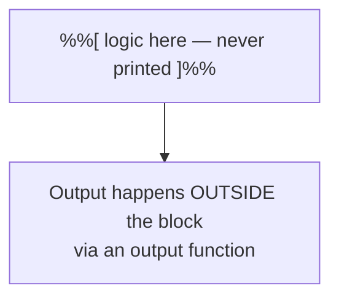
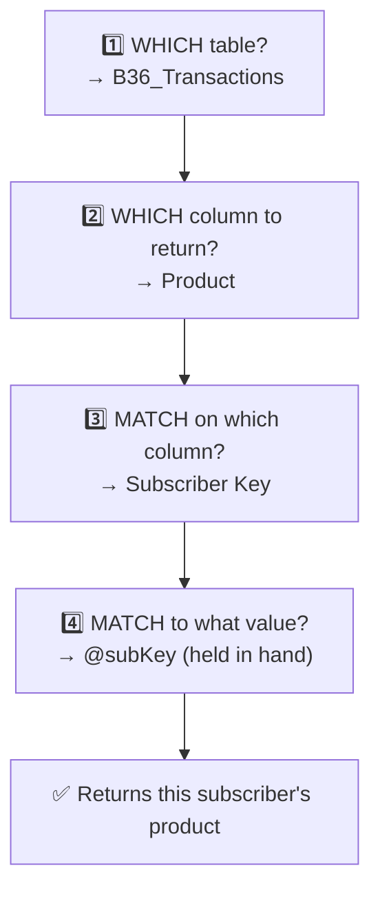
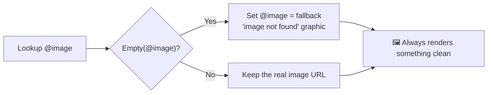
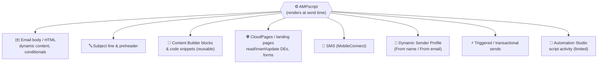

# 📗 Module 8 — AMPscript for Dynamic Content

> **Module goal:** Break past the personalization-string ceiling. Learn **AMPscript** — Marketing Cloud's scripting language — end to end: **script blocks**, **variables** (`VAR`/`SET`), **output** (`v()`), **`Lookup()`/`LookupRows()`**, **conditionals & loops**, safe personalization, a **categorized function reference**, and **everywhere AMPscript runs** (emails, subject lines, CloudPages, SMS, and dynamic sender profiles). Sections 1–8 build the invoice; Sections 9–14 are your working reference.
>
> *These are my own study notes. Diagrams are original recreations of the lecture concepts. Function details were cross-checked against Salesforce's AMPscript documentation. The raw course slides/manuals are kept in a separate private folder, not published here.*

---

## 1. Why AMPscript? Personalization Strings vs AMPscript

Personalization strings (Module 7) can only **display** a value from the **sendable** DE. An invoice needs data from **non-sendable** DEs (transactions, product specs) too — so we need a tool that can **reach across related DEs**.

> 🔑 **AMPscript** is Marketing Cloud's scripting language for **data-driven, dynamic** content. It can **retrieve data from any DE in your relational model** — sendable *or* non-sendable — store values, run logic, and output results.

| | **Personalization String** | **AMPscript** |
|---|---|---|
| Purpose | Display a field value | Retrieve, store, compute, and output data |
| Reads from | **Sendable DE only** | **Any** DE in the relational model |
| Logic | None | Variables, functions, conditionals |
| Syntax | `%%FieldName%%` | Script blocks + functions |

> 💡 Design and layout still come from **HTML/CSS**; **AMPscript** supplies the **data** and **logic**. The two work together inside one email.

---

## 2. The Script Block

AMPscript logic lives inside a **script block**, placed via a **Code Snippet** block (usually near the top of the email).

> 🔑 **Script block syntax:** `%%[ ... your logic ... ]%%`. **Nothing inside a script block is printed** — it's for logic only. To show a value, you **output** it *outside* the block (Section 4).



---

## 3. Variables — `VAR` and `SET`

To hold a value locally (so you can reuse it as a reference), use a **variable**.

> 🔑 Two steps:
> - **Declare:** `VAR @name` — variable names start with **`@`**.
> - **Assign:** `SET @name = value`.

```
%%[
  VAR @subKey
  SET @subKey = [Subscriber Key]
]%%
```

> ⚠️ **Why not just use `%%Subscriber Key%%`?** A personalization string **displays** the value but doesn't **store** it — you can't reuse it as a lookup key. `SET @subKey = [Subscriber Key]` **captures the value locally** ("in your hand"), so you can feed it into lookups against other DEs. *Storing a reference is the whole reason we move to AMPscript.*

---

## 4. Output — the `v()` Function

Because script blocks never print, you display a variable **outside** the block with an output function.

> 🔑 **Output syntax:** `%%=v(@name)=%%` prints the value stored in `@name`.

```
%%=v(@subKey)=%%
```

> **Check it renders:** after `SET @subKey = [Subscriber Key]`, add `%%=v(@subKey)=%%` in the body and preview — toggling records shows the stored key changing. Unlike a personalization string, this value is now **held in a variable** and reusable as a lookup key.

---

## 5. `Lookup()` — Retrieving from Non-Sendable DEs

This is the heart of the module. To pull a value from a **related, non-sendable** DE, use **`Lookup()`**.

> 🔑 **`Lookup(DataExtension, ReturnColumn, MatchColumn, MatchValue)`** =
> "In **DataExtension**, find the row where **MatchColumn = MatchValue**, and return its **ReturnColumn**."

Think of it as answering four questions the system asks, in order:



```
%%[
  VAR @subKey, @product, @bill, @qty, @date
  SET @subKey  = [Subscriber Key]
  SET @product = Lookup("B36_Transactions", "Product",  "SubscriberKey", @subKey)
  SET @bill    = Lookup("B36_Transactions", "Bill",     "SubscriberKey", @subKey)
  SET @qty     = Lookup("B36_Transactions", "Quantity", "SubscriberKey", @subKey)
  SET @date    = Lookup("B36_Transactions", "Date",     "SubscriberKey", @subKey)
]%%
```

Then output each where you want it in the invoice:

```
Product: %%=v(@product)=%%   Bill: %%=v(@bill)=%%
Qty: %%=v(@qty)=%%   Date: %%=v(@date)=%%
```

> 🔑 **The reference chain:** `@subKey` came from the **sendable** Profile DE (easy to get), and it's the **shared key** into the non-sendable **Transactions** DE. That's why we captured it into a variable first — **without a value "in hand," you can't look up related data.**

### Chaining lookups across a third DE

The **Product Specification** DE (brand, size, colour, image) is non-sendable too — but we already retrieved `@product`, so it becomes the reference into the product table:

```
%%[
  VAR @brand, @color, @size, @image
  SET @brand = Lookup("B36_Product_Specification", "Brand", "Product", @product)
  SET @color = Lookup("B36_Product_Specification", "Color", "Product", @product)
  SET @size  = Lookup("B36_Product_Specification", "Size",  "Product", @product)
  SET @image = Lookup("B36_Product_Specification", "Image", "Product", @product)
]%%
```

> 💡 **This is the relational model paying off:** Profile → (Subscriber Key) → Transactions → (Product) → Product Specification. Each lookup hops one relationship using a value you already hold. (Watch spelling — a mistyped column like `Quantiy` throws a lookup error.)

---

## 6. Displaying the Image Properly

The image field stores a **URL**, not a picture. Printing `%%=v(@image)=%%` as text just shows the raw URL. Render it as an actual image via an **HTML block**:

```

```

---

## 7. Conditionals — Graceful Fallbacks

Not every product has an image. A missing URL renders an ugly broken box. Fix it with an **`IF` conditional** and the **`Empty()`** check.

> 🔑 **`IF Empty(@var) THEN ... ENDIF`** runs logic only when a value is missing. Use it to substitute a fallback.

```
%%[
  IF Empty(@image) THEN
    SET @image = "https://example.com/image-not-found.png"
  ENDIF
]%%
```



> **Use case:** several catalogue items (e.g. some accessories) have no stored image. The conditional swaps in a tidy "image not found" graphic, so customers never see a broken box on their invoice.

---

## 8. Practical Workflow (and a Word on HTML/CSS)

A realistic build order:

1. **Script first** — write the script block: capture `@subKey`, `Lookup()` the transaction and product fields, add the image fallback.
2. **Prove the data** — output each variable with `v()` and **preview**, toggling records to confirm correct values.
3. **Design last** — once the data is right, arrange it into a clean invoice with **HTML/CSS**. (If layout isn't your strength, tools like ChatGPT can turn your finalized fields into formatted HTML/CSS — the *skill* that matters here is the **AMPscript**, not the styling.)
4. **Test send** — email it to yourself and confirm it renders in a real inbox.

> 🔑 **The professional split:** **AMPscript = data & logic; HTML/CSS = presentation.** Master the script; the design is a finishing layer.

---

## 9. Where AMPscript Can Be Used

AMPscript isn't just for the email body. It runs as a **server-side language at render/send time** across many parts of Marketing Cloud Engagement.



| Location | What AMPscript does there |
|---|---|
| **Email body** | The main use — dynamic content, lookups, conditionals |
| **Subject line & preheader** | Personalize the subject (with a limitation — see below) |
| **Content blocks / code snippets** | Reusable dynamic blocks, pulled in with `ContentBlockByKey()` |
| **CloudPages / landing pages** | Retrieve, insert, and update DE data; process form submissions |
| **SMS (MobileConnect)** | Personalize text messages the same way as email |
| **Sender Profile (dynamic)** | Set From Name / From Email per subscriber |
| **Triggered sends** | Deterministic personalization for real-time transactional email |

### 9.1 Subject line & preheader

Personalize the subject like any content — but mind one rule:

```
Subject: Hi %%=v(@firstName)=%%, your invoice is ready
```

> ⚠️ **Subject-line limitation:** Marketing Cloud **no longer processes *nested* AMPscript inside subject lines** (a change made in 2023). Use a **single** AMPscript/personalization call — don't nest a `%%…%%` variable inside another AMPscript expression in the subject. Do the heavy logic in the **email body** (a script block near the top), store the result in a variable, then reference that single variable in the subject.

### 9.2 Dynamic Sender Profile — AMPscript in the "From"

> 🔑 You can make the **From Name and From Email dynamic per subscriber** using a **Dynamic Sender Profile**: AMPscript lives in **code-snippet content blocks** that the sender profile references, plus a one-time account setting to enable dynamic sender profiles.

- **Use case:** send each customer's email **from their assigned account manager** (name + address), or switch the sender's display name by the subscriber's **language/region** — e.g. an Urdu-preference subscriber gets a localized From Name.
- The AMPscript in the snippet simply **looks up** the right From value (e.g. `Lookup()` on a manager DE by Subscriber Key) and outputs it; the sender profile renders that snippet at send time.

> 💡 **Where this sits vs Send Classification (Module 9):** a **Send Classification** *bundles* a sender profile + delivery profile. Making the *sender* dynamic is a property of the **sender profile** it references — AMPscript supplies the value, the classification just carries the profile.

---

## 10. Control Flow — Conditionals & Loops

Beyond simple lookups, AMPscript has real logic constructs.

### 10.1 `IF / ELSEIF / ELSE / ENDIF`

```
%%[
  IF @country == "PK" THEN
    SET @shipping = "Free nationwide delivery"
  ELSEIF @country == "US" THEN
    SET @shipping = "Standard delivery"
  ELSE
    SET @shipping = "International rates apply"
  ENDIF
]%%
%%=v(@shipping)=%%
```

### 10.2 `IIF()` — inline one-liner

`IIF(condition, valueIfTrue, valueIfFalse)` is a compact conditional:

```
%%=IIF(Empty(@firstName), "Valued Customer", @firstName)=%%
```

### 10.3 `FOR … NEXT` loops

Loop to render **many rows** — e.g. every line item on a multi-product invoice, or a set of recommendations:

```
%%[
  SET @rows = LookupRows("B36_Transactions", "SubscriberKey", @subKey)
  SET @count = RowCount(@rows)
  FOR @i = 1 TO @count DO
    SET @row = Row(@rows, @i)
    SET @product = Field(@row, "Product")
    SET @bill = Field(@row, "Bill")
]%%
    <p>%%=v(@product)=%% — Rs %%=v(@bill)=%%</p>
%%[
  NEXT @i
]%%
```

> 🔑 A single `Lookup()` returns **one** value; a `FOR` loop over **`LookupRows()`** is how you render **repeating** content (order lines, wishlists, recommendations).

---

## 11. Working With Multiple Rows — `LookupRows`, `Row`, `Field`, `RowCount`

`Lookup()` grabs a single value. When a subscriber has **many** related rows (several orders), use the rowset family:

| Function | Purpose |
|---|---|
| **`LookupRows(DE, matchCol, matchVal)`** | Return **all** matching rows as a rowset |
| **`LookupOrderedRows(DE, count, "col ASC/DESC", matchCol, matchVal)`** | Return a limited, **sorted** set (e.g. latest 3 orders) |
| **`RowCount(rowset)`** | How many rows came back |
| **`Row(rowset, n)`** | Get the **n-th** row |
| **`Field(row, "col")`** | Read a **column** from a row |

```
%%[
  SET @orders = LookupOrderedRows("B36_Transactions", 3, "Date DESC", "SubscriberKey", @subKey)
  IF RowCount(@orders) > 0 THEN
    SET @latest = Row(@orders, 1)
    SET @lastProduct = Field(@latest, "Product")
  ENDIF
]%%
```

> 💡 **Performance:** prefer **one `LookupRows()`** over many repeated single `Lookup()` calls — repeated lookups slow down rendering at scale and can delay delivery.

---

## 12. Safe Personalization — `AttributeValue()` & Defaults

Referencing a field that doesn't exist can **throw an error** and break the whole render. Two habits prevent this:

> 🔑 **Use `AttributeValue("FieldName")` instead of `[FieldName]`** to read a subscriber/DE attribute safely, then supply a **default** when it's empty.

```
%%[
  VAR @firstName
  SET @firstName = AttributeValue("FirstName")
  IF Empty(@firstName) THEN
    SET @firstName = "Valued Customer"
  ENDIF
]%%
Hi %%=v(@firstName)=%%,
```

> ⚠️ **Why it matters:** without a default, a missing first name renders an awkward *"Hi ,"*. `Empty()` / `IsNull()` checks plus a fallback keep every send looking intentional — the same defensive pattern as the image fallback in Section 7.

---

## 13. AMPscript Function Reference (Most-Used)

A working cheat-sheet, grouped by category. (Salesforce's full index lists 200+; these are the ones you'll actually reach for.)

### 🗂️ Data Extension / Row functions

| Function | What it does |
|---|---|
| `Lookup(DE, returnCol, matchCol, matchVal)` | Return one value from a matching row |
| `LookupRows(DE, matchCol, matchVal)` | Return all matching rows (rowset) |
| `LookupOrderedRows(DE, count, "col DESC", matchCol, matchVal)` | Return a sorted, limited rowset |
| `Row(rowset, n)` / `Field(row, "col")` | Get the n-th row / a column from a row |
| `RowCount(rowset)` | Number of rows returned |
| `InsertDE(DE, col, val, …)` | Insert a row into a DE |
| `UpsertDE(DE, keyCols…, valCols…)` | Update if exists, else insert |
| `UpdateDE(DE, …)` / `DeleteDE(DE, …)` | Update / delete rows |
| `ClaimRow(DE, claimedCol, …)` | Safely claim a unique row (e.g. a one-time voucher code) |

### 🔤 String functions

| Function | What it does |
|---|---|
| `Concat(a, b, …)` | Join strings together |
| `Substring(str, start, length)` | Extract part of a string |
| `Length(str)` | String length |
| `Trim(str)` | Remove leading/trailing spaces |
| `Replace(str, old, new)` | Replace text |
| `IndexOf(str, sub)` | Position of a substring |
| `ProperCase(str)` / `Uppercase(str)` / `Lowercase(str)` | Change casing |
| `Format(value, "pattern")` | Format numbers/dates by pattern |

### 📅 Date & Time functions

| Function | What it does |
|---|---|
| `Now()` | Current system date/time |
| `DateAdd(date, n, "D/M/Y/H/MI")` | Add/subtract time |
| `DateDiff(startdate, enddate, "D/M/Y…")` | Difference between dates |
| `DatePart(date, "year/month/day…")` | Extract a part of a date |
| `FormatDate(date, "yyyy-MM-dd")` | Format a date for display |
| `SystemDateToLocalDate()` / `LocalDateToSystemDate()` | Convert between system (UTC-6) and local time |

### 🔢 Math functions

| Function | What it does |
|---|---|
| `Add / Subtract / Multiply / Divide(a, b)` | Basic arithmetic |
| `Mod(a, b)` | Remainder |
| `FormatNumber(num, "N2")` | Format a number (decimals, grouping) |
| `FormatCurrency(num, "en-US")` | Format as currency |
| `Random(min, max)` | Random number in a range |

### 🧩 Utility & Conditional functions

| Function | What it does |
|---|---|
| `IIF(cond, ifTrue, ifFalse)` | Inline conditional |
| `Empty(val)` / `IsNull(val)` | Test for blank / null |
| `IsEmailAddress(str)` / `IsPhoneNumber(str)` | Validate format |
| `AttributeValue("name")` | Safely read a subscriber/DE attribute |
| `V(@var)` | Output a variable's value |
| `GUID()` | Generate a unique identifier |
| `RaiseError("msg", true)` | Stop the send with an error (validation) |
| `Output()` / `OutputLine()` | Explicitly output content |
| `RedirectTo(url)` | Redirect (CloudPages) |
| `TreatAsContent(str)` | Render a string as AMPscript/HTML content |

### 🧱 Content functions

| Function | What it does |
|---|---|
| `ContentBlockByKey("key")` | Insert a reusable content block by its **key** (most robust) |
| `ContentBlockById("id")` / `ContentBlockByName("path")` | Insert a block by ID / name |
| `ContentArea` / `ContentAreaByName` | (Classic) insert stored content |
| `BeginImpressionRegion()` / `EndImpressionRegion()` | Wrap content for impression-tracking reports |

### 🌐 HTTP / API & Site functions

| Function | What it does |
|---|---|
| `HTTPGet(url)` | Fetch content/data from a URL |
| `HTTPPost(url, contentType, payload, …)` | POST data to an endpoint |
| `CloudPagesURL(pageId, "param", value)` | Build an encrypted link to a CloudPage |
| `RedirectTo(url)` / `MicrositeURL(…)` | Redirect / build a microsite URL |

### 🔐 Encryption / Encoding functions

| Function | What it does |
|---|---|
| `Base64Encode(str)` / `Base64Decode(str)` | Encode / decode Base64 |
| `MD5(str)` / `SHA256(str)` / `SHA512(str)` | Hashing |
| `EncryptSymmetric(…)` / `DecryptSymmetric(…)` | Two-way encryption |

### ☁️ Sales/Service Cloud functions *(need Marketing Cloud Connect)*

| Function | What it does |
|---|---|
| `CreateSalesforceObject("Contact", …)` | Create a CRM record |
| `RetrieveSalesforceObjects(…)` | Read CRM records |
| `UpdateSalesforceObject(…)` | Update a CRM record |

---

## 14. AMPscript Best Practices

- **Start with the data, not the email.** Decide your **join key** (usually Subscriber Key) and the source-of-truth DE first.
- **Build a safe-default layer.** Every variable/section should have a fallback (`Empty()`/`IsNull()` + default) so a missing value never ships as *"Hi ,"* or a broken block.
- **Use `AttributeValue()`**, not direct `[Attribute]`, so a missing field doesn't error the whole render.
- **Minimize lookups.** Prefer one **`LookupRows()`** + a loop over many single `Lookup()` calls — faster at scale.
- **Centralize reusable logic** in **code snippets** pulled with **`ContentBlockByKey()`** (survives folder moves) so common blocks live in one place.
- **AMPscript is case-insensitive**, but pick a **naming convention** (e.g. `@camelCase`) and stick to it.
- **Test every variant.** AMPscript failures are binary (renders or breaks); preview across records that exercise each branch, then test-send.
- **Know the ceiling:** for heavy logic (arrays, JSON, sorting, complex loops), switch to **SSJS (Server-Side JavaScript)** — you can mix both in the same message.

> 🔑 **Interview-worthy contrast:** **AMPscript** = lightweight, inline, render-time personalization; **SSJS** = heavier server-side scripting for API calls, complex data handling, and automation. Use AMPscript for most email personalization; reach for SSJS when it gets complex.

---

## 🎯 Key Takeaways

1. **AMPscript** retrieves data from **any** DE in the relational model — the fix for personalization strings' sendable-only limit.
2. **Script block `%%[ ... ]%%` never prints**; output happens **outside** with `%%=v(@var)=%%`.
3. **Variables:** `VAR @x` to declare, `SET @x = value` to assign — capturing a value locally so it can be a **reference**.
4. **`Lookup(DE, returnCol, matchCol, matchVal)`** pulls a value from a related, non-sendable DE using a key you already hold.
5. **Chain lookups** along relationships: Subscriber Key → Transactions; Product → Product Specification.
6. **Render images** via ``, and guard missing ones with **`IF Empty(...) THEN ... ENDIF`**.
7. **Build order:** script → prove data in preview → design with HTML/CSS → test send.
8. **AMPscript runs in many places:** email body, **subject line/preheader**, content blocks/snippets, **CloudPages**, **SMS**, **dynamic sender profiles**, and triggered sends.
9. **Control flow:** `IF/ELSEIF/ELSE/ENDIF`, inline `IIF()`, and `FOR…NEXT` loops (for repeating rows).
10. **Multiple rows:** `LookupRows()` + `RowCount()` + `Row()` + `Field()` — prefer one `LookupRows` over many `Lookup` calls.
11. **Safety:** use `AttributeValue()` + `Empty()`/`IsNull()` defaults so missing data never breaks a send.
12. **Function families:** DE/row, string, date, math, utility/conditional, content, HTTP/API, encryption, and (with MC Connect) Salesforce.
13. **Reuse** logic via `ContentBlockByKey()`; escalate to **SSJS** for heavy logic.

---

## 💼 Interview Questions (with model answers)

- **Q: What is AMPscript?**
  A: Marketing Cloud's **scripting language** for dynamic, data-driven content — it can retrieve data from **any** DE (sendable or not), store values, run logic, and output results.

- **Q: Difference between a personalization string and AMPscript?**
  A: A **personalization string** (`%%Field%%`) only **displays** a value from the **sendable** DE. **AMPscript** can **retrieve from any related DE**, store values in variables, and run logic.

- **Q: Where can AMPscript be used in Marketing Cloud?**
  A: Email body, **subject line & preheader**, **Content Builder blocks/code snippets**, **CloudPages/landing pages**, **SMS (MobileConnect)**, **dynamic sender profiles**, triggered/transactional sends, and (in a limited way) Automation Studio script activities.

- **Q: Can you use AMPscript to personalize the From name/email?**
  A: Yes — via a **Dynamic Sender Profile**, where AMPscript in a code snippet looks up and outputs the From Name/Email per subscriber (plus a one-time account setting to enable dynamic sender profiles).

- **Q: Any limitation with AMPscript in subject lines?**
  A: **Nested AMPscript in subject lines is no longer processed** — use a **single** call; do complex logic in the body, store it in a variable, and reference that one variable in the subject.

- **Q: What is the script-block syntax, and does it print?**
  A: `%%[ ... ]%%` — it holds logic and **never prints**. Output is done outside via `%%=v(@var)=%%`.

- **Q: How do you declare, set, and output a variable?**
  A: `VAR @x` declares, `SET @x = value` assigns, `%%=v(@x)=%%` outputs. Names start with `@`.

- **Q: What does the Lookup() function do?**
  A: `Lookup(DataExtension, returnColumn, matchColumn, matchValue)` returns a column's value from a DE row where the match column equals the match value — used to pull data from **non-sendable/related** DEs.

- **Q: Difference between Lookup() and LookupRows()?**
  A: `Lookup()` returns a **single value**; `LookupRows()` returns **all matching rows** (a rowset) you iterate with `RowCount()`, `Row()`, and `Field()` — used for repeating content like multiple orders.

- **Q: Why use AttributeValue() instead of [FieldName]?**
  A: `AttributeValue("FieldName")` reads an attribute **safely** — a missing field won't throw an error and break the render, unlike a direct `[FieldName]` reference.

- **Q: How do you loop through multiple rows?**
  A: `LookupRows()` to get the rowset, then a `FOR @i = 1 TO RowCount(@rows) DO … NEXT @i` loop, reading each with `Row()` and `Field()`.

- **Q: Why capture the Subscriber Key into a variable instead of using its personalization string?**
  A: A personalization string only **displays** the value; `SET @subKey = [Subscriber Key]` **stores** it so it can be used as the **match value** in a `Lookup()`.

- **Q: When would you use SSJS instead of AMPscript?**
  A: For **heavy** logic — arrays, JSON, sorting/grouping, complex API work — SSJS is better; AMPscript is best for lightweight inline personalization. You can mix both.

- **Q: How do you handle a missing image (or any missing value)?**
  A: Use `IF Empty(@var) THEN SET @var = <fallback> ENDIF` to substitute a default (e.g. an "image not found" graphic).

---

## 🔁 Quick-Recall Flashcards

- **Q:** AMPscript reads from which DEs? → **A:** Any DE in the relational model (not just sendable).
- **Q:** Script block syntax? → **A:** `%%[ ... ]%%` (never prints).
- **Q:** Declare / assign / output a variable? → **A:** `VAR @x` / `SET @x = value` / `%%=v(@x)=%%`.
- **Q:** Retrieve one value from a DE? → **A:** `Lookup(DE, returnCol, matchCol, matchVal)`.
- **Q:** Retrieve many rows? → **A:** `LookupRows()` + `RowCount()` / `Row()` / `Field()`.
- **Q:** Loop construct? → **A:** `FOR @i = 1 TO @n DO … NEXT @i`.
- **Q:** Inline conditional? → **A:** `IIF(cond, ifTrue, ifFalse)`.
- **Q:** Safe attribute read? → **A:** `AttributeValue("FieldName")`.
- **Q:** Handle a missing value? → **A:** `IF Empty(@var) THEN … ENDIF` (or `IsNull()`).
- **Q:** Reusable snippet function? → **A:** `ContentBlockByKey("key")`.
- **Q:** Build a CloudPage link? → **A:** `CloudPagesURL(pageId, …)`.
- **Q:** Where can AMPscript run? → **A:** Email, subject/preheader, blocks, CloudPages, SMS, sender profile, triggered sends.
- **Q:** Personalize the From name/email? → **A:** Dynamic Sender Profile (AMPscript in a code snippet).
- **Q:** Subject-line limitation? → **A:** No nested AMPscript — use a single call.
- **Q:** When to use SSJS instead? → **A:** Heavy logic (arrays, JSON, sorting, complex APIs).
- **Q:** Data vs design split? → **A:** AMPscript = data/logic; HTML/CSS = presentation.

---

## 📖 Glossary

| Term | Meaning |
|---|---|
| **AMPscript** | Marketing Cloud's scripting language for dynamic, data-driven content; renders at send time. |
| **Script Block** | `%%[ ... ]%%` container for AMPscript logic; never prints. |
| **Variable** | A named store for a value; declared `VAR @x`, assigned `SET @x = value`. |
| **Output function `v()`** | `%%=v(@x)=%%` prints a variable's value outside the script block. |
| **`Lookup()`** | Returns a single column value from a DE row matching a key. |
| **`LookupRows()`** | Returns all matching rows (rowset) for iteration. |
| **`LookupOrderedRows()`** | Returns a limited, sorted rowset (e.g. latest N). |
| **`Row()` / `Field()` / `RowCount()`** | Get n-th row / a column / the row count from a rowset. |
| **`AttributeValue()`** | Safely reads a subscriber/DE attribute (won't error if missing). |
| **`IIF()`** | Inline conditional: `IIF(cond, ifTrue, ifFalse)`. |
| **`IF … ENDIF` / `FOR … NEXT`** | Block conditional / loop constructs. |
| **`Empty()` / `IsNull()`** | Tests for blank / null values. |
| **`ContentBlockByKey()`** | Inserts a reusable content block by its stable key. |
| **`InsertDE` / `UpsertDE` / `UpdateDE` / `DeleteDE`** | Write functions to modify DE rows at runtime. |
| **`ClaimRow()`** | Safely claims a unique row (e.g. one-time voucher codes). |
| **`CloudPagesURL()`** | Builds an encrypted link to a CloudPage. |
| **`Now` / `DateAdd` / `DateDiff` / `FormatDate`** | Common date/time functions. |
| **`Concat` / `Substring` / `Replace` / `ProperCase`** | Common string functions. |
| **Dynamic Sender Profile** | A sender profile whose From Name/Email is set by AMPscript per subscriber. |
| **SSJS** | Server-Side JavaScript — heavier scripting for complex logic; complements AMPscript. |
| **Reference key** | A value (e.g. Subscriber Key) held in a variable, used to look up related data. |
| **Fallback value** | A default used when the real value is missing (e.g. "image not found"). |

---

*End of Module 8. Next: **Module 9 — Email Sends: Configuration & Tracking** — send classification, sender & delivery profiles, shared vs dedicated IPs, user-initiated vs triggered sends, deduplication, and KPIs.*
