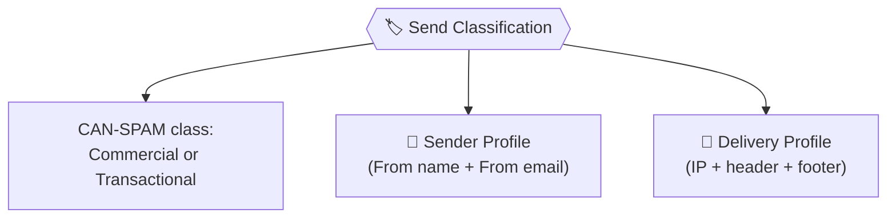
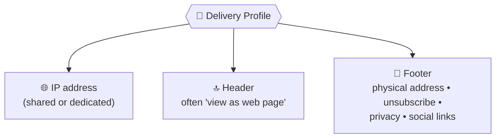
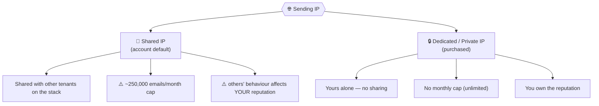
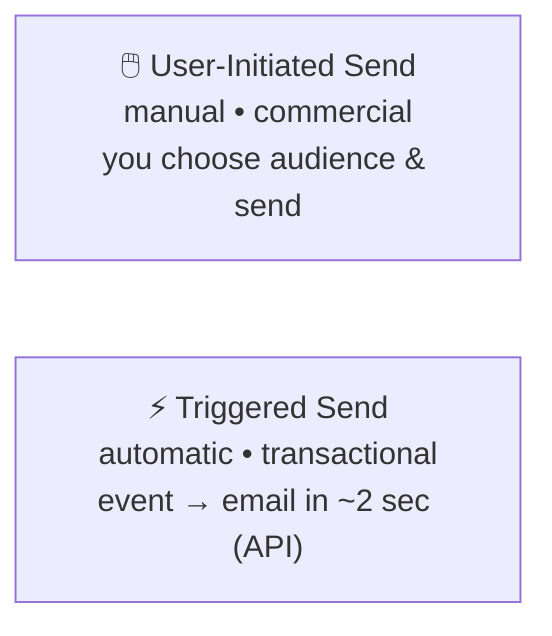
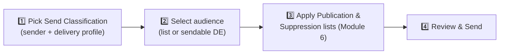
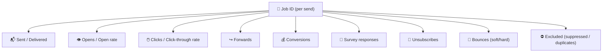

# 📗 Module 9 — Email Sends: Configuration & Tracking

> **Module goal:** Configure and execute an email send. Learn **Send Classification** (the setting that enforces CAN-SPAM), its two components — **Sender Profile** and **Delivery Profile** — the **shared vs dedicated IP** decision, the two **send types** (user-initiated vs triggered), the **deduplication** setting, and the **KPIs/tracking** you read afterwards.
>
> *These are my own study notes. Diagrams are original recreations of the lecture concepts. The raw course slides/manuals are kept in a separate private folder, not published here.*

> 🔗 **Builds on Module 6 (Compliance):** Send Classification is *how you implement CAN-SPAM in the platform*. And on Module 7–8: you send the **email you built**, to a **sendable DE**, applying **publication/suppression lists** (Module 6).

---

## 1. Send Classification — Telling the System Commercial vs Transactional

CAN-SPAM applies different rules to commercial vs transactional email — so the platform must **know which you're sending**. That's what a **Send Classification** declares.

> 🔑 A **Send Classification** is the setting that classifies a send as **Commercial** or **Transactional**, and bundles the **Sender Profile** + **Delivery Profile**. Based on the class, MC **enforces CAN-SPAM checks** automatically.

**Create it:** Email Studio → **Setup → Email Studio Settings → Send Classification → Create** → name it → pick **CAN-SPAM Classification** (Commercial/Transactional) → attach a Sender Profile + Delivery Profile.

> 🔑 **Why it matters — automatic guardrails:** if you classify a send **Commercial**, MC **checks for an unsubscribe link and physical address** and **blocks the send** if they're missing. If you classify it **Transactional**, it does **not** require (or allow) an unsubscribe link. In a rush you might forget a CAN-SPAM rule — the system won't.

---

## 2. Sender Profile — Who the Email Is From (CAN-SPAM Rule 1)

> 🔑 A **Sender Profile** defines the **From Name** and **From Email** address — satisfying CAN-SPAM's "accurately identify the sender" rule.

**Create it:** Setup → **Sender Profile → Create** → *Use specified information* → set **From Name** (e.g. the brand) and **From Email** (e.g. `marketing@brand.pk`) → **Verify** → **Save**.

- The From Name and From Email should **match the brand's real domain**, or recipients (and spam filters) flag you as fake.
- **Verification:** MC emails a one-time link to the From address; you must click it to prove ownership. (In a training account you verify your own personal address; a real brand verifies its own domain.)

> 💡 Once you've verified an address, future sender profiles using that same address are **auto-verified**.

---

## 3. Delivery Profile — IP, Header & Footer (CAN-SPAM Rules 4 & 5)

> 🔑 A **Delivery Profile** defines **three** things: the **IP address** used to send, the **header**, and the **footer** (which carries the physical mailing address + unsubscribe link).

**Create it:** Setup → **Delivery Profile → Create** → choose IP, header, footer → **Save**.

- **Header** — commonly the *"View this email as a web page"* link.
- **Footer** — the CAN-SPAM workhorse: **physical mailing address**, **unsubscribe link**, privacy policy, social links. Salesforce provides an **Account Default** header/footer that's CAN-SPAM compliant; you can customize it in **Setup → Company Settings → Account Settings** (HTML header/footer). Set it to **None** only if you'll supply your own inside each email.

---

## 4. IP Addresses — Shared vs Dedicated

The IP your email sends from carries a **reputation** that affects deliverability. There are two kinds — a guaranteed interview question.

| | 🤝 **Shared IP** | 🔒 **Dedicated (Private) IP** |
|---|---|---|
| **Who uses it** | Multiple tenants on the same MC **stack** | You alone |
| **How you get it** | Default when you buy MC | **Purchase** it; Salesforce adds it to your account |
| **Send limit** | ~**250,000 emails/month** | **Unlimited** |
| **Reputation** | Shared — a fraudster on your IP can **drag you down** | **Yours** — you build (or damage) it yourself |
| **Best for** | Small/low-volume senders | High-volume / brand-critical senders |

> ⚠️ **The two shared-IP drawbacks to memorize:** (1) the **~250,000/month** cap (tiny for a multinational), and (2) **no control over co-tenants** — if someone sharing your IP sends spam, **your** deliverability suffers.

> 🔑 **Interview:** *"Types of IPs in Marketing Cloud?"* → **Shared** (account default, capped, shared reputation) and **Dedicated/Private** (purchased, unlimited, sole reputation).

---

## 5. Two Types of Email Sends

> 🔑 There are **two send types** in Marketing Cloud:
> - **User-Initiated Send** — you **manually** send (commercial emails: promos, newsletters). You pick the audience and hit send.
> - **Triggered Send** — sent **automatically** by an event, in seconds (transactional: OTP, purchase confirmation). Powered by **APIs / automations** (covered with Journey Builder later).

> **Why triggered exists:** millions can request an OTP in a minute — nobody drafts those by hand. Triggered sends fire the right email instantly off a user action. (Our invoice's *automatic* delivery will be a triggered flow, built later.)

---

## 6. The User-Initiated Send Flow (+ Deduplication)

For a manual commercial send: **open the email → Send** → configure the send.

> 🔑 **Deduplicate by Subscriber:** a send-flow setting (on by default) that **prevents sending duplicate emails to the same email address**. If two rows have **different Subscriber Keys but the same email**, only **one** email goes out.

> **Worked example:** a DE has 10 rows but they share **your** email across different subscriber keys. With **Deduplicate by Subscriber ON**, you receive **1** email, not 10. Turn it **off** and all 10 send (minus anyone unsubscribed/suppressed). *"How do you avoid duplicate emails to a subscriber?"* → the **Deduplicate by Subscriber** checkbox.

> 🔗 **Publication & Suppression lists** (which lists an unsubscribe hits, and who's on the do-not-contact list) are applied here at send time — full detail in **Module 6**.

---

## 7. KPIs & Tracking — Reading Send Performance

Every send creates a **Job** (with a **Job ID**). Open it under **Tracking → Sends** to see performance.

> 🔑 An email isn't fire-and-forget — you **measure** it. Each send's Job ID exposes the **KPIs** that tell you whether the campaign worked.

| KPI | What it tells you |
|---|---|
| **Sent / Delivered** | How many actually went out and landed |
| **Opens / Open rate** | Is your **subject line** compelling? |
| **Clicks / CTR** | Did people engage with your links? |
| **Forwards** | Organic sharing/referral |
| **Conversions** | Did the email drive a purchase/goal? |
| **Survey responses** | Feedback captured |
| **Unsubscribes** | Opt-outs from this send |
| **Bounces** | Soft/hard deliverability failures (Module 5) |
| **Excluded** | Skipped due to suppression or deduplication |

> 💡 **Tracking lags:** engagement (opens/clicks) can take time to populate — often up to **24–72 hours** — before the Job ID's numbers settle.

> **Worked example:** you send to a 10-row DE but only **7** are "Sent." Tracking explains it: some were **unsubscribed** (Module 6 publication logic), and one was on a **suppression list** — shown under **Excluded**. Reading the job turns "why so few?" into a precise answer.

---

## 8. Two Extras: Send Logging & Triggered Send Definitions

Two related concepts that round out the sending picture.

### 8.1 Send Logging (the Send Log DE)

> 🔑 A **Send Log** is an optional **data extension you create** to record details **at send time** — who was sent to, which job, and even the **AMPscript values** used to build each message. It's your audit trail.

- Not on by default — you **create the Send Log DE** (from a template) and enable send logging in settings.
- Invaluable for **customer service and debugging**: when a customer asks "what exactly did my invoice say?", the send log holds the values that were rendered for them.

> ⚠️ Send logging **grows fast** — apply a **retention policy** (Module 4) so it doesn't balloon.

### 8.2 Triggered Send Definitions (TSD)

Section 5 introduced **triggered sends** (automatic, event-driven, via API). The object that defines one is a **Triggered Send Definition**.

> 🔑 A **Triggered Send Definition (TSD)** is the reusable configuration for a triggered send — it ties together the **email**, the **sendable DE**, and the **send classification**, and is **started** (activated) so that an **API call or automation** can fire it in real time.

- Used for **transactional** messages: order confirmations, OTPs, password resets, and our invoice's eventual real-time delivery.
- The full build (API/event wiring) comes with **Journey Builder / Automation Studio** — here, just know the TSD is *what a triggered send is configured as*.

> 💼 **Interview Q — "What is send logging used for?"** → An audit trail of what was sent (including AMPscript values), created as a Send Log DE — used for debugging and customer service.
> **Q — "What configures a triggered send?"** → A **Triggered Send Definition**, linking the email, sendable DE, and send classification, fired by an API/automation.

---

## 🎯 Key Takeaways

1. **Send Classification** declares **Commercial vs Transactional** and enforces CAN-SPAM checks automatically (blocks a commercial send missing an unsubscribe link).
2. It bundles a **Sender Profile** (From name/email — verified) and a **Delivery Profile** (IP + header + footer).
3. The **footer** carries the physical address + unsubscribe; Salesforce's **Account Default** footer is CAN-SPAM compliant.
4. **Shared IP** = account default, ~**250k/month** cap, shared reputation; **Dedicated IP** = purchased, unlimited, sole reputation.
5. **Two send types:** **user-initiated** (manual/commercial) and **triggered** (automatic/transactional via API).
6. **Deduplicate by Subscriber** stops multiple emails to the same address (different keys, same email).
7. Every send creates a **Job ID**; read **KPIs** (opens, clicks, conversions, bounces, unsubscribes, excluded) under **Tracking → Sends**.

---

## 💼 Interview Questions (with model answers)

- **Q: What is a Send Classification?**
  A: A setting that classifies a send as **Commercial or Transactional** and bundles the **Sender** and **Delivery** profiles; it drives automatic **CAN-SPAM checks**.

- **Q: What are the components of a Send Classification?**
  A: A **CAN-SPAM class** (commercial/transactional), a **Sender Profile**, and a **Delivery Profile**.

- **Q: What does a Sender Profile define?**
  A: The **From Name** and **From Email** (verified) — CAN-SPAM's accurate-sender rule.

- **Q: What does a Delivery Profile contain?**
  A: **IP address**, **header**, and **footer** (footer carries physical address + unsubscribe).

- **Q: What are the types of IP addresses in Marketing Cloud?**
  A: **Shared** (account default; ~250,000/month cap; reputation shared with co-tenants) and **Dedicated/Private** (purchased; unlimited; you own the reputation).

- **Q: What are the two drawbacks of a shared IP?**
  A: The ~**250,000 emails/month** cap, and **no control over co-tenants** whose behaviour can harm your reputation.

- **Q: What are the two types of email sends?**
  A: **User-initiated** (manual, commercial) and **triggered** (automatic, transactional, via API).

- **Q: How do you avoid sending duplicate emails to a subscriber?**
  A: Use the **Deduplicate by Subscriber** setting on the send flow — it stops multiple sends to the same email address.

- **Q: How do you measure an email send's performance?**
  A: Open its **Job ID** under **Tracking → Sends** and read the **KPIs** — opens, clicks, conversions, bounces, unsubscribes, excluded, etc.

- **Q: You sent to 10 records but only 7 delivered — how do you find out why?**
  A: Check the **Job ID** — the **Excluded** and status columns reveal unsubscribes (publication logic) and suppression-list exclusions.

---

## 🔁 Quick-Recall Flashcards

- **Q:** What declares commercial vs transactional? → **A:** Send Classification.
- **Q:** Two components inside a send classification? → **A:** Sender Profile + Delivery Profile.
- **Q:** Sender Profile defines? → **A:** From Name + From Email (verified).
- **Q:** Delivery Profile's three parts? → **A:** IP, header, footer.
- **Q:** Where does the physical address / unsubscribe live? → **A:** The footer.
- **Q:** Shared IP monthly cap? → **A:** ~250,000 emails.
- **Q:** Dedicated IP send limit? → **A:** Unlimited.
- **Q:** Two send types? → **A:** User-initiated and triggered.
- **Q:** Triggered sends are powered by? → **A:** APIs / automations.
- **Q:** Setting to avoid duplicate emails? → **A:** Deduplicate by Subscriber.
- **Q:** Each send creates a…? → **A:** Job (Job ID).
- **Q:** Name five KPIs. → **A:** Opens, clicks, conversions, bounces, unsubscribes.
- **Q:** Where do you read KPIs? → **A:** Tracking → Sends → the Job ID.

---

## 📖 Glossary

| Term | Meaning |
|---|---|
| **Send Classification** | Setting classifying a send commercial/transactional; enforces CAN-SPAM; bundles sender + delivery profiles. |
| **Sender Profile** | Defines the From Name and (verified) From Email. |
| **Delivery Profile** | Defines the sending IP, header, and footer. |
| **Header** | Top-of-email element, often "view as web page." |
| **Footer** | Bottom element carrying physical address, unsubscribe, privacy, social links. |
| **Account Default (header/footer)** | Salesforce-provided, CAN-SPAM-compliant footer/header (editable in Company Settings). |
| **Shared IP** | Account-default sending IP shared across tenants; ~250k/month; shared reputation. |
| **Dedicated / Private IP** | Purchased, exclusive sending IP; unlimited; sole reputation. |
| **Stack** | The shared MC infrastructure/tenant group an account sits on. |
| **User-Initiated Send** | A manually initiated send (commercial). |
| **Triggered Send** | An automatic, event-driven send (transactional, via API). |
| **Deduplicate by Subscriber** | Send setting preventing duplicate emails to the same address. |
| **Job / Job ID** | The record created per send, holding its tracking/KPIs. |
| **KPI** | A performance metric (opens, clicks, conversions, bounces, unsubscribes, excluded…). |

---

*End of Module 9. Next up (future batches): building **SMS/push** invoices in **Mobile Studio**, then automating real-time delivery with **Automation Studio & Journey Builder** (triggered sends).*
