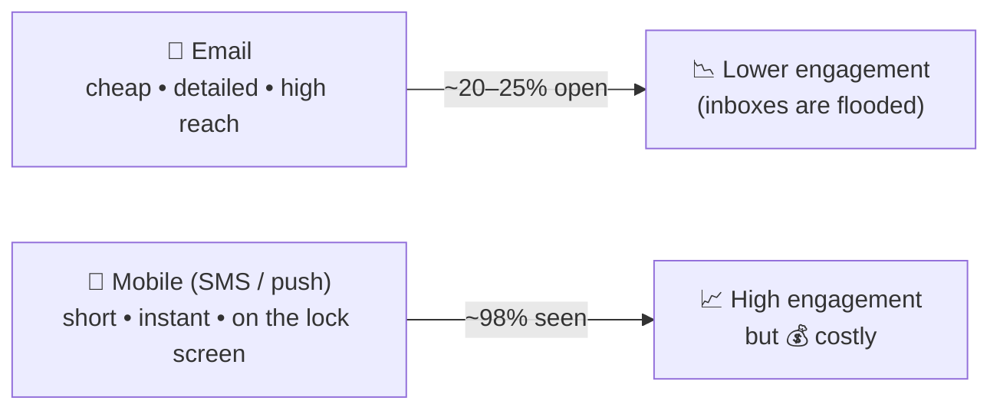
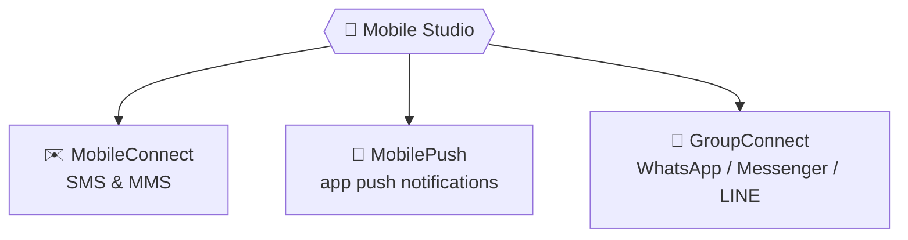
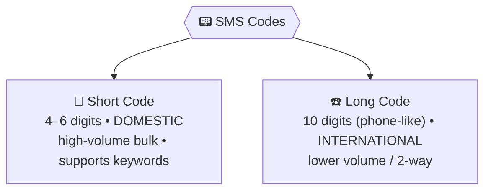
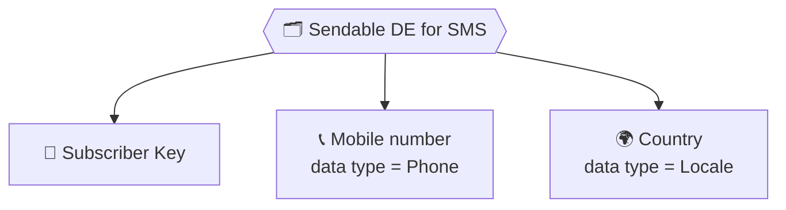
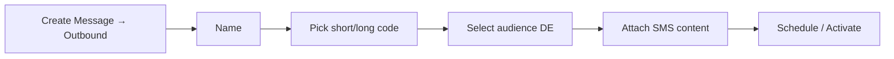

# 📕 Module 10 — Mobile Studio: SMS & MobileConnect

> **Module goal:** Move from email to **mobile**. Understand *why* mobile matters (engagement vs cost), Mobile Studio's **three channels**, then go deep on **MobileConnect (SMS/MMS)** — short vs long codes, the blackout window, keywords, the data-extension prerequisites for SMS, and how to build and send a text.
>
> *These are my own study notes. Diagrams are original recreations of the lecture concepts. Current market details were verified against recent sources. The raw course slides/manuals are kept in a separate private folder, not published here.*

---

## 1. Why Mobile? Engagement vs Cost

Email and mobile solve the same job — reaching the customer — but with opposite trade-offs.

> 🔑 **The core trade-off:**
> - **Email** is **low-cost and high-affordability**, so *everyone* uses it — which floods inboxes and drags typical **open rates to ~20–25%** (a respectable email figure).
> - **Mobile** messages land on the **lock screen with an alert**, so they're **seen ~98%** of the time — but they're **expensive** to send.

> 💡 **Why mobile costs so much:** SMS/MMS need **paid licences from mobile operators**; push needs a **built, downloaded app**; and WhatsApp/Messenger need **paid messaging-API licences**. None of it is "free like email."

> 🔑 **Consultant takeaway:** for aggressive, time-boxed campaigns you can't rely on email's ~25% alone — you layer in mobile's ~98% reach, accepting the higher cost for the higher engagement.

---

## 2. Mobile Studio's Three Channels

Mobile Studio delivers on mobile in **three** ways — a guaranteed interview question.

| Channel | Delivers | Covered in |
|---|---|---|
| **MobileConnect** | **SMS** and **MMS** (the phone's native texting) | This module |
| **MobilePush** | **Push notifications** to your mobile app | Module 11 |
| **GroupConnect** | Messages via **third-party apps** (WhatsApp, Facebook Messenger, LINE) | Module 11 |

---

## 3. MobileConnect — SMS vs MMS

> 🔑 **SMS (Short Message Service)** = plain **text only** — no images, colour, or media. **MMS (Multimedia Messaging Service)** = supports **images/media**.

> ⚠️ **MMS is largely deprecated.** In many markets (including Pakistan) MMS isn't really used anymore — its multimedia role has been taken over by **WhatsApp and other messengers** (handled via **GroupConnect**, Module 11). So in practice, MobileConnect today means **SMS**.

---

## 4. SMS Codes — Short Code vs Long Code

To send SMS you need a **code** — the "number" the text comes from — licensed from a mobile operator (in Pakistan, **Jazz, Zong, or Ufone**). Think of it as SMS's equivalent of the email **From address**.

| | **Short Code** | **Long Code** |
|---|---|---|
| **Length** | 4–6 digits | 10 digits (like a phone number) |
| **Reach** | **Domestic** only | **International** |
| **Typical use** | High-volume domestic bulk marketing | Global senders / OTPs / two-way |
| **Keywords?** | ✅ Yes (inbound keywords) | Generally no |

> **Everyday tell:** promotional SMS from local companies arrive from **short codes** (e.g. `8092`, `9092`); a one-time passcode from **Google, WhatsApp, or Facebook** arrives from a **long code** (a full international number), because those are global senders.

> 💼 **Interview Q — "Difference between a short code and a long code?"** → **Short code**: 4–6 digits, domestic, high-volume, supports keywords. **Long code**: ~10 digits, international, lower volume / two-way.

---

## 5. Blackout Window — Don't Text at 2 AM

Email arrives silently; **SMS rings the phone**. Sending at the wrong hour annoys — or even alarms — subscribers.

> 🔑 A **blackout window** is a period during which MobileConnect **will not send any SMS**, no matter what. It stops messages going out at **inopportune times** (classic example: **nights and weekends**).

> **Use case:** set a blackout window of **8 PM → 8 AM**. Even a subscriber who's otherwise eligible for a message won't receive one during that window — protecting elderly or sleeping customers from a jarring midnight alert.

> 🔑 **Rule of thumb:** with email you can be lenient; with SMS you must respect every subscriber's comfort, because you're interrupting their phone directly.

---

## 6. Keywords — Two-Way SMS

SMS isn't only outbound. Subscribers can **text a keyword** to your short code to *request* something — making SMS a **two-way** channel.

> 🔑 A **keyword** is a word a subscriber texts to your **short code** to trigger an action (keywords work with **short codes**, not long codes). Examples: `SIGNUP`, `HELP`, `BALANCE`, `OPT IN`, `OPT OUT`.

> **Use case (familiar to everyone):** before banking apps, you'd text a keyword + last digits of your account to a bank's short code and get your **balance** back by SMS. In Pakistan, banks (HBL, UBL, Meezan) and mobile operators still offer SMS/USSD keyword services to check balances or activate packages. You build the keyword in Marketing Cloud and attach the **action** that replies to the subscriber.

### STOP keywords (auto-unsubscribe)

> ⚠️ Every MobileConnect account has built-in **STOP keywords** — **`STOP`, `QUIT`, `CANCEL`, `UNSUBSCRIBE`**. When a subscriber replies with any of these, they're **automatically unsubscribed** from SMS. This is mandatory (the SMS equivalent of the email unsubscribe link).

> 💼 **Interview Q — "What are keywords / STOP keywords?"** → Keywords are words a subscriber texts to a short code to trigger an action (two-way SMS). STOP keywords (STOP/QUIT/CANCEL/UNSUBSCRIBE) auto-unsubscribe the sender.

---

## 7. Prerequisites — Preparing a DE for SMS

Like email, SMS sends from a **sendable data extension** (lists are **Email-Studio-only** — Mobile Studio uses **data extensions** from the centralized contact model). But SMS needs **three specific fields**, or the DE can't be used.

| Prerequisite | Why | Data type |
|---|---|---|
| **Subscriber Key** | Uniquely identifies the subscriber | Text |
| **Mobile number** | Where the SMS is delivered | **Phone** (not Number — MC must recognize it as dialable) |
| **Country** | Required for SMS routing | **Locale** |

> ⚠️ **Country is required for SMS but *not* for email.** A DE missing any of the three — or storing the phone as *Number* instead of *Phone* — **can't send SMS**, even if it's sendable. (Same principle as email needing the **Email Address** data type.)

> 💼 **Interview Q — "Prerequisites to send SMS?"** → A **sendable** DE containing **Subscriber Key**, a **mobile number (Phone type)**, and a **country (Locale type)**.

---

## 8. Building & Sending an SMS

### Building (Content Builder)

> 🔑 SMS are built in the **standalone Content Builder** (opened as its own app, not the one *inside* Email Studio — that only makes email). Create → **SMS Message**.

- **160 characters** per SMS; beyond that it splits into another message automatically.
- **Text only** — strip out logos/images (no multimedia).
- **Data-driven and dynamic** — the *same* personalization strings and **AMPscript** from the email work here (e.g. `%%FirstName%%`, lookups for product/bill). Preview per subscriber exactly like email.

> **Invoice project tie-in:** the invoice we built for email must *also* go by SMS. We reuse the **same AMPscript** to pull product, bill, quantity, etc. — just without the images — into a text-only invoice message.

### Sending (Mobile Studio → MobileConnect)

Building doesn't send — you send from **Mobile Studio → MobileConnect → Create Message**, choosing a message type:

| Send type | Use |
|---|---|
| **Outbound** | One-way bulk send (most common) — no reply expected |
| **Text Response** | Two-way — subscribers can reply (e.g. "reply YES to continue") |
| **Opt-in** | Confirm/collect opt-in consent |

Then: **name it → pick the short/long code → select the audience (DE) → attach the content → schedule or activate**.

> 💡 In a demo/training account you can walk the whole flow but **can't actually send** — SMS requires **paid operator licences** (and provisioned codes), which cost real money.

---

## 🎯 Key Takeaways

1. **Email = cheap but ~20–25% open; mobile = ~98% seen but costly.** Layer mobile in for high-engagement campaigns.
2. **Mobile Studio has three channels:** MobileConnect (SMS/MMS), MobilePush (push), GroupConnect (WhatsApp/Messenger).
3. **MMS is largely deprecated** — WhatsApp/messengers (GroupConnect) fill the multimedia role; MobileConnect ≈ SMS today.
4. **Short code** = 4–6 digits, domestic, high-volume, keyword-capable; **Long code** = ~10 digits, international/two-way.
5. **Blackout window** blocks SMS at inopportune times (e.g. 8 PM–8 AM).
6. **Keywords** enable two-way SMS; **STOP/QUIT/CANCEL/UNSUBSCRIBE** auto-unsubscribe.
7. **SMS prerequisites:** a sendable DE with **Subscriber Key + mobile (Phone) + country (Locale)**.
8. **Build SMS in standalone Content Builder** (160 chars, text-only, AMPscript works); **send from MobileConnect** (Outbound/Text Response/Opt-in).

---

## 💼 Interview Questions (with model answers)

- **Q: What are the three channels of Mobile Studio?**
  A: **MobileConnect** (SMS/MMS), **MobilePush** (push notifications), and **GroupConnect** (third-party messengers like WhatsApp).

- **Q: Why use mobile over email?**
  A: Mobile messages land on the lock screen and are seen ~**98%** of the time vs email's ~**20–25%** open rate — far higher engagement, at higher cost.

- **Q: SMS vs MMS?**
  A: SMS is **text only**; MMS supports **multimedia** — but MMS is largely **deprecated**, replaced by WhatsApp/messengers.

- **Q: Short code vs long code?**
  A: **Short code** = 4–6 digits, domestic, high-volume, supports keywords. **Long code** = ~10 digits, international, lower-volume/two-way.

- **Q: What is a blackout window?**
  A: A period when MobileConnect **won't send SMS** (e.g. nights/weekends) to avoid disturbing subscribers.

- **Q: What are keywords and STOP keywords?**
  A: Keywords are words a subscriber texts to a **short code** to trigger an action (two-way SMS). **STOP/QUIT/CANCEL/UNSUBSCRIBE** auto-unsubscribe them.

- **Q: What are the prerequisites to send SMS?**
  A: A **sendable** data extension with **Subscriber Key**, **mobile number (Phone type)**, and **country (Locale type)**.

- **Q: Where do you build vs send an SMS?**
  A: **Build** in standalone **Content Builder** (SMS Message, 160 chars, AMPscript works); **send** from **Mobile Studio → MobileConnect**.

---

## 🔁 Quick-Recall Flashcards

- **Q:** Three Mobile Studio channels? → **A:** MobileConnect, MobilePush, GroupConnect.
- **Q:** Email vs mobile engagement? → **A:** ~20–25% open vs ~98% seen.
- **Q:** MobileConnect handles? → **A:** SMS and MMS.
- **Q:** Is MMS widely used? → **A:** No — largely replaced by WhatsApp/messengers.
- **Q:** Short code = ? → **A:** 4–6 digits, domestic, keyword-capable.
- **Q:** Long code = ? → **A:** ~10 digits, international/two-way.
- **Q:** Blackout window? → **A:** Time period when no SMS is sent.
- **Q:** STOP keywords? → **A:** STOP, QUIT, CANCEL, UNSUBSCRIBE (auto-unsubscribe).
- **Q:** Do keywords work on long codes? → **A:** No — short codes only.
- **Q:** SMS DE prerequisites? → **A:** Subscriber Key + mobile (Phone) + country (Locale).
- **Q:** SMS character limit? → **A:** 160 (then it splits).
- **Q:** Does Mobile Studio use lists? → **A:** No — data extensions only (lists are Email-Studio-only).

---

## 📖 Glossary

| Term | Meaning |
|---|---|
| **Mobile Studio** | The Marketing Cloud area for mobile channels. |
| **MobileConnect** | Mobile Studio's SMS/MMS channel. |
| **MobilePush** | Mobile Studio's app push-notification channel (Module 11). |
| **GroupConnect** | Mobile Studio's third-party messaging channel — WhatsApp, Messenger, LINE (Module 11). |
| **SMS** | Short Message Service — plain text only. |
| **MMS** | Multimedia Messaging Service — supports media; largely deprecated. |
| **Short Code** | 4–6 digit domestic sending code; supports keywords. |
| **Long Code** | ~10 digit international sending code; often two-way. |
| **Blackout Window** | A period during which SMS won't be sent. |
| **Keyword** | A word a subscriber texts to a short code to trigger an action. |
| **STOP Keywords** | STOP/QUIT/CANCEL/UNSUBSCRIBE — auto-unsubscribe a subscriber. |
| **Locale (data type)** | Country field type required for SMS. |
| **Phone (data type)** | Mobile-number field type required for SMS. |

---

*End of Module 10. Next: **Module 11 — Mobile Studio: Push Notifications & GroupConnect** — integrating your app, building push, location-based (geofence) messaging, and WhatsApp/Messenger via GroupConnect.*
