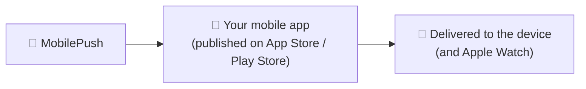
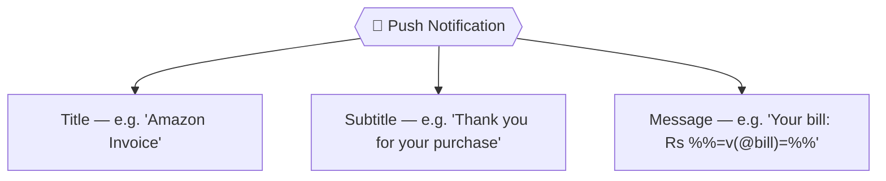
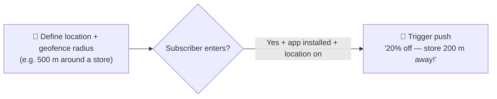

# 📕 Module 11 — Mobile Studio: Push Notifications & GroupConnect

> **Module goal:** Finish Mobile Studio with the two remaining channels. Learn **MobilePush** — integrating a mobile app, building a push notification, and **location-based (geofence)** messaging — and **GroupConnect** for WhatsApp and other third-party messengers.
>
> *These are my own study notes. Diagrams are original recreations of the lecture concepts. The raw course slides/manuals are kept in a separate private folder, not published here.*

---

## 1. MobilePush — What It Is and What It Needs

> 🔑 **MobilePush** sends **push notifications** from Marketing Cloud to your **own mobile app**. Unlike SMS (which needs only a phone number), push **requires an app** — one that's been **built, published to the App Store / Play Store, and integrated** with Marketing Cloud.

> 💡 **Why push is expensive:** you first have to **build** an app, then get customers to **download** it — only then can you push to them. No app, no push.

---

## 2. Integrating a Mobile App

Setup happens in **Mobile Studio → MobilePush → Administration → Create New App**.

| Platform | What you need from your developer |
|---|---|
| **iOS** | Apple push certificates/keys |
| **Android** | A server key (FCM — Firebase Cloud Messaging) |

Other integration settings:

- **Push icon** — the small brand icon shown on the notification (like the WhatsApp/Facebook icon you recognize at a glance); upload it at the required pixel size.
- **Custom sound** — an optional alert sound; if disabled, push arrives **silently**.

> 🔑 The app must be **hosted on Google Play / the App Store** and integrated with these keys before you can push to it. Integration is a developer-assisted step.

---

## 3. Building a Push Notification

Built in the **standalone Content Builder** (Create → **Push Notification**), same as SMS.

> 🔑 A push notification has **three parts**: **Title**, **Subtitle**, and **Message** — and it supports **personalization strings and AMPscript**, just like email and SMS.

- **Preview across devices** — check how it looks on **iPhone** and **Android** (lock screen, banner, long-press/expanded) and even **Apple Watch**, so the copy fits every surface.
- **Invoice tie-in:** the same invoice data (via AMPscript) can be pushed — `%%FirstName%%`, bill, etc. — reusing the logic from email and SMS.

> 🔑 **One message, three channels:** the invoice project delivers the *same* transactional content by **email, SMS, and push** — built once with AMPscript, adapted per channel (rich email, text SMS, short push).

---

## 4. Location-Based Push — Geofencing & Beacons

Because a push app can access the phone's **location** (with permission), MobilePush can trigger messages by **where the subscriber is** — the most powerful mobile feature.

> 🔑 A **geofence** is a virtual boundary around a physical location. MobilePush can fire a notification on **location entry** or **location exit** — "someone with our app just came near our store."

> **Use case (retail):** **McDonald's** sets a geofence around its outlet near **Jinnah International Airport, Karachi**. A subscriber with the app who passes within 500 m gets a **"Grab 20% now — store 50 m away"** push — turning foot traffic into orders. (Requires the app installed *and* location enabled.)

> **Use case (delivery):** **foodpanda / Careem / Bykea** track *both* your location and the rider's, triggering "arriving in 5 minutes" pushes — the same geofence/location mechanics, powered by Marketing Cloud behind the scenes.

- **To set up:** define the location on the map, set a **geofence radius** (100 m / 400 m / 500 m…), save it, then create a **Location Entry** (or Exit) message that targets people entering it.
- **Beacons** — small **Bluetooth** devices once used for in-store proximity — are **legacy**; modern targeting uses phone **location/geofencing** instead.

> 💼 **Interview Q — "How does location-based push work?"** → Define a **geofence** around a location; MobilePush fires on **entry/exit** to subscribers who have the app installed with location enabled.

---

## 5. GroupConnect — WhatsApp & Third-Party Messengers

The third Mobile Studio channel reaches customers on the messaging apps they already live in.

> 🔑 **GroupConnect** sends messages through **third-party messaging platforms** — **WhatsApp**, **Facebook Messenger**, **LINE** — rather than native SMS or your own app.

- Ideal where **WhatsApp** dominates (as in Pakistan), and for **rich** content SMS can't carry — filling the gap left by deprecated MMS.
- ⚠️ Requires a **paid messaging-API licence** from the provider (e.g. the WhatsApp Business API via Meta) — you **can't** bulk-message on these platforms for free.

> 💡 **Which mobile channel when?** **SMS (MobileConnect)** for universal reach (works on any phone, no app); **Push (MobilePush)** for app users and location triggers; **GroupConnect** for rich, conversational messaging on WhatsApp/Messenger.

> 💼 **Interview Q — "What is GroupConnect?"** → Mobile Studio's channel for sending via third-party messengers (WhatsApp, Messenger, LINE), needing a paid messaging-API licence.

---

## 🎯 Key Takeaways

1. **MobilePush** sends push to your **own app**, which must be **built, published, and integrated** (iOS certs / Android FCM key).
2. Integration also sets the **push icon** and optional **custom sound**.
3. A push has **Title, Subtitle, Message**, supports **AMPscript**, and should be **previewed across devices** (incl. Apple Watch).
4. **Geofencing** triggers push on **location entry/exit** (app + location required); **beacons** are legacy Bluetooth.
5. The invoice project sends the **same content across email, SMS, and push** — built once, adapted per channel.
6. **GroupConnect** reaches **WhatsApp/Messenger/LINE** (paid API licence) — rich messaging where MMS left off.
7. **Channel choice:** SMS for universal reach, push for app users + location, GroupConnect for rich conversational messaging.

---

## 💼 Interview Questions (with model answers)

- **Q: What does MobilePush require that SMS doesn't?**
  A: A **mobile app** — built, published to the App Store/Play Store, and integrated with Marketing Cloud (iOS certificates / Android FCM key).

- **Q: What are the parts of a push notification?**
  A: **Title, Subtitle, and Message** — with personalization strings/AMPscript support.

- **Q: How does location-based push work?**
  A: Define a **geofence** around a location; MobilePush fires on **entry** or **exit** for subscribers who have the app installed with location enabled.

- **Q: What are beacons, and are they current?**
  A: Small **Bluetooth** proximity devices — now **legacy**; modern targeting uses phone location/geofencing.

- **Q: What is GroupConnect?**
  A: Mobile Studio's channel for **third-party messengers** (WhatsApp, Facebook Messenger, LINE), requiring a paid messaging-API licence.

- **Q: When would you choose SMS vs push vs GroupConnect?**
  A: **SMS** for universal reach (any phone, no app); **push** for app users and location triggers; **GroupConnect** for rich, conversational WhatsApp/Messenger content.

---

## 🔁 Quick-Recall Flashcards

- **Q:** MobilePush needs…? → **A:** A built, published, integrated app.
- **Q:** iOS vs Android integration keys? → **A:** Apple push certs vs Android FCM server key.
- **Q:** Push notification parts? → **A:** Title, Subtitle, Message.
- **Q:** Does push support AMPscript? → **A:** Yes.
- **Q:** Preview surfaces? → **A:** iPhone, Android, lock screen, banner, Apple Watch.
- **Q:** Geofence triggers on…? → **A:** Location entry/exit.
- **Q:** Geofencing requirements? → **A:** App installed + location enabled.
- **Q:** Beacons use what, and are they current? → **A:** Bluetooth; legacy.
- **Q:** GroupConnect channels? → **A:** WhatsApp, Messenger, LINE.
- **Q:** GroupConnect cost? → **A:** Paid messaging-API licence.

---

## 📖 Glossary

| Term | Meaning |
|---|---|
| **MobilePush** | Mobile Studio channel for app push notifications. |
| **Push Notification** | An app alert with Title, Subtitle, and Message. |
| **App integration** | Connecting a published app to MC via iOS certs / Android FCM key. |
| **FCM** | Firebase Cloud Messaging — Android push delivery service. |
| **Push icon / custom sound** | The notification's brand icon and optional alert sound. |
| **Geofence** | A virtual boundary around a physical location. |
| **Location Entry / Exit** | Push triggers based on entering/leaving a geofence. |
| **Beacon** | Legacy Bluetooth proximity device for in-store targeting. |
| **GroupConnect** | Mobile Studio channel for third-party messengers (WhatsApp, Messenger, LINE). |
| **WhatsApp Business API** | The paid API used to send WhatsApp messages at scale. |

---

*End of Module 11 — and of Mobile Studio. Next up (future batches): **Automation Studio** (imports, SQL queries, scheduled workflows) and **Journey Builder** (the triggered, real-time automation that finally delivers our invoice the instant a transaction happens).*
