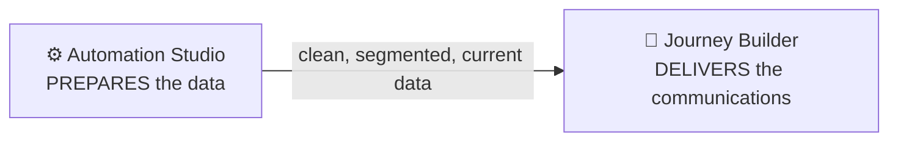
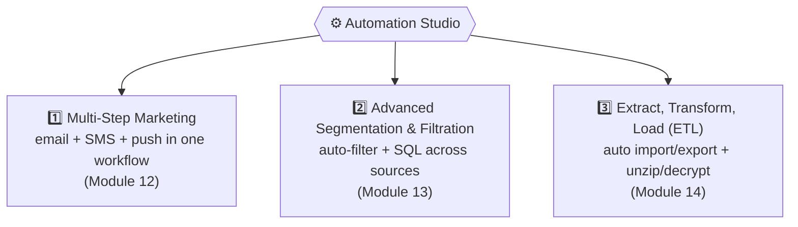
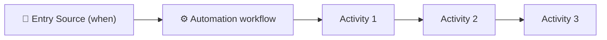
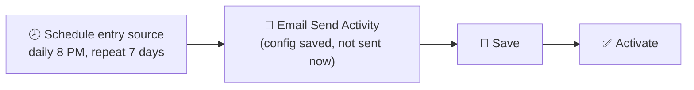
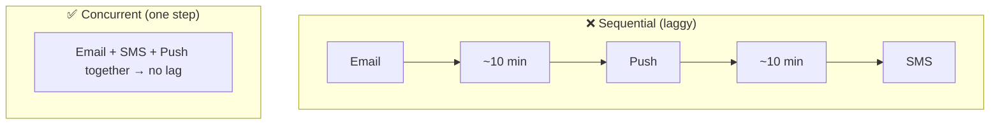

# 📙 Module 12 — Automation Studio: Foundations & Multi-Step Marketing

> **Module goal:** Enter the automation half of Marketing Cloud. First understand what a **journey** is and how **Journey Builder** relates to **Automation Studio**, then learn what Automation Studio is, its **three capabilities**, its **entry sources & activities**, and go hands-on with **Capability 1 — multi-step marketing** via **scheduled automations**.
>
> *These are my own study notes. Diagrams are original recreations of the lecture concepts. The raw course slides/manuals are kept in a separate private folder, not published here.*

> 🧭 **Where we are:** we've built the data model, emails, SMS, and push — all sent **manually**. Automation Studio is how those actions start running **on their own**. This is a three-module arc (12–14), one per capability, and it's one of the **most interview-heavy** areas of Marketing Cloud.

---

## 1. What Is a Journey?

Before automation, the *why*: everything we automate ultimately serves a **journey**.

> 🔑 A **journey** is a **series of communications** arranged to solve a **business problem** — the right message, to the right customer, at the right time, step by step.

Three journeys you already receive:

| Journey | The sequence |
|---|---|
| **Purchase** | Order placed (invoice) → packed → shipped → out for delivery → delivered → "rate your experience" |
| **Offer (HR)** | Offer letter → "3 days left, accept it" → "congrats, joining 1 June" → induction agenda → document reminder → "welcome aboard" |
| **Return** | Return accepted → pickup scheduled → picked up → quality check → refund approved → refund processed |

> 🔑 **Journey Builder** is Marketing Cloud's **1-to-1 customer-experience platform** — where these sequences are designed. A complex journey has **decisions** ("offer accepted? yes → path A, no → path B"), so it can react to each customer individually. *(Full Journey Builder is the next section; here it's the motivation for automation.)*

---

## 2. Journey Builder vs Automation Studio — the Distinction That Gets Asked

> 💼 **This is one of the most common Marketing Cloud interview questions.**

> 🔑 **Journey Builder *delivers* communications; Automation Studio *prepares the data* those communications need.** A journey can't decide "was the offer accepted?" or "is the order shipped?" without **processed data** — and that data work is Automation Studio's job.

- Both live under **Journey Builder** in the app, but they're **two separate tools**.
- You must understand **Automation Studio first**, because a good journey depends on well-prepared data.

---

## 3. What Is Automation Studio?

> 🔑 **Automation Studio is a Marketing Cloud application used to automate data and messaging processes** — everything you've done manually (importing data, filtering, sending) can be made to run automatically on a schedule or a trigger.

Why it's essential: at enterprise scale you **can't** hand-import files or hit "send" all day. Data arrives **real-time and in batches** from many systems; a company will **never** let you keep customer data on your desktop (a security violation). Automation handles it.

---

## 4. The Three Capabilities of Automation Studio

Learn these three — they frame this whole module set.

| Capability | What it does |
|---|---|
| **Multi-step marketing** | Send **email, SMS, and push** (any channel) in a **single workflow** — no hopping between studios |
| **Advanced segmentation & filtration** | **Auto-refresh** filtered data, and use **SQL** to combine multiple sources |
| **Extract, Transform, Load (ETL)** | **Automate** data import/export, and transform files (unzip, decrypt) |

---

## 5. Anatomy — Entry Sources + Activities

Every automation has two parts.

> 🔑 **Entry Source = *when* the automation runs. Activities = *what* it does when it runs.**

**Three entry sources:**

| Entry source | Fires when… | Covered in |
|---|---|---|
| **Schedule** | A time you set (e.g. daily 8 PM) | This module |
| **File Drop** | A file lands on the SFTP | Module 14 |
| **Trigger** | An **API** call fires it (real-time) | Module 14 → Journey Builder |

**Commonly used activities:** Send Email / SMS / Push, **Wait**, **Filter**, **SQL Query**, **Import**, **Data Extract**, **File Transfer**, Refresh Group, Verification.

**To open it:** Journey Builder → **Automation Studio** → **New Automation**. Existing automations show **green** (success) or **red** (error).

---

## 6. Capability 1 — Multi-Step Marketing

> 🔑 **Multi-step marketing** lets you send **email, SMS, and push** — previously stuck in separate studios — from **one automation workflow**. In a single automation you can fire all three channels; no more logging into Email Studio, then MobileConnect, then MobilePush separately.

---

## 7. Building a Scheduled Automation

**Path:** Automation Studio → New Automation → drag the **Schedule** entry source onto the canvas.

### Configure the schedule

- Pick the **start date/time** (e.g. today, 8 PM **Pakistan Standard Time**).
- Set a **repeat frequency**: hourly, daily, weekdays, weekly, monthly, yearly.
- Set an **end**: after *N* occurrences, on a specific date, or **never**.

> **Use case (commercial):** a 25%-off sale runs all week → schedule the promo email to **repeat daily for 7 days**. The audience already exists, so scheduling fits perfectly.

### Add the activity

Drag an **Email Send Activity** → **Create New** → the **same send flow** you know (sender/delivery profile → audience DE → publication/suppression list → review).

> 🔑 **The key shift:** clicking **Finish** here **doesn't send** — it **saves the configuration** to execute at the scheduled time (8 PM). SMS and push work the same way (where enabled).

> ⚠️ **You can't activate an automation with an *unconfigured* activity** — remove or configure every step first.

---

## 8. Sequential vs Concurrent Steps — Avoiding the Time Lag

Automation runs steps **one after another**, which can hurt customer experience.

> ⚠️ **The time-lag trap:** put Email in Step 1, Push in Step 2, SMS in Step 3, and for millions of subscribers each step takes ~10 minutes — so a customer gets the email, then push 10 min later, then SMS 10 min later. **25 minutes of dribbling notifications** feels broken.

> 🔑 **Fix — one concurrent step:** place **email, SMS, and push in a *single* step** so they fire **simultaneously**, with no lag. Use **separate steps only when you *want* a gap**, adding a **Wait activity** between them (e.g. email now → wait 10 min → push).

> 💡 **Wait activity** can't sit *inside* a combined step — it's its own step, used deliberately to space communications out.

---

## 9. Running, Activating & Monitoring

- **Save & Activate** → the automation runs on its schedule (e.g. daily 8 PM for 7 days). Its run **history** is tracked.
- **Run Once** → **bypasses the schedule** and runs immediately. ⚠️ **Not a test** — it hits the **real production audience** in the DE. To test safely, point the activity at a **test-audience DE** first.
- **Notifications** → set an email to be alerted when the automation **fails** *and* when it **completes** — so you catch and fix errors fast.

> 💼 **Interview Q — "What's the difference between Run Once and scheduling?"** → Scheduling runs the automation at the configured time(s); **Run Once** executes it **immediately**, bypassing the schedule, against the live audience.

---

## 10. Why Schedule Doesn't Solve the Invoice

> ⚠️ **Scheduling needs the data to already exist.** For a **25%-off sale** that's fine — you know the audience and time in advance. But for a **real-time invoice**, you *can't* know when a customer will buy, and their transaction data **isn't there yet**. So **schedule entry source suits commercial marketing, not transactional**.

> 🔑 The invoice still isn't automated — we need a way to start automations **when data arrives**, not at a fixed clock time. That's **File Drop** and **Trigger** (Module 14), and ultimately **APIs** in Journey Builder.

---

## 🎯 Key Takeaways

1. A **journey** is a series of communications solving a business problem; **Journey Builder** designs them (a 1-to-1 CX platform).
2. **Journey Builder delivers; Automation Studio prepares the data** — *the* classic interview distinction.
3. **Automation Studio automates data & messaging processes**; it's part of Journey Builder.
4. **Three capabilities:** multi-step marketing, advanced segmentation & filtration, ETL.
5. **Entry source = when; Activities = what.** Entry sources: **Schedule, File Drop, Trigger**.
6. **Multi-step marketing** sends email/SMS/push from one workflow.
7. **Scheduled automations** have a start, repeat frequency, and end; **Finish saves** the send config rather than sending.
8. **Combine channels in one step** to avoid the time lag; use **Wait** only for deliberate gaps.
9. **Run Once** bypasses the schedule and hits production — not a test.
10. **Scheduling suits commercial, not transactional** — real-time invoice needs file drop / trigger / API.

---

## 💼 Interview Questions (with model answers)

- **Q: What is the difference between Journey Builder and Automation Studio?**
  A: **Journey Builder delivers** the sequence of communications; **Automation Studio prepares and processes the data** those communications rely on.

- **Q: What is a journey?**
  A: A series of communications arranged to solve a business problem (purchase, offer, return…), delivering the right message at the right time.

- **Q: What is Automation Studio?**
  A: A Marketing Cloud application that automates data and messaging processes (import, filter, segment, send) on a schedule or trigger.

- **Q: What are the three capabilities of Automation Studio?**
  A: **Multi-step marketing**, **advanced segmentation & filtration**, and **ETL (extract, transform, load)**.

- **Q: What is multi-step marketing?**
  A: Sending multiple channels — email, SMS, push — from a **single automation workflow**.

- **Q: What are an automation's two parts?**
  A: An **entry source** (when it runs) and **activities** (what it does).

- **Q: What are the entry sources?**
  A: **Schedule, File Drop, and Trigger.**

- **Q: Why put channels in one step vs separate steps?**
  A: Separate steps run sequentially and cause delays between channels; a **single step** sends them **concurrently**. Use a **Wait activity** only when you *want* a gap.

- **Q: Difference between scheduling and Run Once?**
  A: Scheduling runs at set times; **Run Once** runs immediately (bypassing the schedule) against the live audience — not a test.

- **Q: Why can't scheduling handle a real-time invoice?**
  A: Scheduling needs the **data present in advance**; transactional data arrives in real time, so you need **file drop or trigger (API)** instead.

---

## 🔁 Quick-Recall Flashcards

- **Q:** Journey = ? → **A:** A series of communications solving a business problem.
- **Q:** Journey Builder does? → **A:** Delivers communications (1-to-1 CX platform).
- **Q:** Automation Studio does? → **A:** Prepares/processes the data.
- **Q:** Three AS capabilities? → **A:** Multi-step marketing, segmentation & filtration, ETL.
- **Q:** Entry source vs activity? → **A:** When it runs vs what it does.
- **Q:** Three entry sources? → **A:** Schedule, File Drop, Trigger.
- **Q:** Multi-step marketing? → **A:** Email + SMS + push in one workflow.
- **Q:** Does Finish send in a scheduled email activity? → **A:** No — it saves the config for the scheduled time.
- **Q:** Avoid channel time-lag how? → **A:** Put channels in one concurrent step.
- **Q:** Wait activity is for? → **A:** Deliberate gaps between steps.
- **Q:** Run Once? → **A:** Runs immediately, bypasses schedule, hits production.
- **Q:** Schedule suits which marketing? → **A:** Commercial (data already present), not transactional.

---

## 📖 Glossary

| Term | Meaning |
|---|---|
| **Journey** | A series of communications solving a business problem. |
| **Journey Builder** | The 1-to-1 platform that designs and delivers journeys. |
| **Automation Studio** | The application that automates data and messaging processes. |
| **Entry Source** | What determines *when* an automation runs (Schedule / File Drop / Trigger). |
| **Activity** | A step an automation performs (send, filter, SQL, import, extract…). |
| **Multi-Step Marketing** | Sending multiple channels in one automation workflow. |
| **Schedule Entry Source** | Runs an automation at set times, with repeat/end options. |
| **Repeat Frequency** | How often a scheduled automation reoccurs. |
| **Email/SMS/Push Send Activity** | An activity that saves a send config to execute in the automation. |
| **Wait Activity** | A step that pauses the automation for a set time. |
| **Run Once** | Executes an automation immediately, bypassing the schedule. |
| **Activate** | Turns a saved automation on so it runs per its entry source. |

---

*End of Module 12. Next: **Module 13 — Segmentation with Filters & SQL** (Capability 2) — auto-refreshing filtered data, groups, and querying multiple data extensions and data views with SQL.*
