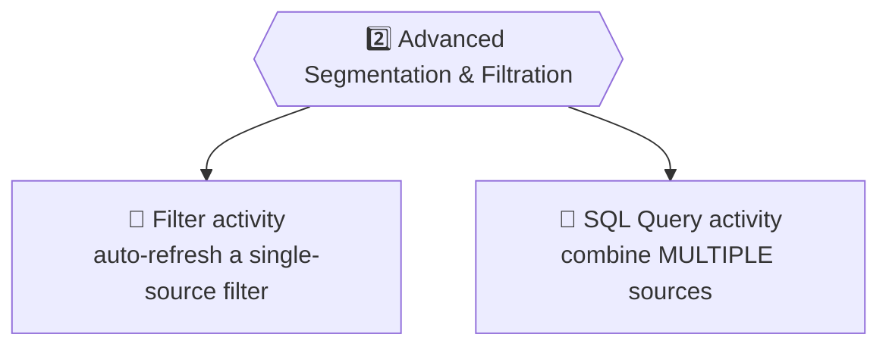
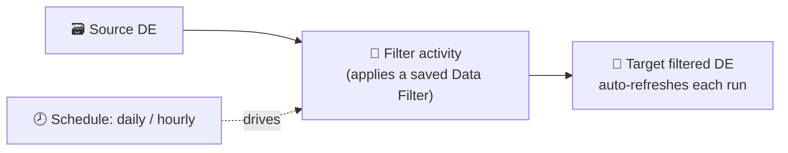
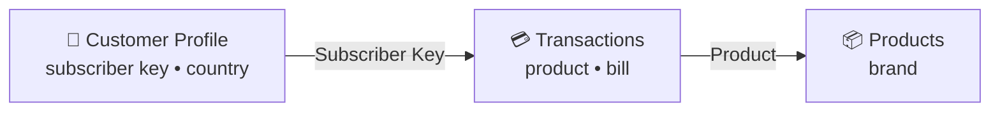

# 📙 Module 13 — Automation Studio: Segmentation with Filters & SQL

> **Module goal:** Master Automation Studio's **second capability — advanced segmentation & filtration**. Learn the **Filter activity** (auto-refreshing filtered data), **Groups** (filtered lists), and the **SQL Query activity** to combine **multiple data extensions and data views** into one target — plus the SQL rules interviewers always ask about.
>
> *These are my own study notes. Diagrams are original recreations of the lecture concepts. The raw course slides/manuals are kept in a separate private folder, not published here.*

---

## 1. Capability 2 — Advanced Segmentation & Filtration

Two problems this capability solves:

1. **Filtered data extensions don't auto-refresh** (Module 3) — you've had to hit *refresh* manually.
2. **Filters only work on a *single* source** — but real requirements often need data from **many** sources.



---

## 2. The Filter Activity — Auto-Refreshing Filtered Data

> 🔑 The **Filter activity** automates the refresh of a filtered data extension: it pulls records matching a **data filter** from a **single source** DE into a **target filtered DE**, and re-runs **every time the automation runs**.

### Step 1 — create a Data Filter

> 🔑 A **Data Filter** is a **saved filter criterion** (e.g. `Country = Pakistan`), created in **Email Studio → Subscribers → Data Filters**. Unlike building a filtered DE directly, a data filter **saves the criteria** so it can be reused in automations.

### Step 2 — use it in a Filter activity

Drag the **Filter activity** in → choose your **data filter** → it builds a **target filtered DE** that refreshes on every automation run.



> ⚠️ **The rule interviewers test:** the Filter activity **only refreshes a filtered DE that *it* created**. A filtered DE you built **manually** (Module 3) **cannot** be auto-refreshed by it — the automation refreshes only its own output.

> **Use case (birthdays):** every day, filter subscribers whose **birthday = today** into a target DE, then chain an **Email Send activity** to wish them — all automatic, daily. Same pattern for anniversaries or payment due dates.

> 💼 **Interview Q — "How do you automate refreshing a filtered data extension?"** → Save the criteria as a **Data Filter** (Email Studio → Subscribers → Data Filters), add a **Filter activity** to a scheduled automation using that filter; it builds and auto-refreshes its own target DE each run. (It can't refresh a manually-created filtered DE.)

---

## 3. Groups — Filtered Lists

Filters have a **list** equivalent, since lists can't be filtered like DEs.

> 🔑 A **Group** is a **filtered list** — the list-world counterpart of a filtered data extension. Create filtered or random **groups** on a list (e.g. by age/gender/city). Like filtered DEs, groups **don't auto-refresh** — but a **Refresh Group activity** in Automation Studio automates it.

> 💡 **Difference from filter activity:** with groups you **don't** create a separate data filter — you build the group on the list, then just select it in the **Refresh Group activity** and schedule it.

| | Data Extension world | List world |
|---|---|---|
| Filtered subset | **Filtered DE** | **Group** |
| Auto-refresh activity | **Filter activity** (needs a Data Filter) | **Refresh Group activity** (uses the group directly) |

---

## 4. When Filters Aren't Enough → SQL

Filters work on **one** source. But requirements often span **several**.

> **Problem statement (from the course):** *"Find everyone who bought a **bag** from **Pakistan** and **the UAE** — give me their subscriber key, country, product, and brand."*

The data is spread across **three** DEs:



- Subscriber key + country → **Customer Profile**
- Product → **Transactions**
- Brand → **Products**

No single filter can join these. This needs the **SQL Query activity**.

---

## 5. The SQL Query Activity

> 🔑 The **SQL Query activity** runs a SQL `SELECT` against **multiple data extensions (and data views)**, joins them, and writes the result into a **target data extension you create first**.

### Step 1 — create the target DE first

Unlike the Filter activity (which builds its own target), **SQL requires you to pre-create the target DE** with exactly the columns you'll return — e.g. `SQL_Results_B36` with **SubscriberKey, Country, Product, Brand**.

### Step 2 — write the query

Add the **SQL Query activity** → write the query (fields are listed on the left to drag in) → **Validate** (green = valid syntax) → choose the **target DE** → Finish.

```sql
SELECT  cp.SubscriberKey,
        cp.Country,
        tx.Product,
        pr.Brand
FROM    B36_Customer_Profile      cp
JOIN    B36_Transactions          tx  ON cp.SubscriberKey = tx.SubscriberKey
JOIN    B36_Products              pr  ON tx.Product       = pr.Product
WHERE   cp.Country IN ('PK','AE')
  AND   tx.Product = 'Bag'
```

> 🔑 **What's happening:** alias each DE (`cp`, `tx`, `pr`), **JOIN** them on their shared keys (Subscriber Key links profile↔transactions; Product links transactions↔products — the **relational model** from Module 4 paying off), filter with **WHERE**, and the result lands in the target DE.

> ⚠️ **You cannot query a *list* directly by name** in SQL — only **data extensions** and **data views**. (To "query" a list, you use a **Group**, or query the `_Subscribers` data view — Section 6.)

> 💡 **Run Once** is handy for filter/SQL activities when you want the result **immediately** rather than waiting for the schedule.

---

## 6. Data Views — Querying System Data with SQL

SQL can also read Marketing Cloud's **hidden system tables**.

> 🔑 **Data Views** are **system tables** (not visible in the DE list, can't be modified) holding **subscriber** and **tracking** data. You query them with an **underscore prefix**: `_Open`, `_Click`, `_Bounce`, `_Unsubscribe`, `_Sent`, `_Complaint`, and `_Subscribers`. *(Introduced in Module 3; here we use them.)*

> **Use case (open report):** management asks *"who opened this email send?"* → query the **`_Open`** data view for that **Job ID**:

```sql
SELECT  SubscriberKey, EventDate, IsUnique, Domain
FROM    _Open
WHERE   JobID = 12345
```

- `IsUnique = true` → opened **once**; `IsUnique = false` → opened **multiple times** (more engaged).
- ⚠️ Forget the underscore (`Open` instead of `_Open`) and SQL errors — it looks for a *data extension* named "Open," which doesn't exist.

### Getting email addresses — the `_Subscribers` view

The `_Open` view gives subscriber keys, but not email addresses. Management wants emails too.

> 🔑 **`All Subscribers` is a list — you can't query it directly.** But its **backend data view is `_Subscribers`**, which you *can* query. **Join** `_Open` to `_Subscribers` on Subscriber Key to get each opener's email:

```sql
SELECT  o.SubscriberKey, s.EmailAddress, o.EventDate
FROM    _Open        o
JOIN    _Subscribers s  ON o.SubscriberKey = s.SubscriberKey
WHERE   o.JobID = 12345
```

> 🔑 **Data views are part of the *predefined* relational model**, connected to your custom DEs through the **Contact object** (Module 4). So SQL can join **data views + data extensions together** freely.

---

## 7. Three SQL Considerations (Interview-Critical)

> 💼 These three come up constantly in interviews.

| # | Consideration | Detail |
|---|---|---|
| 1 | **30-minute runtime cap** | A query that runs longer than **30 minutes** **auto-stops and fails** — process only what fits; break large jobs up |
| 2 | **6 months of tracking data** | Data views retain only ~**6 months** of tracking (opens/clicks/bounces/unsubscribes) — you can't query older engagement |
| 3 | **No `SELECT *`** | You **must** list field names explicitly — `SELECT *` isn't allowed (it overloads the platform) |

> 💼 **Interview Q — "How far back can you query tracking data?"** → About **6 months** via data views. **"What's the max query runtime?"** → **30 minutes**, then it times out. **"Can you use SELECT *?"** → No — specify fields.

---

## 🎯 Key Takeaways

1. **Capability 2 = advanced segmentation & filtration** — auto-filtering plus SQL across sources.
2. **Filter activity** auto-refreshes a **single-source** filtered DE using a saved **Data Filter** — but **only a DE it created itself**.
3. **Groups** are filtered **lists**; automate them with a **Refresh Group activity** (no separate data filter needed).
4. **SQL Query activity** joins **multiple DEs/data views** into a **pre-created target DE**.
5. SQL uses standard **SELECT / JOIN / WHERE**; joins rely on the shared keys of your **relational model**.
6. **Lists can't be queried directly**; **data views** (`_Open`, `_Subscribers`, …) can, with an **underscore prefix**.
7. **`All Subscribers` → `_Subscribers` data view**; join it to get email addresses.
8. **Three SQL limits:** **30-min** runtime, **6-month** tracking window, **no `SELECT *`**.

---

## 💼 Interview Questions (with model answers)

- **Q: What does the Filter activity do, and its key limitation?**
  A: It auto-refreshes a **single-source** filtered DE using a saved **Data Filter** — but it only refreshes a filtered DE **it created**, not a manually-made one.

- **Q: What is a Data Filter?**
  A: A **saved filter criterion** (Email Studio → Subscribers → Data Filters) reused by the Filter activity.

- **Q: What is a Group?**
  A: A **filtered list** (the list equivalent of a filtered DE); auto-refreshed via a **Refresh Group activity**.

- **Q: When do you use SQL instead of a filter?**
  A: When you must combine data from **multiple sources** — filters work on a single source only.

- **Q: What must you do before running a SQL Query activity?**
  A: **Create the target data extension** with the exact columns the query returns (SQL doesn't auto-create it, unlike the Filter activity).

- **Q: Can you query a list with SQL?**
  A: **No** — only data extensions and data views. To get list/subscriber data, query the **`_Subscribers`** data view.

- **Q: What are data views?**
  A: **System tables** holding subscriber and tracking data (`_Open`, `_Click`, `_Bounce`, `_Unsubscribe`, `_Subscribers`), queried with an **underscore prefix**.

- **Q: What's the backend name of the All Subscribers table?**
  A: **`_Subscribers`** (the data view).

- **Q: What are the three SQL considerations?**
  A: **30-minute** max runtime, **6 months** of tracking data, and **no `SELECT *`** (list fields explicitly).

---

## 🔁 Quick-Recall Flashcards

- **Q:** Capability 2? → **A:** Advanced segmentation & filtration.
- **Q:** Filter activity auto-refreshes what? → **A:** Only a filtered DE it created (single source).
- **Q:** Where do you save filter criteria? → **A:** Data Filters (Email Studio → Subscribers).
- **Q:** Filtered list = ? → **A:** Group.
- **Q:** Auto-refresh a group with? → **A:** Refresh Group activity.
- **Q:** SQL joins across…? → **A:** Multiple data extensions and data views.
- **Q:** Before a SQL activity you must…? → **A:** Create the target DE.
- **Q:** Can SQL query a list? → **A:** No — query the `_Subscribers` data view.
- **Q:** Data view prefix? → **A:** Underscore (e.g. `_Open`).
- **Q:** All Subscribers backend view? → **A:** `_Subscribers`.
- **Q:** Max query runtime? → **A:** 30 minutes.
- **Q:** Tracking data window? → **A:** ~6 months.
- **Q:** SELECT * allowed? → **A:** No.

---

## 📖 Glossary

| Term | Meaning |
|---|---|
| **Advanced Segmentation & Filtration** | Automation Studio's 2nd capability: auto-filter + SQL. |
| **Filter Activity** | Auto-refreshes a single-source filtered DE using a Data Filter. |
| **Data Filter** | A saved, reusable filter criterion (Email Studio → Subscribers). |
| **Group** | A filtered list (list equivalent of a filtered DE). |
| **Refresh Group Activity** | Automates refreshing a group. |
| **SQL Query Activity** | Runs SQL across DEs/data views into a target DE. |
| **Target Data Extension** | The pre-created DE that receives SQL results. |
| **Data View** | A system table of subscriber/tracking data, queried with `_` prefix. |
| **`_Subscribers`** | The data-view backend of the All Subscribers list. |
| **JOIN** | SQL clause linking tables on a shared key. |
| **SQL considerations** | 30-min runtime, 6-month tracking window, no `SELECT *`. |

---

*End of Module 13. Next: **Module 14 — ETL, File Drop & Getting Data In** (Capability 3) — SFTP, import/file-transfer/extract activities, and the four ways data enters Marketing Cloud (and why only APIs are truly real-time).*
