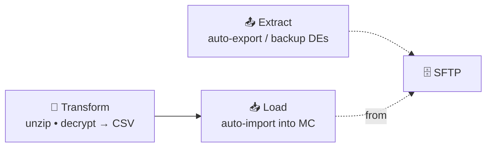
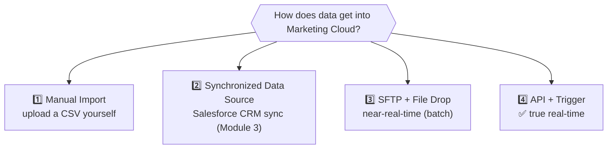
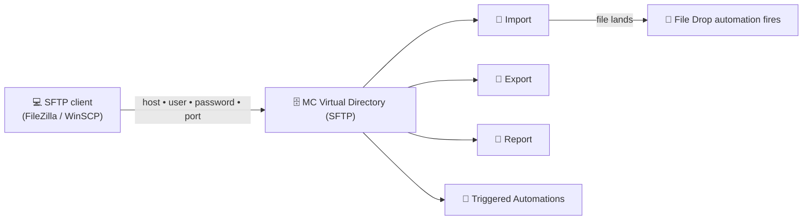
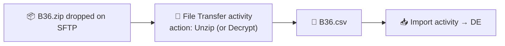

# 📙 Module 14 — Automation Studio: ETL, File Drop & Getting Data In

> **Module goal:** Finish Automation Studio with its **third capability — ETL (Extract, Transform, Load)** — and solve the real-time question: how does data actually *get into* Marketing Cloud? Learn the **File Drop** entry source and **SFTP**, the **Import**, **File Transfer**, and **Data Extract** activities, and why only **APIs** achieve true real-time (the bridge to Journey Builder).
>
> *These are my own study notes. Diagrams are original recreations of the lecture concepts. The raw course slides/manuals are kept in a separate private folder, not published here.*

---

## 1. Capability 3 — Extract, Transform, Load (ETL)

> 🔑 **ETL** automates moving and reshaping data:
> - **Extract** — automatically **export/back up** data extensions
> - **Transform** — convert files so they're importable (**unzip**, **decrypt**)
> - **Load** — automatically **import** data into Marketing Cloud

Why it matters: you **can't** hand-import files forever. Real clients (banks, insurers, the military) will **never** hand you a plain CSV on your desktop — they send **encrypted** or **zipped** files, from systems like **SAP or Oracle** that don't sync natively. ETL handles all of it.

---

## 2. The Real-Time Problem (Recap)

Everything so far assumed **the data is already present**. But the **invoice** is a **real-time** transaction — the data doesn't exist until the customer buys.

> 🔑 **Scheduling can't help a real-time invoice** — there's no audience to schedule to yet. We need automations that **start when data *arrives***, not at a fixed clock time.

---

## 3. Four Ways Data Enters Marketing Cloud

A key synthesis — and a strong interview answer.

| Method | Automation start | Real-time? |
|---|---|---|
| **Manual import** | You schedule after importing | ❌ No (manual) |
| **Synchronized data source** | Syncs CRM data | ❌ Not for fresh transactions |
| **SFTP (File Drop)** | Fires when a file lands | ⚠️ **Near** real-time (batches, ~15–20 min) |
| **API (Trigger)** | Fires on an API call | ✅ **True** real-time (seconds) |

> 🔑 **Only manual import and sync require the data in advance** (so they pair with **Schedule**). **File Drop** and **Trigger** start automations **when data arrives** — the key to transactional use cases.

---

## 4. File Drop Entry Source & SFTP

> 🔑 A **File Drop automation** starts the moment a **file is dropped** onto Marketing Cloud's **SFTP**. It watches for a new file and auto-runs — no schedule needed.

### What is the SFTP?

> 🔑 **SFTP (Secure File Transfer Protocol)** here refers to a **virtual directory** Marketing Cloud provides with every account, integrated with the platform. You drop files into it, and automations can detect them.

It has **four folders**: **Import**, **Export**, **Report**, and **Triggered Automations**.

- **Access it** with an **SFTP client** (e.g. **FileZilla** or **WinSCP**) using the **host, username, password, and port** from your account.
- **Configure a File Drop entry source** to watch the **Import** or **Triggered Automations** folder, optionally matching a **filename pattern** (e.g. any file containing `B36`).

> **Use case (invoice, near real-time):** clear the customer DE, then whenever a **batch file** of new transactions is dropped to the SFTP, the File Drop automation **auto-imports it and sends** the invoice — no manual step, no fixed schedule.

---

## 5. Import Activity & Data Actions

> 🔑 The **Import activity** loads a file from the SFTP into a data extension. You choose a **data action**:

| Data action | Effect |
|---|---|
| **Overwrite** | **Delete all** existing records, load the file fresh |
| **Add** | Insert new records |
| **Update** | Update existing matching records |
| **Add & Update (Append)** | Insert new **and** update existing |

> **Use case:** batches arrive hourly and each replaces the last → use **Overwrite**. But ⚠️ overwrite **destroys** the previous batch, so if you must keep it, **back it up first** (Section 7).

---

## 6. File Transfer Activity — the "Transform" Step

Only **CSV** and **TXT** import. Real files often arrive **zipped** or **encrypted** — so you must transform them first.

> 🔑 The **File Transfer activity** prepares a dropped file for import — it can **unzip** a `.zip` or **decrypt** an encrypted file, turning it into an importable CSV.

- Configure it with the **file naming pattern** (e.g. `B36.zip`) and the **action** (Unzip / Decrypt).
- ⚠️ Import a `.zip` directly and you get **"file not found"** — the importer is looking for a CSV. **Transform before import.**

> **Typical file-drop chain:** File Transfer (unzip) → Import (load) → Email Send (notify) → Data Extract (backup).

---

## 7. Data Extract Activity — the "Extract" Step

> 🔑 The **Data Extract activity** exports a data extension to a **CSV in the SFTP export folder** — automating backups (e.g. before an overwrite wipes the batch).

- Define the **output file name** (e.g. `B36_backup.csv`) and the **extract type**.
- ⚠️ Certain extract types are a **premium (paid) feature** — so in a demo account the option may be greyed out, but the **concept and interview answer** still apply: *to back up data automatically, use the **Data Extract activity***.

> **Use case:** hourly batches overwrite the DE, so each hour: import → send → **Data Extract** the DE to the SFTP export folder as a timestamped CSV backup, before the next batch overwrites it. Manually exporting 20+ DEs every hour is impossible; this automates it.

---

## 8. Why Only API Is Truly Real-Time (→ Journey Builder)

We've now surveyed all four data-entry methods against the invoice:

| Method | Verdict for the invoice |
|---|---|
| Manual import | ❌ Not automatic |
| Sync data source | ❌ No advance transaction data |
| **SFTP / File Drop** | ⚠️ **Near** real-time — batches, min ~15–20 min (too slow for an OTP/withdrawal alert) |
| **API / Trigger** | ✅ **True** real-time — data flows and communication fires in **seconds** |

> 🔑 **The invoice project needs APIs.** SFTP hugely reduces manual work and is great for batch use cases, but *"withdrew money, got the SMS an hour later"* isn't acceptable. Only an **API-triggered** flow delivers in seconds — and that's covered in **Journey Builder** (next section), which also supports APIs.

> 💡 **Consultant's lens:** not every project needs real-time. Most reporting/marketing work is fine with **manual import, sync, or SFTP** — you choose the method that fits the problem. Real-time transactional is the demanding case that mandates **API**.

---

## 🎯 Key Takeaways

1. **ETL = Extract (auto-export/backup), Transform (unzip/decrypt), Load (auto-import).**
2. **Four data-entry methods:** manual import, synchronized data source, **SFTP/File Drop**, **API/Trigger**.
3. **Manual & sync need data in advance** (→ Schedule); **File Drop & Trigger** start automations **when data arrives**.
4. **File Drop** fires when a file lands on the **SFTP** — a virtual directory with **Import/Export/Report/Triggered-Automations** folders, accessed via an SFTP client (FileZilla/WinSCP).
5. **Import activity** loads files with a **data action** (Overwrite / Add / Update / Append).
6. **File Transfer activity** transforms files (**unzip/decrypt**) before import — only CSV/TXT import.
7. **Data Extract activity** auto-backs-up a DE to the SFTP (some extract types are **premium**).
8. **Only APIs are truly real-time** — SFTP is *near* real-time; the invoice needs **API/Trigger** (Journey Builder next).

---

## 💼 Interview Questions (with model answers)

- **Q: What is ETL in Automation Studio?**
  A: **Extract** (auto-export/backup), **Transform** (unzip/decrypt files), **Load** (auto-import) — automating data movement and reshaping.

- **Q: What are the ways data enters Marketing Cloud?**
  A: **Manual import**, **synchronized data source**, **SFTP (File Drop)**, and **API (Trigger)**. Only File Drop and Trigger start automations when data arrives; only **API** is truly real-time.

- **Q: What is a File Drop automation?**
  A: An automation that **starts when a file is dropped** on the SFTP — no schedule needed.

- **Q: What is the SFTP in Marketing Cloud?**
  A: A **virtual directory** MC provides (Import/Export/Report/Triggered-Automations folders), accessed with an SFTP client (FileZilla/WinSCP); dropping files there can trigger automations.

- **Q: What data actions does the Import activity offer?**
  A: **Overwrite, Add, Update, and Add & Update (Append).**

- **Q: You receive a zipped/encrypted file — how do you import it?**
  A: Use the **File Transfer activity** to **unzip/decrypt** it into a CSV first, then the **Import activity** (only CSV/TXT import).

- **Q: How do you automate backing up a data extension?**
  A: Use the **Data Extract activity** to export it to the SFTP export folder (some extract types are a premium feature).

- **Q: Why isn't SFTP good enough for the invoice?**
  A: It's **near** real-time (batches, ~15–20 min minimum) — too slow for transactional alerts. Real-time needs **API/Trigger**.

- **Q: Which method is truly real-time?**
  A: **API (Trigger)** — data flows and the communication fires within seconds.

---

## 🔁 Quick-Recall Flashcards

- **Q:** ETL stands for? → **A:** Extract, Transform, Load.
- **Q:** Transform includes? → **A:** Unzip and decrypt files.
- **Q:** Four data-entry methods? → **A:** Manual import, sync data source, SFTP/File Drop, API/Trigger.
- **Q:** File Drop fires when? → **A:** A file is dropped on the SFTP.
- **Q:** SFTP folders? → **A:** Import, Export, Report, Triggered Automations.
- **Q:** SFTP clients? → **A:** FileZilla, WinSCP.
- **Q:** Import data actions? → **A:** Overwrite, Add, Update, Add & Update.
- **Q:** Unzip/decrypt activity? → **A:** File Transfer activity.
- **Q:** Which importable file types? → **A:** CSV and TXT only.
- **Q:** Auto-backup a DE with? → **A:** Data Extract activity.
- **Q:** Is SFTP real-time? → **A:** Near real-time (batch).
- **Q:** Truly real-time method? → **A:** API (Trigger).

---

## 📖 Glossary

| Term | Meaning |
|---|---|
| **ETL** | Extract, Transform, Load — Automation Studio's 3rd capability. |
| **File Drop (entry source)** | Starts an automation when a file lands on the SFTP. |
| **SFTP** | Secure File Transfer Protocol — MC's integrated virtual directory. |
| **SFTP client** | A tool (FileZilla/WinSCP) used to connect to the SFTP. |
| **Import Activity** | Loads a file into a DE with a chosen data action. |
| **Data Action** | Overwrite / Add / Update / Add & Update for an import. |
| **File Transfer Activity** | Transforms a file (unzip/decrypt) before import. |
| **Data Extract Activity** | Exports a DE to a CSV in the SFTP (backup); some types premium. |
| **Trigger (entry source)** | Starts an automation via an API call (real-time). |
| **API** | Application Programming Interface — the only true real-time entry. |
| **Near real-time** | Batch-based delivery with a short delay (SFTP). |

---

*End of Module 14 — and of Automation Studio. Next section: **Journey Builder** — decision-based journeys, entry sources (including **API events**), and finally delivering the invoice in **true real-time** the instant a transaction happens.*
